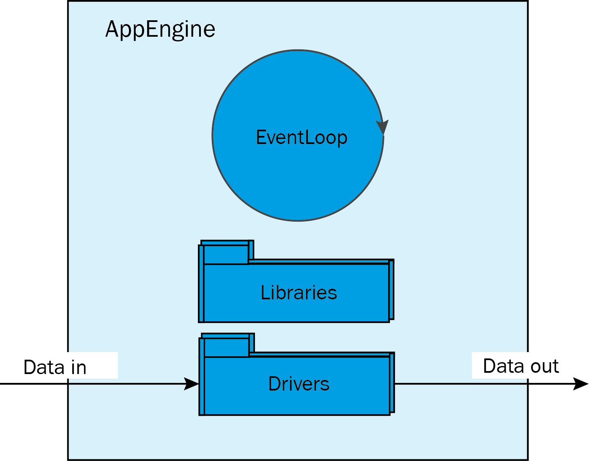

= AppEngine framework

The _AppEngine_ is part of all programmable SICK AppSpace devices and contains an event loop, libraries and drivers to control input and output data. To get a SensorApp up and running, the underlying runtime environment of the _AppEngine_ must be launched first.

The *SICK AppEngine* is a program that can be installed on Windows or Linux machine to emulate the behavior of a real hardware device. In *SICK AppStudio* the program can be additionally configured to include only the APIs available in the specific devices.

The following section explains how the *SICK AppEngine* functions as an emulator:

* The emulator is a type of "abstract" device that allows to develop your applications
* It includes an event loop that sends events to the application similar to real devices
* The emulator allows the configuration to a target device and thus, provides the same API as the real target device
* It includes all the libraries and device drivers of the selected target device
* The emulator needs to be connected to *SICK AppStudio* or *SICK AppSpace SDK* in the same way as a real hardware device

// add more content; e.g. from https://mosaicplus.sick.com/display/wikiAppSpace/Runtime+Model:

The AppEngine has just two aspects:

* serving functions:
** For instance, the following function is a service to send a message on the TCPIP client
connection.
+
[source, lua]
----
TCPIPClient.transmit(handle, message)
----

* serving events:

** For instance the event _TCPIPClient.OnReceive_ can be observed by registering a callback function to it.
+
[source, lua]
----
function handleOnReceive( data ) 
  -- Insert event handling code here end
end
TCPIPClient.register( handle, "OnReceive", handleOnReceive )
----

Every time data is received on the appropriate communication channel the engine
throws the _"OnReceive"_ event and the registered function _handleOnReceive(...)_ is called.
