= UI-Builder: UI bindings

# About this tutorial

:source-highlighter: highlightjs

## Overview
Bindings are needed to enable the user interface - and thus the user - to interact with different parts of the application (e.g. functions/events of the SensorApp lua script, functions of the device, or the UI itself). This way, the application can e.g. react to a button being pressed. Another example would be displaying a specific value (generated within the lua code of the app) on the UI. +
The goal of this tutorial is to show you how to use bindings. You will be able to connect UI elements to the functionalities of your application.

The concept and different aspects of bindings are explained in the paragraph "General information". It is followed by explanations on how to generate bindings in the UI-Builder of SICK AppStudio and SICK AppSpace SDK. At the end of the tutorial, you will find specific step-by-step examples. 

## Prerequisites
* Basic skills in SICK AppStudio or SICK AppSpace SDK, mainly how to serve functions and events and how to create apps. Consider the following tutorials for more information:
** "Multiple apps" link:https://supportportal.sick.com/tutorial/multiple-apps/[on the Support Portal]
** "App properties" link:https://supportportal.sick.com/tutorial/app-properties-serves/[on the Support Portal]
//TODO: Link to tutorial which explains how to create apps (application specific UI?)
//TODO: Add links to github once available.

# General information

## Bindings
A binding connects a property / event of a control (a UI element e.g. a button, input field, slider, …​) to other parts of the application / device. It allows the control to receive or transmit values via a defined channel and defines the behavior of the control in this context.

The bindings created in the UI-Builder are *unidirectional*, which means that each binding has a direction in which the information flows (get / set).

Since each control can be connected to multiple functionalities by using multiple bindings, bidirectional bindings can be achieved by using two bindings with different directions.

## Add Bindings
Bindings can be added via the "Add binding" dialog, which can be accessed either via the binding icon of the control in the structure view or the "+ Add" button in the Bindings tab.

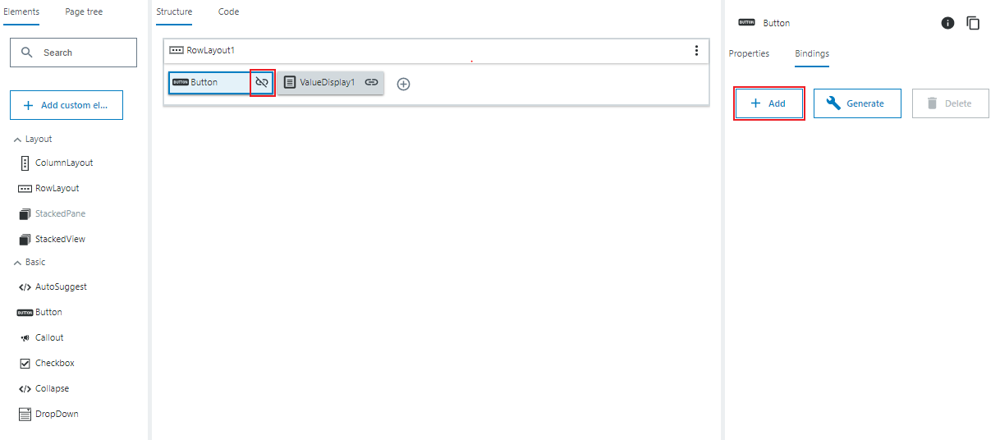

## Binding configuration
Non-legacy binding requests (crown-get, crown-set, crown-on, etc.) are queued if their number exceeds the configured maximum number, which makes it possible to limit the number of parallel requests and therefore work with a large amount of
bindings even in combination with less powerful devices, which have limited resources. The default configuration looks as follows:

[source, json]
----
{
  "@sick-appspace/as-bindings": {
    "requestQueue": {
      "concurrentRequests": 30,
      "maxSize": 2000,
      "retryPeriods": [300, 700, 1500, 3100, 6300]
    }
  }
}
----

The default configuration can be adjusted by adding a file with differing values in "$appName/pages/assets/sensor-application.conf.json". The configuration parameters have the following meaning:

* "concurrentRequests": maximum number of parallel requests
* "maxSize": the queue size can grow as big as "maxSize". If the queue size equals "maxSize" and new requests are submitted they will be ignored instead of being enqueued.
* "retryPeriods": if a request fails it will be added to the queue again after 300 milliseconds. If it fails again it will be added again after 700 milliseconds, and so on. There will be at most five retries per request.
(exception: there are no retries for CrownSet/ParameterSet)

Reducing the number of "concurrentRequests" may help when working with small / less powerful devices. On the other hand this number can be raised to higher values
to take advantage of the resources of bigger / more powerful devices. If there is a huge number of initial requests, you may want to raise the value of "maxSize". If no retries are wanted
"retryPeriods" can be set to an empty array.

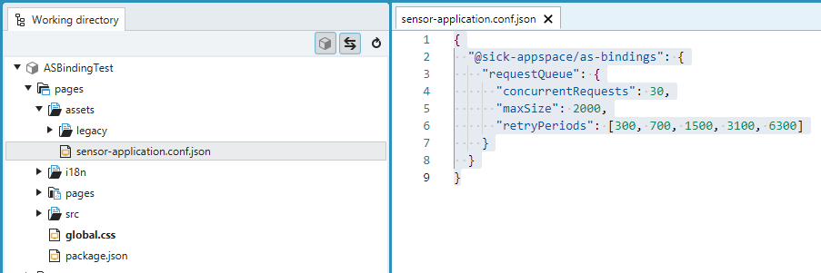

## Binding types
The binding type specifies with which parts of the system a control / UI element interacts and how this is done. Depending on the binding type, the UI-Builder suggests fitting bindings. In the following paragraphs, you will learn how to use the different binding types (Serves, Parameter and UI) to connect properties or events of your controls to the system.

### Serves: binding to the Lua code of the SensorApp

When using bindings to connect the UI to the Lua code of a SensorApp, the required events or functions need to be served by the SensorApp (see paragraph "Definition of endpoints: Serves").
//does not work <<endpoints>>).

#### Lua event → Control property
The binding type "Serves" can be used to bind a control property to a served and published event of a SensorApp. The resulting CrownOn binding is used to react directly to value changes (i.e. update the control to the value that is passed with the event). In the image below, you can see that available events are listed in the "Add binding" dialog. Note: events are indicated by the lightning icon. 

This is the recommended option for communicating value changes to the UI, since it only strains the performance when necessary. For showing values on first page load, an additional binding of the type "Serves - Function" is needed (see paragraph "Lua function -> control property").

The event in the lua code needs to have a parameter of the same type as the control property which you want to bind. You can check the event parameter types in the list of the available events (in the image below, you see that the "newValueEvent" provides a value of type "string") or in the "App properties". 

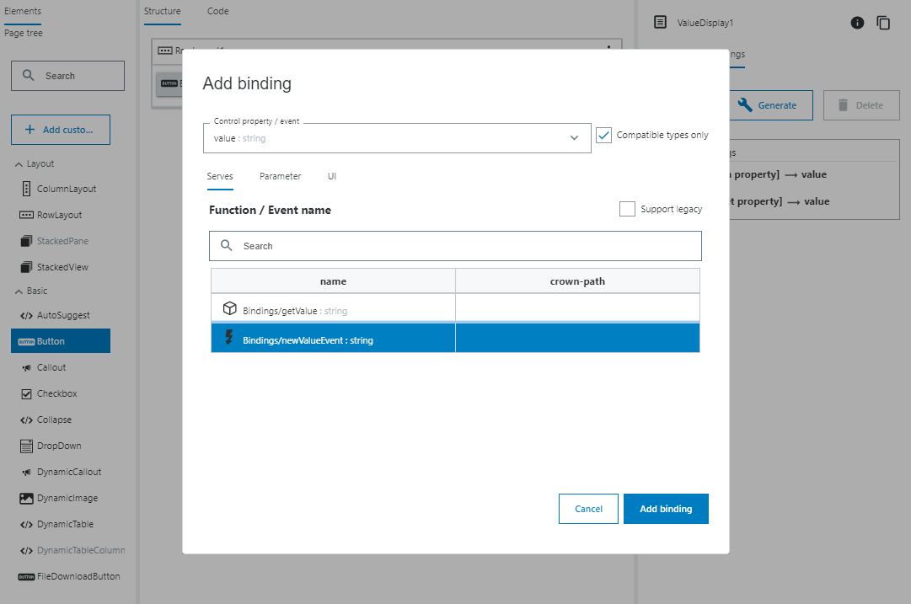

[[serves_function]]
#### Lua function -> Control property

With the binding type "Serves", a control can also be bound to a served and published Lua function of the SensorApp. This "getter" function provides values that are queried by the system and passed to the property of the control. Note that the return value of the Lua function has to be of the same type as the control property. In the image below, you can see that the "value" property of a ValueDisplay control is of the type "string" and the Lua code of the SensorApp provides/serves the compatible function "getValue". Note: functions are indicated by the box icon.
This binding only allows unidirectional access, i.e. reading and writing require separate bindings.

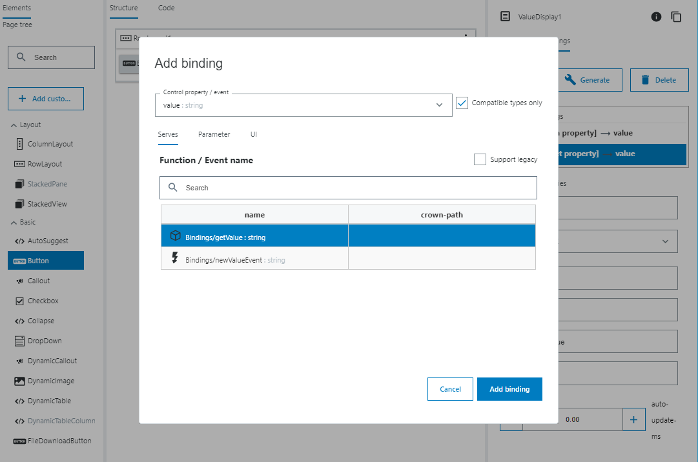

The resulting CrownGet binding can be used to retrieve a value once or periodically. The binding property "auto-update-ms" specifies the time interval for polling a new value, whereas 0 disables the periodic polling (see image below). Note that periodic updates can consume much performance. Therefore, this option should be used as seldom as possible.

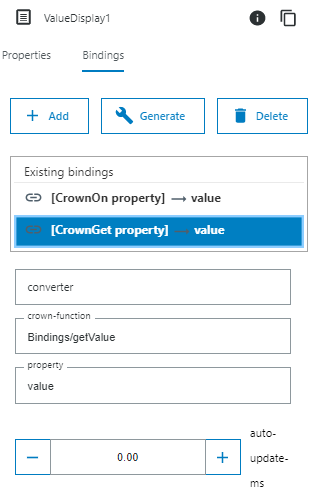

#### Control event -> Lua function

Beside providing properties, controls can emit events that usually indicate a user interaction (e.g. the "submit" event of a button or the "change" event of a slider). +
Events of controls can be bound to Lua functions that are served by your SensorApp. In the image below, you can see how the selected "submit" event of a Button control results in a filtered list of the compatible functions that are served by the Lua code of the SensorApp. In the example below, the resulting CrownSet binding will call the "getValue" lua function every time the button is pressed in the UI.

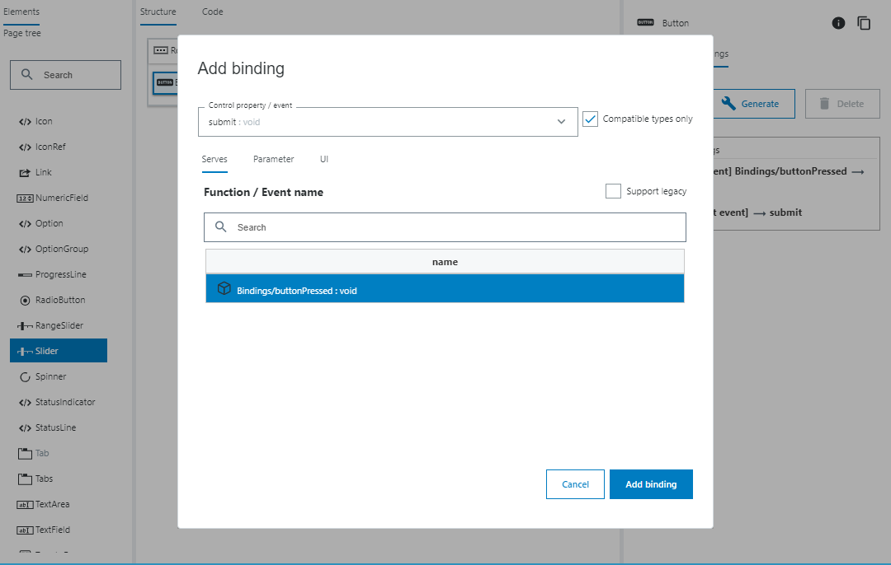

### Parameters: binding to a SOPAS variable
With the binding type "Parameters", a control property is bound to a SOPAS variable (parameter, e.g. "AppEngineVersion"), which is defined in the cid.xml file of an app (located in $appName/parameters).

#### Parameter changed event → Control property
The CrownOn binding is used to react directly to value changes of a parameter (i.e. update the control to the new value of the changed parameter).
In the image below, you can see that available parameter events are listed in the "Add binding" dialog. Note: If the parameter crown is deactivated for security
reasons ParameterOn bindings will not work.

This is the recommended option for communicating parameter changes to the UI, since it only strains the performance when necessary.
Initial values are shown on first page load - if this is not intended, this can be turned off by adding the boolean property onlyChanges.

The parameter in the cid.xml file needs to be of the same type as the control property which you want to bind. You can check the parameter types in the list of the available parameter changed events. In the image below, you see that the type of the property value is "string|number", which matches the type of the "stringTest" changed event, which again is the same as the parameter type in the main.cid.xml file in the tab below.

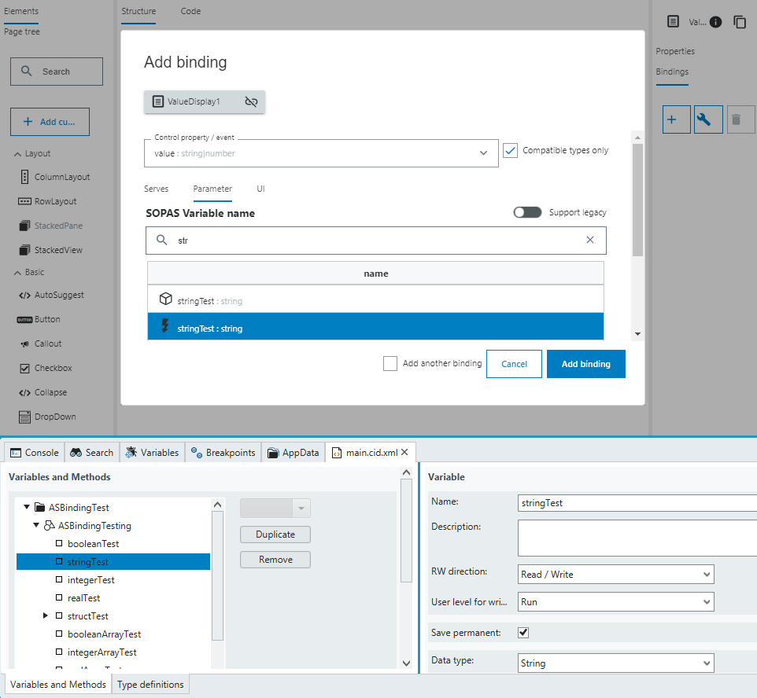

[[serves_function]]
#### Parameter value -> Control property

This "parameter getter" provides values from the app's or device's parameters that can be attached to a property of the control. Note that the parameter has to be of the same type as the control property. In the image below, you can see that the "value" property of a ValueDisplay control is of the type "string|number" matching the type of the "floatValue" parameter "number" in the table and "Real" in the main.cid.xml file.
This binding only allows unidirectional access, i.e. reading and writing require different bindings, see below.

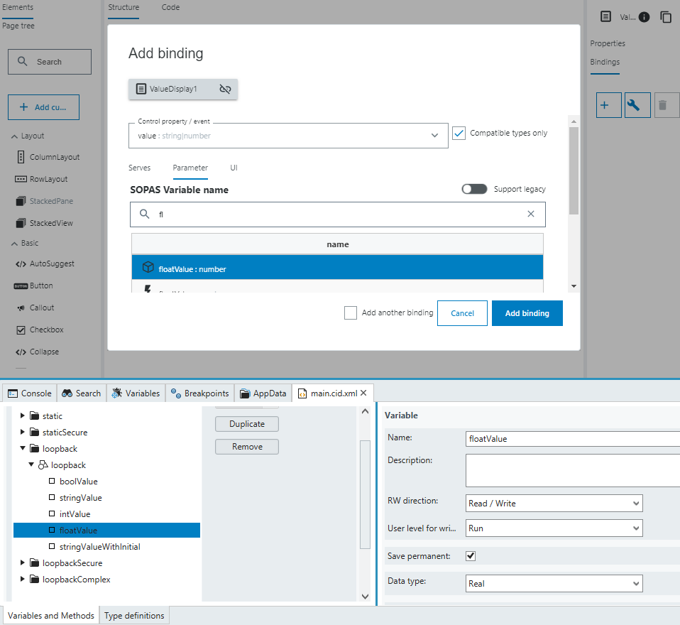

The resulting ParameterGet binding can be used to retrieve a value once or periodically. The binding property "auto-update-ms" specifies the time interval for polling a new value, whereas 0 disables the periodic polling (see image below). Note that periodic updates should not be used if performance is crucial.

#### Control event -> Parameter value

Events of controls can be bound to setting a parameter on your SensorApp. In the image below, you can see how the selected "change" event of a Button control results in a filtered list of the compatible parameters from the main.cid.xml file. In the example below, the resulting ParameterSet binding will set the "booleanTest" parameter every time the button is toggled (provided the button is in toggle mode).

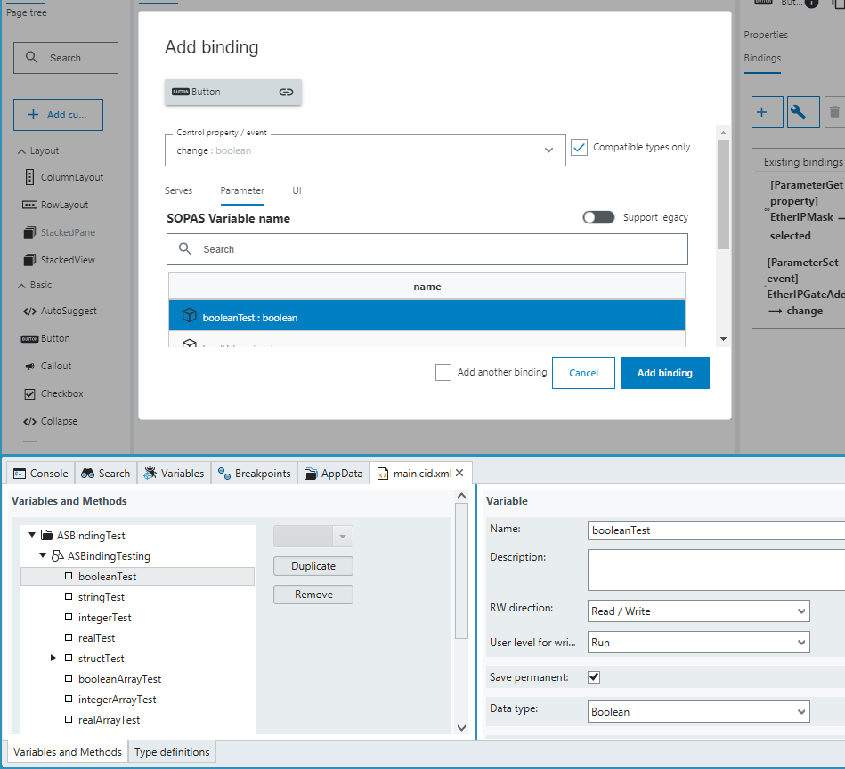

### UI: binding to other UI elements

With the binding type "UI", bindings can be made within the UI to allow UI elements to interact directly with each other (no link to the Lua code needed). This type of binding is also called a local binding.  

The UI-Builder offers several predefined UI bindings which are shown in the "Add binding" dialog. In addition, customized UI bindings can be defined via the "Generate" button in the Bindings tab. For more information, see paragraph "Bindings to UI internal variables". 

## Legacy bindings

Legacy bindings are needed if the UI will be deployed on a device that runs with an old firmware based on an AppEngine framework version lower than 2.9.

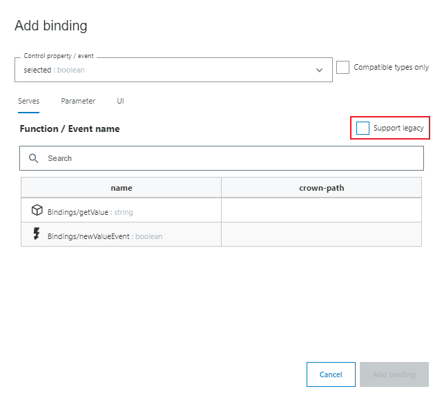

It is recommended to not enable the "Support legacy" setting without a reason because

* the new bindings, i.e. non-legacy bindings, have a better performance
* the number of parallel requests is configurable for the new bindings
* listening on parameter changes is only possible for the ParameterOn binding

The restriction to only using legacy bindings if the device firmware is based on an AppEngine framework version lower than 2.9 does not hold true for the parameter bindings ParameterGet and ParameterSet, that use the "srt"
protocol by default. Still the user can use the legacy sopas-binding if desired.

## Binding properties
Binding properties can be edited after the initial creation of a binding via the Bindings tab on the right side of the UI-Builder. Depending on the chosen binding type, there are different editable binding properties.

### Converter functions
The "converter" property of a binding allows to specify a function that is called whenever the binding is activated (i.e. for properties after polling, for events before sending). You can define an anonymous Typescipt/Javascript function as shown below.

[source, typescript]
----
function(x) {return 2*x;}
----

In addition, you can define a Typescript/Javascript function in the file $appName/pages/src/converter.ts and specify the function name in the "converter" field (without parameters and brackets).

[[endpoints]]
## Definition of endpoints: Serves
Serves are the measure to create a public interface of an app and are therefore the connection points between the app and everything else. They are also used for app internal communication between different parts of the app (e.g. between the Lua script and the UI).
//Information about the manifest? It declares the capabilities of the application ("Serves"), collection of all serves

You can serve functions and events. +
*Functions* which are served by an app can be called from another app or component. They are a call _into_ the app. +
*Events* which are served by an app are notifications _from_ the app. Other apps or components can register to the event.

For information about how to add serves to the app or where to see the serves of an app take a look at the tutorial 
"App properties / Serves" link:https://supportportal.sick.com/tutorial/app-properties-serves/[on the Support Portal].

//TODO: Add links to github once available.

## Workflow overview
In general, the following steps are needed to add a binding. For more detailed information, take a look at the following paragraph "Creating bindings in the UI-Builder".

. Serve function / event in script and app manifest
. Select UI element / control in UI-Builder
. Open binding dialog
. Add the relevant bindings for the properties
.. Select property / event
.. Select type
.. Choose available matching served function / event
.. Adapt binding properties to suit the binding needs

[[create_bindings]]
# Creating bindings in the UI-Builder

To create a binding in the UI-Builder, the app which serves the respective functionality to which you want to bind needs to be activated in SICK AppStudio. In SICK AppSpace SDK, the app that serves the functionality needs to be checked in the "App Model Configuration" subsection of the SICK AppSpace SKD view. If you want to bind the UI to device-specific functionalities, make sure that you are connected to the device.

If you want to see how to serve a function or an event, check out the tutorial "Multiple apps" link:https://supportportal.sick.com/tutorial/multiple-apps/[on the Support Portal].
//TODO: Add links to github once available

Note: If you want to you want to bind to a function which does not exist yet, follow the steps described within the paragraph "Generating a serve and a binding at once".

## Generating a serve and a binding at once

If the function to which you want to bind a control does not exist yet, the UI-Builder offers the possibility to create an empty function in the main script of the app and bind the control to it in one step.

*Note:* This is only possible for functions. If you want to bind the control to an event, you will have to create and serve this in the Lua script as explained in the tutorial "Multiple apps" link:https://supportportal.sick.com/tutorial/multiple-apps/[on the Support Portal].
//TODO: Add links to github once available

The "Generate binding" dialog can be accessed via the "Generate" button in the "Bindings" tab (see image below).

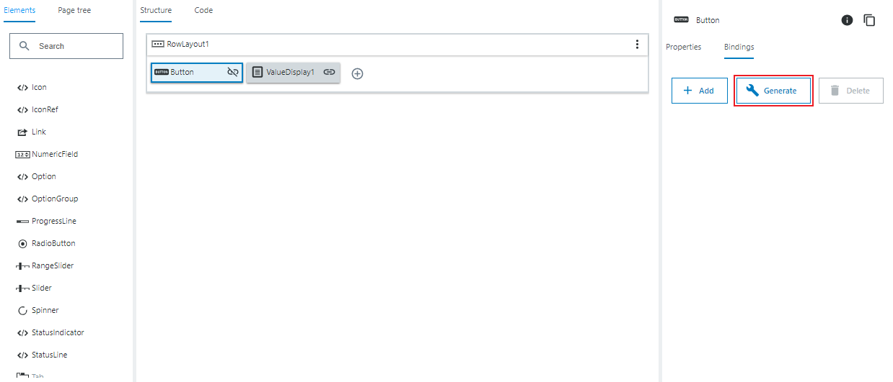

Choose the control property or event to which you want to bind the new endpoint. Hover above the different properties to get more information about them.

Enter a meaningful and valid function name and check if the return type of the endpoint is chosen correctly.

*Note:* 

* A function is valid, if its handle does not start with a number and if it only contains letters, numbers or underscores (_).
* You are only shown return types which suit the chosen control property or event.

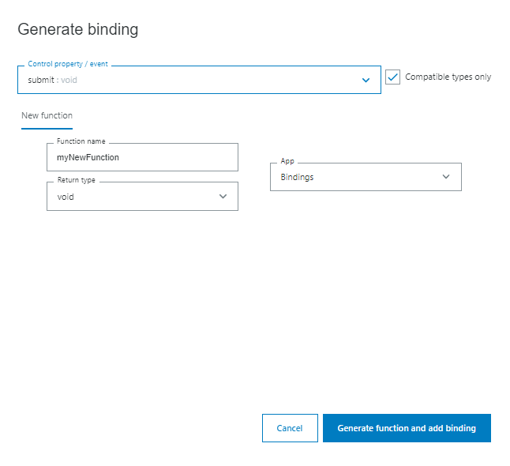

Click the button "Generate function and add binding" to add the binding in the UI-Builder and to generate a placeholder function in the main lua script of the chosen app.

Switch to the main script of the app to see and edit the newly generated function.

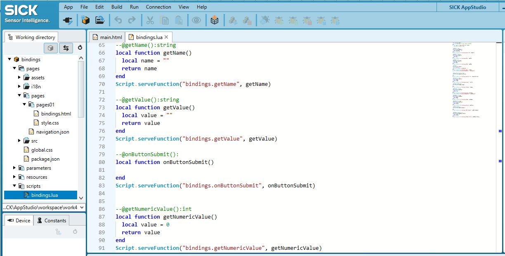

## Troubleshooting
If the desired functionality is not listed in the table of available bindings, this might be due to one or multiple reasons. Check out the list of reasons and how to proceed below:

* The functionality is not implemented in the script of the app yet: +
 Have a look at the paragraph "Generating a serve and a binding at once", if the desired functionality is a function. For events, check out the tutorial "Multiple apps" on link:https://supportportal.sick.com/tutorial/multiple-apps/[on the Support Portal] for explanation on how to serve an event.
//TODO: Add link to github once available.
//internal links would be nicer here
* The functionality is implemented in the app, but not served in the manifest: +
 Serve it as described in the tutorial "Multiple apps" link:https://supportportal.sick.com/tutorial/multiple-apps/[on the Support Portal])
//TODO: Add link to github once available.
* The parameter or return type of the functionality and the type of the selected control property or event do not match: +
 By default only binding types and bindings are listed for which the parameter or return type matches the type of the selected control property or event. E.g. a NumericField value property cannot be be bound directly to a function which returns a string. Therefore it is not shown in the default selection. +
 A binding can still be created by de-selecting "filter by type" and choosing the according served function. As this binding would fail due to the mismatch in data types during run-time, using a converter function is required.
//TODO: insert (see $linkToConverterFunctionTut) after converter function
* Downloading the app onto the device leads to performance issues: +
There might be too many Function bindings with the "auto-update" option set to a value bigger than 0. Try to set them to 0 and communicate changes from the device via Events instead.

[[internal_vars]]
## Bindings to UI internal variables

Local bindings (binding type "UI") are direct bindings between two UI elements of the UI. 

### General information on local bindings

To add a local binding, you need to define the two endpoints of the local binding: one endpoint is an event of a UI element (referenced as "binding source" within this paragraph), the other endpoint is a property of another UI element (referenced as "binding target").

Usually, you first want to define a "binding source" by opening the "Generate binding" dialog in the Bindings tab.

In the image below, the "Generate binding" dialog is shown. The "input" event of a TextField was chosen and the New local tab is selected. In the "Topic" field, you can enter the name of the topic under which all updates should be published. The local "binding source" is created by pressing the "Add local binding" button.

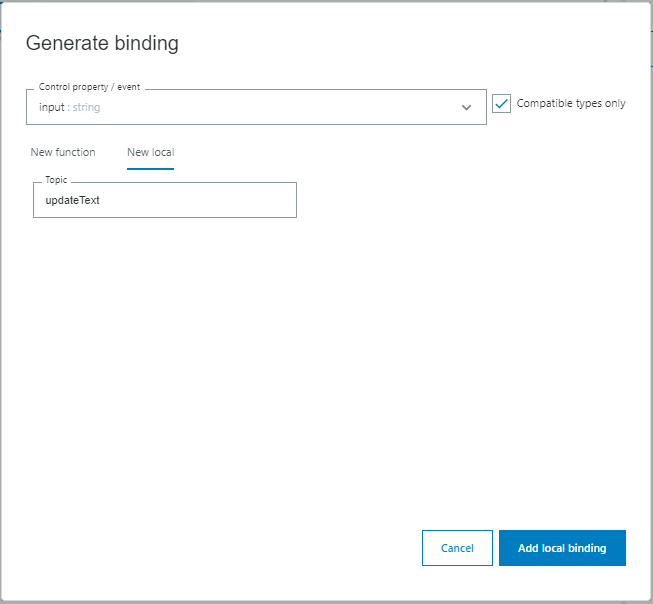

The resulting binding looks as follows
[source, html]
----
<davinci-text-field id="TextField1" type="text">
	<local-binding name="updateText" event="input"></local-binding>
</davinci-text-field>
----

To define a "binding target", a new binding has to be added to the target control. In the example below, the "value" property of a second TextField is selected. The UI tab provides the formerly defined topic name "updateText".

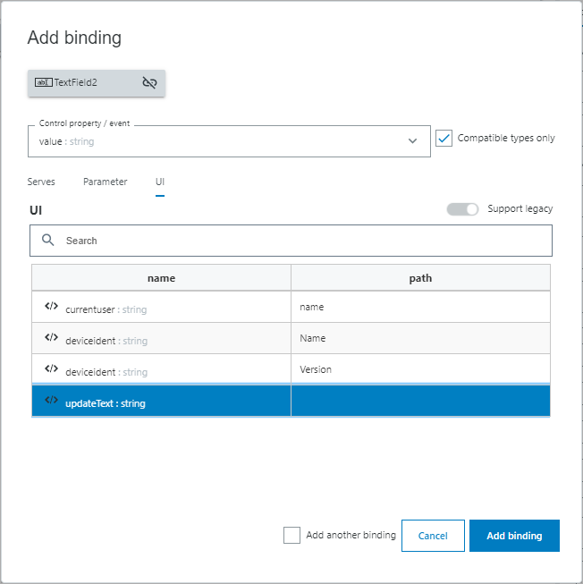

The code of the generated binding is shown in the following snippet.
[source, html]
----
<davinci-text-field id="TextField2" type="text">
	<local-binding property="value" name="updateText" update-on-resume>
	</local-binding>
</davinci-text-field>
----

Consequence for the resulting UI: every time a character is entered in the first text field, an update with the new string is sent to the second text field which shows it immediately. Note that with this method, no Lua code is needed to directly communicate between two controls.

An explicit example is provided in the sample app "LocalBindings" (see below).

## Bindings to functions and events with multiple return values

In some situations it might be useful to provide multiple values by one function or event, e.g. to update the status of multiple UI elements. Instead of providing multiple functions or events, each of which is connected to one UI element, multiple return values of one function or one event can be processed with the "crown-path" binding property.

In the following example there is an event with two return values (of the types int and string) defined and served.

[source, lua]
----
--@randomizeValues():int,string
local function randomizeValues()
  value1 = math.random(0, 100)
  value2 = string.char(math.random(32, 126),math.random(32, 126),math.random(32, 126))
  Script.notifyEvent("OnValues", value1, value2)
end
Script.serveFunction("BindingExamples.randomizeValues", randomizeValues)
----

The event's parameters are named v1 and v2 as shown under "Serves" in the App properties tab in SICK AppStudio.

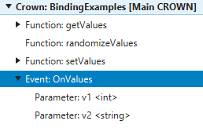

And in the manifest itself:

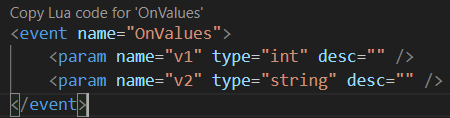

The provided parameters v1 and v2 can now be addressed in the binding as shown in the example below. Note, that there is no support in the UI of the IDE for generating bindings that process functions or events with multiple return values.
In the example, the "crown-path" property of the "CrownOn" binding is used to select the suitable parameter of the event.

[source, html]
----
	<davinci-numeric-field id="NumericField1" type="outline" max="100" ticks="1" group-separator="," decimal-separator="." format-pattern="0" min="0" align-to-ticks>
		<crown-on property="value" crown-event="BindingExamples/OnValues" crown-path="v1"></crown-on>
	</davinci-numeric-field>
	<davinci-text-field id="TextField1" type="text">
		<crown-on property="value" crown-event="BindingExamples/OnValues" crown-path="v2" protocol="crownMSGPACK"></crown-on>
	</davinci-text-field>
----

Once, the "CrownOn" binding is defined via the UI-Builder's code view, its properties can be edited in the Bindings tab as shown below.

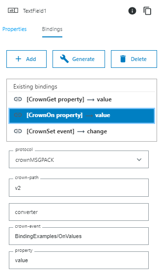

When using functions with multiple return values, the workflow for binding to one of the return values is identical to the above described procedure. An exemplary function with two return values is shown below.

[source, lua]
----
--@getValues():int,string
local function getValues()
  return value1, value2
end
Script.serveFunction("BindingExamples.getValues", getValues)
----

# Examples

## Bindings (SampleApp): FirstSteps - How to create a simple interactive UI

In this example, a simple interactive UI is created. The user will be able to type in their name and will be greeted accordingly.

Start by downloading the link:https://gitlab.com/sick-appspace/samples/Bindings[prepared Bindings app] and open it in SICK AppStudio or SICK AppSpace SDK. As you can see, the app consists of an html page and a lua script. When you download the app onto your device the interactive elements won't do anything.

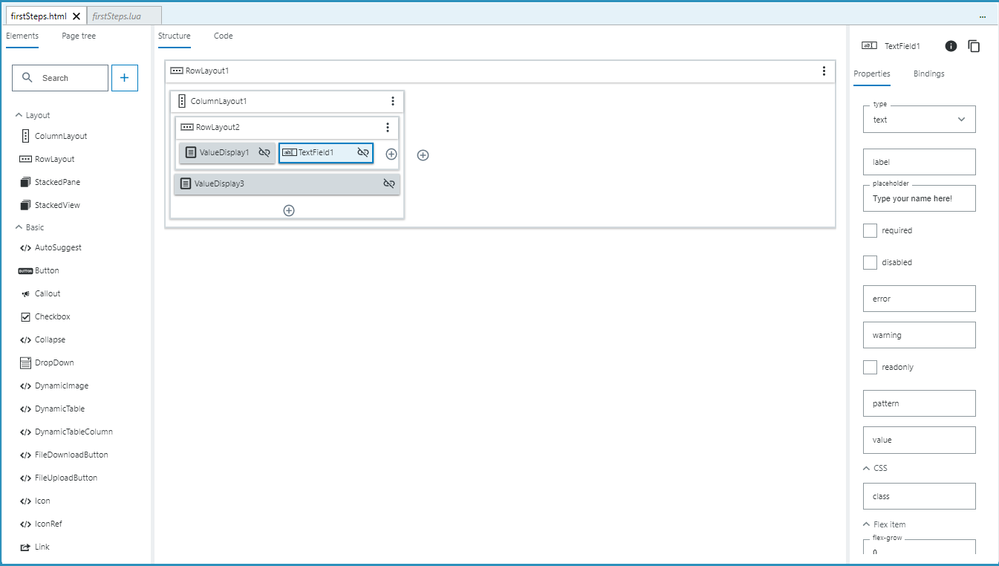
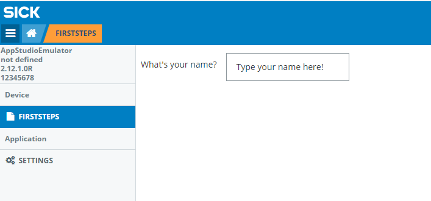

### Connecting the UI to an already existing (setter) function

Find the "setName" function in the lua script:

[source, lua]
----
--@setName(change:string):
local function setName(change)
  name = change
  greeting = "Hello " .. name .. "!"
  Script.notifyEvent("greetingUpdated", greeting)
  print (greeting)
end
Script.serveFunction("FirstSteps_StartingPoint.setName", setName)
Script.serveEvent("FirstSteps_StartingPoint.greetingUpdated", "greetingUpdated")
----

When called, this function processes the value of the parameter it received. Bind the "change" event of the TextField (which is already part of the UI) to this function. To do this, open the binding dialog as described above (see paragraph "Adding a binding").

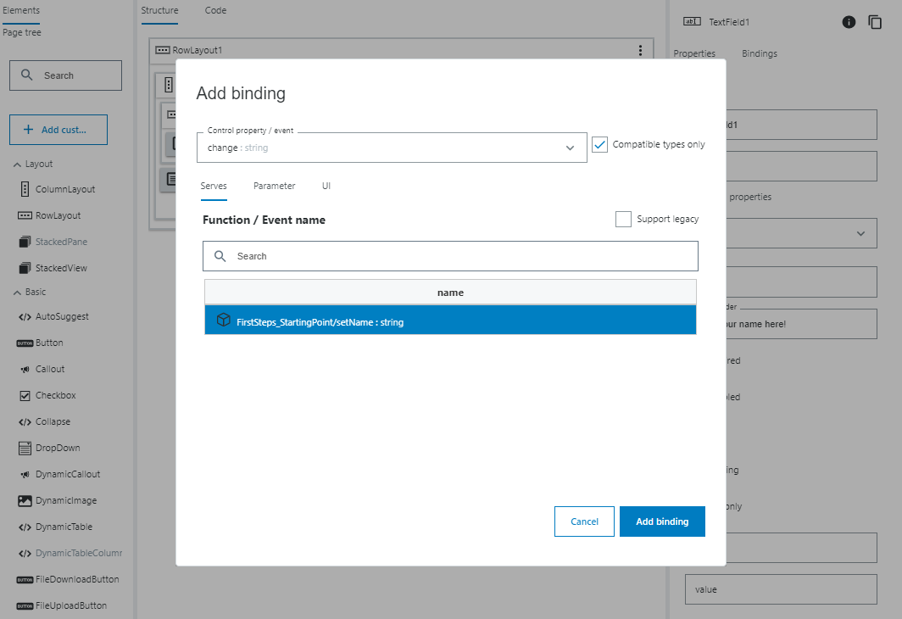

_Note: The "change" event is only triggered once the whole name has been typed and confirmed by the user (e.g. by pressing enter). If, in another scenario, the event should be triggered on every character input, "input" should be selected as event._
 
To complete the binding, select "FirstSteps_StartingPoint/setName" and press "Add binding".

Run the app on your device and open the device page for the app.
//TODO: Link!
After typing in a name and confirming it (either by pressing enter or by clicking anywhere outside the TextField) you will see a personalized greeting in the console of the IDE.

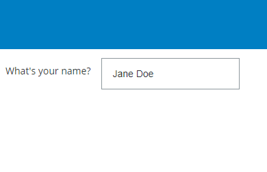

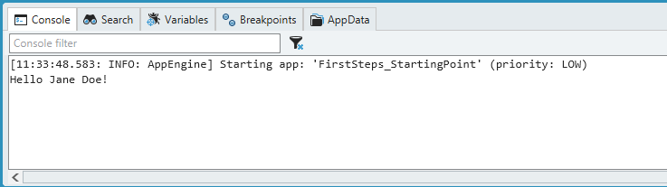

### Connecting the UI to an event

Until now, there is no feedback for the user after entering their name. But the setName function triggers an event every time the name was set.

To display values on the UI, bind the ValueDisplay to this event. In order to do this, open the binding dialog for the control "ValueDisplay3". Set the "Control property/event" to "value" and select "greetingUpdated" as endpoint of the binding.

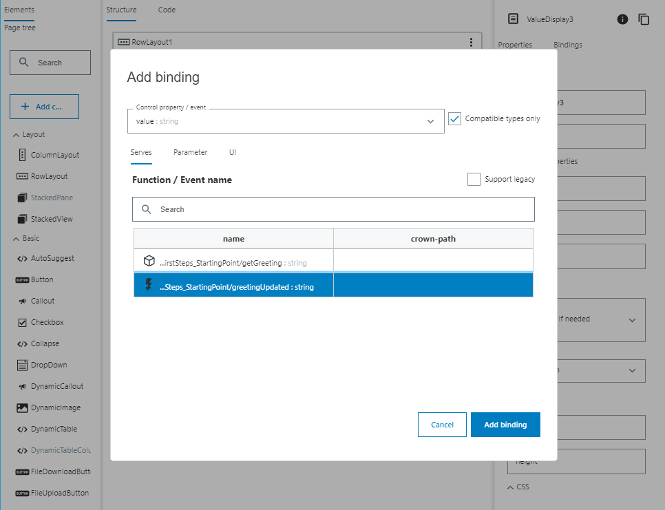

Update the app on the device by pressing "Run all apps" and reload the device page. After entering your name, the message with the personalized greeting is shown.

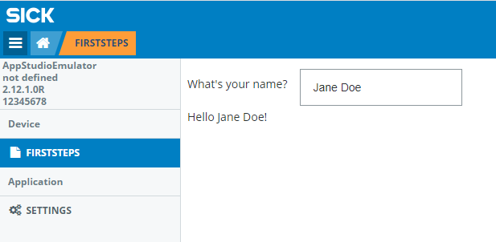

### Connecting the UI to an already existing (getter) function

Until now, the ValueDisplay which shows the greeting does only appear after entering a name. To show a not personalized greeting on a new page load, use the "getGreeting" function which is already implemented and served:

[source, lua]
----
--@getGreeting():string
local function getGreeting()
  return greeting
end
Script.serveFunction("FirstSteps_StartingPoint.getGreeting", getGreeting)
----

Open the binding dialog for the control "ValueDisplay3", set the control property to "value" and choose the endpoint "FirstSteps_StartingPoint/getGreeting".

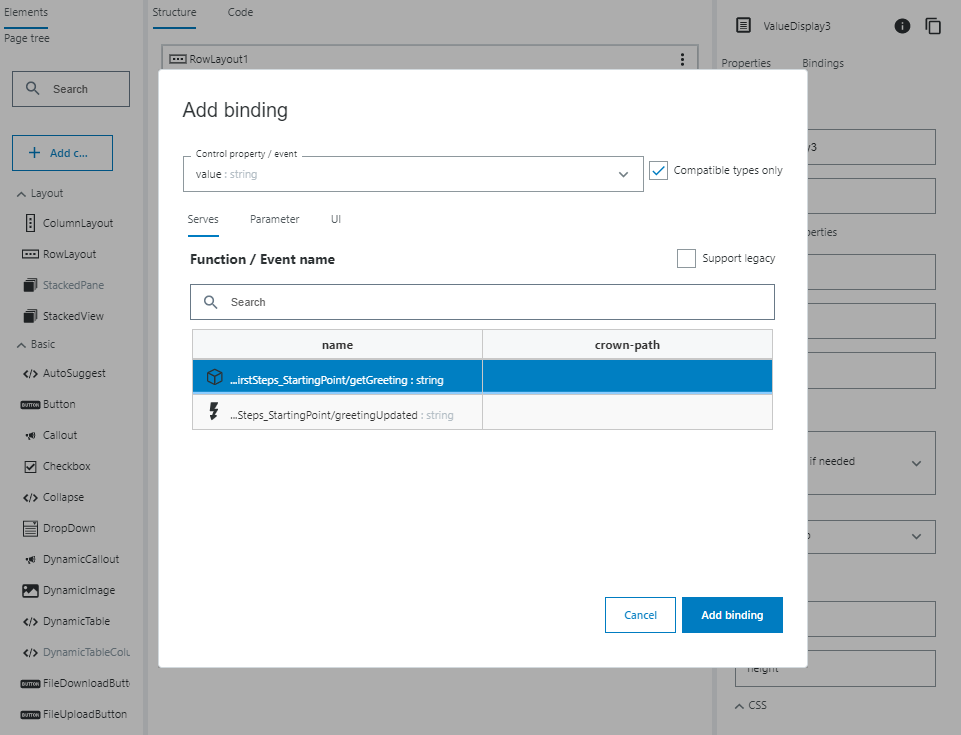

As all value updates of the Textfield (on every change event) are already addressed by the binding we established before, the new binding doesn't need to poll new values. Open the binding properties of the new binding and set "auto-update-ms" to 0.

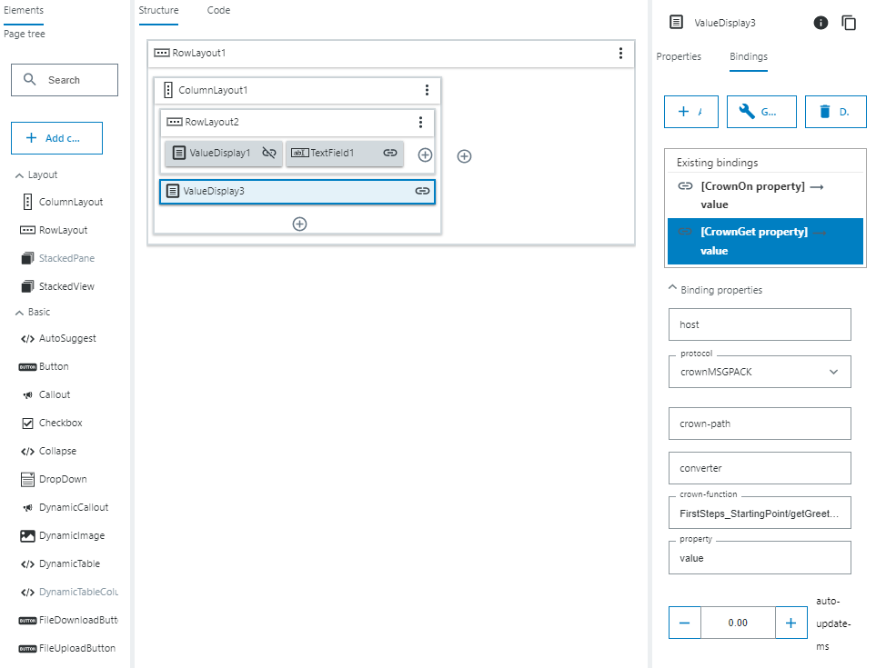

Now, the page will always show a - sometimes personalized - greeting without a significant reduction of the performance of your device.

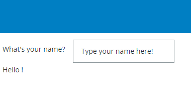

## LocalBindings (SampleApp): How to switch between different stacked panes

The following paragraphs explain step by step how to recreate the SampleApp "LocalBindings". 

The source code of this SampleApp can be found here:

link:https://gitlab.com/sick-appspace/samples/LocalBindings[https://gitlab.com/sick-appspace/samples/LocalBindings]
// TODO: in my opinion, this invites the user to download the app, although this is not needed at all. So this would be better at the bottom of the example.

Start by creating an app with a page. For explanations on how to do this, take a look at the tutorial "UI-Builder: Application specific UI" link:https://supportportal.sick.com/tutorial/ui-builder2-application-specific-ui/[on the Support Portal].
//TODO: Add link to github once available.

Add a stacked view with three stacked panes and a dropdown with three options or copy the following code into your page by using the code view:

[source, html]
----
<layout-row id="RowLayout1">
	<stacked-view id="StackedView1" value="first pane">
		<stacked-pane id="StackedPane1" value="first pane">
			<davinci-callout id="Callout1" type="info">
		This is pane 1
	</davinci-callout>
		</stacked-pane>
		<stacked-pane id="StackedPane2" value="second pane">
			<davinci-callout id="Callout2" type="info">
				This is pane 2
			</davinci-callout>
		</stacked-pane>
		<stacked-pane id="StackedPane3" value="3. pane">
			<davinci-callout id="Callout3" type="info">
				This is pane 3
			</davinci-callout>
		</stacked-pane>
	</stacked-view>
	
	<davinci-drop-down id="DropDown1">
		<davinci-option id="Option1" value="first pane">
			Option 1
		</davinci-option>
		<davinci-option id="Option2" value="second pane">
			Option two
		</davinci-option>
		<davinci-option id="Option3" value="3. pane">
			3. Option
		</davinci-option>
	</davinci-drop-down>
</layout-row>
----

It is important that the values of the options match the values of the stacked panes. In this tutorial the values are "first pane", "second pane" and "3. pane".

You are free to choose the data-content of the options and to add whichever elements you want to to the stacked panes. To match the sample code, add the UI element "callout" to each stacked pane and set the data-content of the UI element in its Properties tab to "Option 1", "Option two" and "3. Option" respectively.
//Note: is the above paragraph, especially the last sentence, necessary?

To bind the selected pane to an input value, add the following line of code in front of the closing tag of the stackedView element ("</stacked-view>"):
[source, html]
----
<local-binding property="value" name="selectedItem" init="first pane"></local-binding>
----
This creates a binding called "selectedItem" which sets the "value" property of the stackedView element. The "init" property is used to set the initially shown pane when the page gets loaded for the first time.

To specify the input value from above, add the following line of code in front of the closing tag of the dropDown element ("</davinci-drop-down>"):
[source, html]
----
<local-binding event="change" name="selectedItem"></local-binding>
----

Start the emulator and open the UI page provided by the app. As you can see, the StackedPane changes with the selected option.
//TODO: Add link to explanation of how to open the app page here!

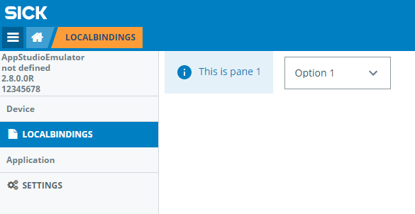
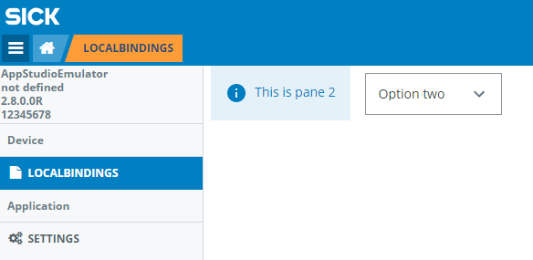
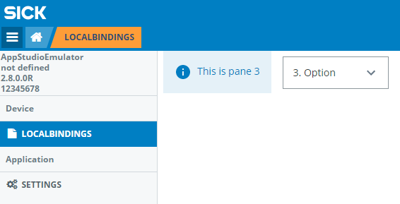

// should be changed to msgpack, but use case may not be important...
// ## Advanced: Bindings to multi-return CROWN functions 
// When dealing with larger amounts of data, you typically do not want to create a function for each item. For example, when creating a table, you might want a function to return the values for a particular row, or for a 3D coordinate, you do not want to create a function for x, y, and z separately. The solution: multi-return CROWN functions, which can be bound to, but aren't displayed in the "Create binding" dialog.

// The following examples show different approaches on how you would bind the x, y, and z components of a 3D coordinate to one numeric field each.

// ### Using one-value-return CROWN functions
// The first approach which might come to your mind is to define three CROWN functions:

// [source, lua]
// ----
// --@getX():float
// local function getX()
//   return x
// end
// Script.serveFunction("MyApp.getX", getX)
 
// --@getY():float
// local function getY()
//   return y
// end
// Script.serveFunction("MyApp.getY", getY)
 
// --@getZ():float
// local function getZ()
//   return z
// end
// Script.serveFunction("MyApp.getZ", getZ)
// ----

// This results in the following html-code for your page (assuming that the return value name is "value" for each function):

// [source, html]
// ----
// <davinci-numeric-field id="NumericField1" type="outline" max="+Infinity" ticks="1" group-separator="," decimal-separator="." format-pattern="0">
//   <crown-binding property="value" name="MyApp/getX" path="result/data/value" auto-update="1000" update-on-resume></crown-binding>
// </davinci-numeric-field>
// <davinci-numeric-field id="NumericField2" type="outline" max="+Infinity" ticks="1" group-separator="," decimal-separator="." format-pattern="0">
//   <crown-binding property="value" name="MyApp/getY" path="result/data/value" auto-update="1000" update-on-resume></crown-binding>
// </davinci-numeric-field>
// <davinci-numeric-field id="NumericField3" type="outline" max="+Infinity" ticks="1" group-separator="," decimal-separator="." format-pattern="0">
//   <crown-binding property="value" name="MyApp/getZ" path="result/data/value" auto-update="1000" update-on-resume></crown-binding>
// </davinci-numeric-field>
// ----

// ### Using multi-return CROWN functions and the path property (advanced!)
// Defining a function for each value can get quite tedious. Luckily, you can again use the path property (or a converter) in order to access each return value of a multi-return function. Start by defining a function as shown below:

// [source, lua]
// ----
// --@getXYZ():float,float,float
// local function getXYZ()
//   return x, y, z
// end
// Script.serveFunction("MyApp.getXYZ", getXYZ)
// ----

// This results in the following html-code for your page:

// [source, html]
// ----
// <davinci-numeric-field id="NumericField1" type="outline" max="+Infinity" ticks="1" group-separator="," decimal-separator="." format-pattern="0">
//   <crown-binding property="value" name="MyApp/getXYZ" path="result/data/x" auto-update="1000" update-on-resume></crown-binding>
// </davinci-numeric-field>
// <davinci-numeric-field id="NumericField2" type="outline" max="+Infinity" ticks="1" group-separator="," decimal-separator="." format-pattern="0">
//   <crown-binding property="value" name="MyApp/getXYZ" path="result/data/y" auto-update="1000" update-on-resume></crown-binding>
// </davinci-numeric-field>
// <davinci-numeric-field id="NumericField3" type="outline" max="+Infinity" ticks="1" group-separator="," decimal-separator="." format-pattern="0">
//   <crown-binding property="value" name="MyApp/getXYZ" path="result/data/z" auto-update="1000" update-on-resume></crown-binding>
// </davinci-numeric-field>
// ----

// Note how each binding addresses a different return value while all bindings use the same function.

// Technical background:
// Bindings return a .json string (a format to store information in a hierarchical way) to hand over the information and SICK AppStudio uses the "path" property to extract the data from it. For "Function (Crown)" bindings, the path to the data always has the prefix "result/data".

// Since the lua function "getXYZ" returns three values, the path "result/data" would lead to extracting all three of them. By suffixing "/x", "/y" or "/z", the desired value is specified and the correct data can be extracted.

