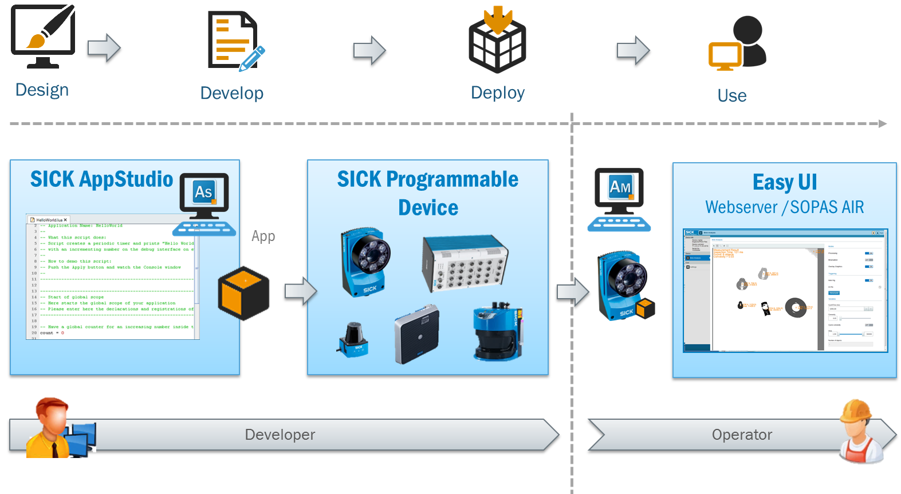

= Development lifecycle

# Design

App developers are responsible for the lifecycle of an application and must define how an application is designed, developed, deployed, and used. Developers choose the development scenario that best matches the use case and also can consider encapsulation of the application. They must also decide whether the application can be implemented using flows, scripts only, or a combination of both. In addition, parameters can be defined that are accessible from the components and these settings can be stored permanently. A user interface for device operators and its layout are also typically part of the application design phase.

## Questionnaire before you start developing your application

|===
*On which type of device(s) do you want to run you application(s)?* |
Please ask your product manager for SICK AppSpace enabled available devices.
|*Which type of application do you need? Do you want to process images, scans or other types of data, do you need communication access or both?* |
Go to the https://gitlab.com/sick-appspace/samples[samples repository] and https://apppool.cloud.sick.com/[SICK AppPool] for examples
|*Which kind of algorithms do you need for your application?* |
You should verify the manifest of the device you want to run the application on whether the algorithms are available.
|*Which kind of hardware resources do you need for your application? Which interfaces and I/O is needed?* |
You should verify the manifest of the device you want to run the application whether the hardware you need is available.
| *How big will your application finally be?* |
Think about whether you want to tailor your solution into several apps to have a higher re-usability of them. Furthermore you should drive to a clear and scalable structure of your application. Remember that you can for instance split your code into several lua scripts.
| *Do the users of your application need a user interface?* |
If yes, you should get familiar with the UI-Builder tool. See the UI-Builder tutorials for an introduction.
| *Does your application need parameters?* |
If yes, you should read the tutorial Parameter handling https://supportportal.sick.com/tutorial/parameter-handling/[on supportportal] that explains how to work with this feature.
//TODO: Add link to github when available
| *Do you have/need sample sensor data to develop on?* |
For development it is good to have recorded sample data to work on. This data needs to be recorded first if there is no data available. To see how, please download the samples https://gitlab.com/sick-appspace/samples/ImageRecorder[ImageRecorder] and https://gitlab.com/sick-appspace/samples/ScanRecorder[ScanRecorder] as an example for how to record images or scans from real devices to a file.

The recorded data can also be used to emulate data coming from the device to help during development. See the samples https://gitlab.com/sick-appspace/samples/ImagePlayer[ImagePlayer] and https://gitlab.com/sick-appspace/samples/PointCloudPlayer[PointCloudPlayer] as an example for how to play the recorded data during development.
|===

# Develop

The next step is to develop the SensorApp. *SICK AppStudio* and *SICK AppSpace SDK* are our development environments that provide developers with easy access to APIs and coding support, regardless of the selected development scenario. During development, *apps* can be run on the *SICK AppEngine* for testing or can be installed directly on the target device. Debugging is easy using the built-in remote debugging options (currently available only in *SICK AppStudio*), which include 2D and 3D visualizations of elements.

# Deploy

Once you have completed the development cycle and tested the applications, you can deploy your solution in a single package. It is also possible to protect apps within a package, in order to prevent copying and to protect your source code from being read by third parties.

# Use
The deployed packages can then be installed on one or more devices using *SICK AppManager* as the package management tool.

The device and apps may also include a user interface that can be accessed by the operator via a standard web browser.
