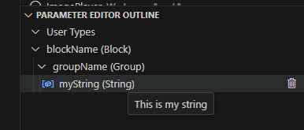
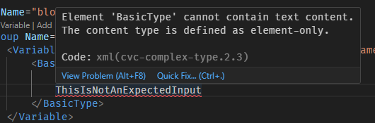

= SICK AppSpace SDK for VS Code - Parameter Editor

# About this Tutorial

Parameter files can be used as a way to persistently store data on a programmable SICK AppSpace-enabled device. They require, however, a pre-defined structure needs to be in place first for them to be functional. The "Parameter Editor" feature of the SICK AppSpace SDK helps with creating and managing the parameter description file that defines that structure.

## Overview

"Parameter Editor" allows the user to create ".cid.xml" files which are required by the parameter storage option. Editing of the parameter description files can be done manually by directly accessing the ".cid.xml" file, but the "Parameter Editor" makes it easier for the user by providing code support. This feature offers following support:

* Proofreading and validating the parameter description file.
* Coding support and autocompletion.
* Specialized XML-parser, suited for parsing ".cid.xml" files.
* CodeLens features, such as adding code for child entities, type definitions, variables etc.
* "Parameter Editor" outline that shows a parsed structure of the file.
* "Parameter Editor" outline actions such as jumping into a code fragment for the selected item in the tree.

The "Parameter Editor" also supports creation of the file by offering a starter template

## Prerequisites

* Installed https://code.visualstudio.com/download[Microsoft Visual Studio Code]
* Latest version of SICK AppSpace SDK installed - a plugin bundle for Microsoft Visual Studio Code (see https://github.com/SICKAG/SICK-AppSpace-SDK-Docs/blob/master/Documentation%20and%20Tutorials/AppStudio%20VSC%20extensions%20User%20Guide/SICK-AppSpace-SDK-Getting-Started/SICK-AppSpace-SDK-Getting-Started.adoc[Getting started tutorial on GitHub] or https://supportportal.sick.com/tutorial/sick-appspace-sdk-for-vs-code-getting-started[on the SICK Support Portal])

# Using the feature

## Creating parameter description file

To create the parameter description file, you can call a command in the command window. To do that, follow the steps below. 

. Use the the Explorer view to select the application you want to create the parameter description file in. If the "parameters" component is not included in the app, create a new folder inside it and name it "parameters".
+

. Create a new file in the "parameters" folder with extension ".cid.xml" and open that file.
+

. Open the command window in the Microsoft Visual Studio Code (click F1 on keyboard). 
. Find the create command. It is "SICK AppSpace: Generate a starter template for the parameter.cid.xml file." , but typing "starter template" is enough for the search functionality to find it.
+

. Select the command.

Selecting the described option will insert the default parameter description inside the selected file.

This feature also supports you when selecting empty or creating new ".cid.xml" files. A dialog window will appear asking to insert a starter template into the opened file.

## Editing the parameter description file

Editing the parameter description file is done by opening the file in the Microsoft Visual Studio Code. The following features will help you in your editing efforts.

### CodeLenses

The CodeLenses can be enabled and disabled by calling the appropriate command in the command window. The commands are "SICK AppSpace: Enable CodeLens for Parameter Editor" and "SICK AppSpace: Disable CodeLens for Parameter Editor".

image::media/Disable-Enable-Codelens-Parameters.png[]

When activated, a CodeLens appears above every XML tag in the ".cid.xml" file where it is possible to add child entities. For example: to the "CID" element, "Block" and "UserType" elements can be added. Selecting the CodeLens action "Add Block" or "Add User Type" will insert the referenced block in the structure.

When adding more complex entries, like variables which can assume one of the several types, a dialog opens. Details of the element can be selected there, such as variable type and other properties. Nested structures, like "Array" of "Arrays", can also be added this way.

All code inserted via the CodeLens needs to be further modified by the user to add details about created entry. This includes actions such as changing the name of the variable, limiting array length etc.

### "Parameter Editor" outline

When activated, the "Parameter Editor" outline appears automatically when the ".cid.xml" file is opened.  Similarly to the CodeView, the feature can be enabled or disabled via the appropriate command. The commands are "SICK AppSpace: Enable tree view for Parameter Editor" and "SICK AppSpace: Disable tree view for Parameter Editor". The outline will appear in the *SICK AppSpace SDK* view.

Selecting the command "SICK AppSpace: Focus on Parameter editor outline view" will automatically open the *SICK AppSpace SDK* view and focus on the outline.

All elements of the outline can be interacted with:

* Hovering over an item displays a tooltip with a description of the corresponding XML tag.
+

* Clicking on an item automatically jumps to the code it represents.
+
 ->

* When an item is selected, the actions that can be performed on it will appear next to it. They offer the same options and work in a similar fashion as the CodeLenses.
+

* The element can be deleted using the "Trash bin" button. This action will also delete all children of an item, if it contains any. The section to be deleted will be marked in the editor and a confirmation dialog appears.
+

### Proofreading and autocompletion

Editing the parameter description file is also supported by the proofreading feature, which checks the correctness of the entered data, and provides autocompletion, which helps the user to enter the data correctly.

Proofreading checks the file against the known scheme of the ".cid.xml" files and notifies the user whenever erroneous data is entered. When it detects a wrong entry, it will underline it in the code editor. Hovering over the underlined line will show more details about the error.

Autocompletion is activated by clicking CTRL + SPACE while editing the parameter description code. When used, it will show all properties, child types and other additional options that are described by the ".cid.xml" schema. 

There are also additional diagnostics available, that the ".cid.xml" schema can't provide. These include detecting name conflicts between child entities and misuse of custom "UserTypes".

# More information

More information about the parameters and parameter description file can be found in the https://github.com/SICKAG/SICK-AppSpace-SDK-Docs/blob/master/Documentation%20and%20Tutorials/Programming%20SensorApps/5.10_ParameterHandling/5.10_ParameterHandling.adoc["Parameter Handling" tutorial on GitHub] or https://supportportal.sick.com/tutorial/parameter-handling[on the SICK Support Portal].

