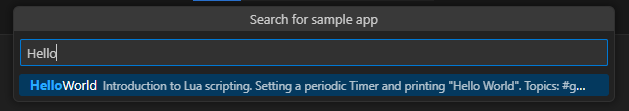

= SICK AppSpace SDK for VS Code - sample import

# About this tutorial

## Overview

The sample import feature enables the user to easily import the SICK AppSpace samples ("SampleApps") from the official SICK GitHub repository and store them on a local drive. This tutorial showcases this feature.

## Prerequisites

* Installed https://code.visualstudio.com/download[Microsoft Visual Studio Code]
* Latest version of the SICK AppSpace SDK installed - a plugin bundle for Microsoft Visual Studio Code (see https://github.com/SICKAG/SICK-AppSpace-SDK-Docs/blob/master/Documentation%20and%20Tutorials/AppStudio%20VSC%20extensions%20User%20Guide/SICK-AppSpace-SDK-Getting-Started/SICK-AppSpace-SDK-Getting-Started.adoc[Getting started tutorial on GitHub] or https://supportportal.sick.com/tutorial/sick-appspace-sdk-for-vs-code-getting-started[on the SICK Support Portal])

# Importing samples from GitHub

## General information

 * The sample import feature downloads the samples from the https://github.com/sick-appspace-samples/[official SICK sample GitHub repository].
 * The SampleApps are then stored locally within the user's global Microsoft Visual Studio Code storage.
 * Each sample is assigned an own workspace and all the apps from within the sample are unpacked there.

*Note:* Currently, the sample import feature cannot use the user's GitHub credentials and uses unauthorized access. This type of access allows for downloading the files from GitHub, but the request quota may be limited by the server to prevent overloads. This may cause slight slowdowns in the performance of the sample import search functionality.

## Downloading samples

To download a sample with the sample import feature, follow the workflow below:

. Navigate to the *SICK AppSpace SDK* view and click the menu icon (three dots) next to the title of the *Workspaces* section and select "Import sample".
+

. The menu will open in the center. Use the search function to find specific SampleApps by their names or tags.
+

. Selecting a sample will start the download. The download progress is displayed in the window in the bottom right corner of VS Code.
+

. After the sample is downloaded, it will be automatically extracted to a new workspace. It will then appear in the *Workspaces* section of the *SICK AppSpace SDK* view.
+

*NOTE:* Selecting a sample that has previously been downloaded will result in an error. To restore the sample to its original state, use the management feature described below to delete the sample and then download it again.

# Managing downloaded samples

## General information

The sample import feature also offers a way to manage downloaded samples in the Microsoft Visual Studio Code user interface. Firstly, it enables you to hide or show the samples in the *Workspaces* section. Secondly, it can delete all or only selected samples along with their workspaces.

The management options can be accessed via the extended options menu of the *Workspaces* section (the three dots icon).
+

## Showing and hiding samples

To hide all sample workspaces to not display them in the *Workspaces* view, select the "Hide samples" option from the menu. Note that it will not uninstall or delete the samples from connected devices. This feature is useful if you do not want to see the samples workspaces at the moment but you also don't want to delete them completely. To display them again, go to the same menu and select "Show samples".

## Deleting samples

Deleting samples is performed by selecting "Delete samples" in the menu. This action lets the deletion menu appear, within which individual samples can be selected. Also, all the samples can be selected at once by clicking on the checkbox next to the displayed search bar. After confirmation, the selected samples get deleted from the local storage. Note that if you want to access the deleted content later, it needs to be downloaded again.

