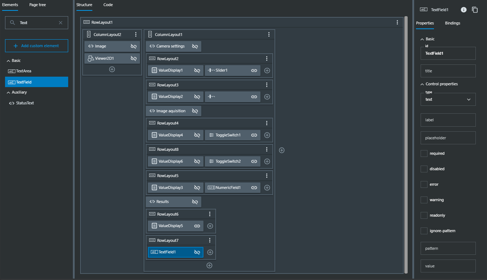
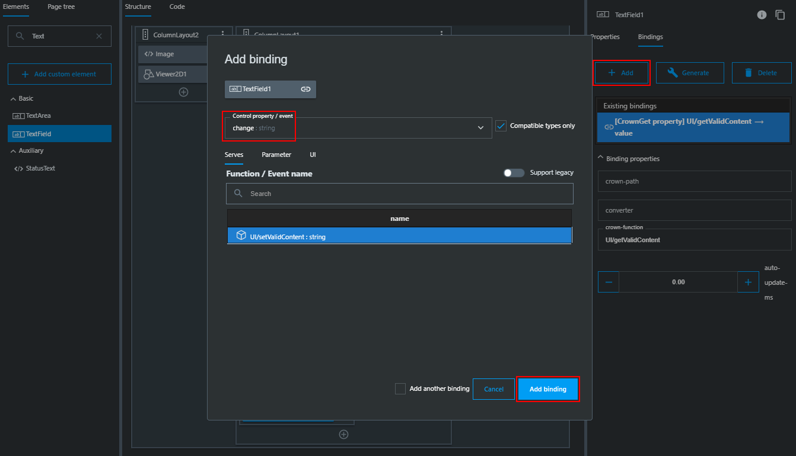

= SICK AppSpace SDK - First SensorApp - step by step

# About this Tutorial
## Overview
This demonstration allows a quick introduction to the SICK AppSpace toolchain. We follow Ulrike User and Doris Developer through the following steps:

. Downloading a SensorApp from a public SICK repository
. Connecting to SICK AppEngine and installing the SensorApp
. Interacting with the web-based user interface of the SensorApp
. Modifying the SensorApp functionality and user interface

The described activity can be done without additional instructions to obtain a hands-on experience with SICK AppSpace, and it can be used as a demo in a training or discussion context.

[NOTE]
====
The instructions are accompanied by comments in the source code of the SensorApp. Thus, for the standard exercise, participants only need to delete the characters "--" in front of the respective lines in the source code. The respective parts are marked/numbered within the source code by "\*#*" and referenced respectively within the instructions given in this exercise.
====

## Prerequisites
 * _Microsoft Visual Studio Code_
 * _SICK AppSpace SDK for Microsoft Visual Studio Code_ installed. Installation instructions can be found in the https://github.com/SICKAG/SICK-AppSpace-SDK-Docs/blob/master/SICK-AppSpace-SDK-Getting-Started/SICK-AppSpace-SDK-Getting-Started.adoc#installation[SICK AppSpace SDK for VS Code guide]
 * SICK AppSpace enabled device - choose one of the following options:
 ** Device emulation via SICK AppEngine 1.3.2 or newer (download available on https://sick.com[sick.com]; operational for 2 hours at a time as demo version: https://www.sick.com/sick-appengine-28x6429-windows/p/p663780[for Windows] or https://www.sick.com/sick-appengine-28x6429-linux/p/p663779[for Linux])
 ** InspectorP with power supply and connection cables (recommendation: InspectorP 63x - using other models is also possible but might result in some limitations in step 5 due to potentially not providing a beeper or a red feedback LED) 
 * An up-to-date browser (Chrome recommended)
 * Recommended: Very basic programming knowledge on the side of the participant(s)

# Step-by-step guide
.Story
****
_In a packaging facility, a printer prints individual QR codes. Ulrike User is tasked with setting up a sensor solution to verify that the printed QR codes have the correct content. She hears about the Development Demonstration SensorApp which may perform such a task when installed on a programmable InspectorP device from SICK._
****

In this tutorial, we will use the SICK AppEngine software instead of an actual device. This will allow everyone to follow the described process, even if no physical devices is at hand.

## Step 1: Download and add the SensorApp to the workspace
****
_Ulrike finds the SensorApp in one of the public SICK repositories and downloads it._
****
. Access the linked https://github.com/SICKAG/SICK-AppSpace-SDK-Docs/blob/master/SICK-AppSpace-SDK-Your-First-SensorApp/QRCodeReader.zip[zip file containing a sample SensorApp on github]
. Click on the *Download* button in the browser
+

. Start _Microsoft Visual Studio Code_ with installed _SICK AppSpace SDK_ and open a workspace folder (any folder in which you wish to keep your SensorApps)
. Open the workspace folder in the Explorer
.. Right click on the empty space in the Workspace Folder section of the _Explorer_ view
// TODO: Linux has different prompt in the context menu. Maybe add alternatives
.. Select *Reveal in File Explorer*
+

. Extract the downloaded zip file to a separate directory inside the Workspace Folder

## Step 2: Connect to the SICK AppSpace device and install the SensorApp
****
_Ulrike now wants to find out if the Development Demonstration SensorApp serves her purpose of verifying the QR codes._
****

. If not started yet, start _Microsoft Visual Studio Code_ with installed _SICK AppSpace SDK_
. Start the SICK AppSpace device:
* If you are not using a real device: start SICK AppEngine
* If you are using InspectorP:
.. Connect the InspectorP to the power supply
.. Connect the InspectorP to the computer via ethernet
+
NOTE: More information on how to connect the InspectorP can be found in the Operating Instructions of the device https://cdn.sick.com/media/docs/6/76/776/operating_instructions_inspectorp63x_flex_c_mount_and_s_mount_en_im0068776.pdf[(link to the respective InspectorP63x document)]

. Connect the SDK with the SICK AppSpace device:
.. Open the *SICK AppSpace SDK* view
+

.. Find the *Device list* section
+

.. Click on the scan button (magnifying glass icon) next to the name of the section. This will open a scan window
+

.. Select the interface, which includes your device
* If you are using SICK AppEngine: select the entry, which includes the local IP address in its description (127.0.0.1) and click *OK*
+

* If you are using an InspectorP: select the entry, which fits to the IP address of the device in its description and click *OK*
** Example: your InspectorP has the address _192.168.0.1_, therefore _Ethernet 5_ from the list needs to be selected as it is located in the same network
+

.. Now the search process starts. After a successful search, the found SICK AppSpace device appears in the result window. Select it and click *OK*. You have now added it to the device list.
+

.. Click on the refresh button next to the title of the *Device list*
+

.. The SICK AppSpace device is now displayed in the list. Click on the circle to the left of the name of the device (in this case the SICK AppEngine). If connected correctly, the circle should now include a check mark
+

+
[NOTE]
====
If you encounter any problems trying to connect to the device / SICK AppEngine, please refer to the document https://github.com/SICKAG/SICK-AppSpace-SDK-Docs/blob/master/SICK-AppSpace-SDK-Getting-Started/SICK-AppSpace-SDK-Getting-Started.adoc#connecting-to-a-device[SICK AppSpace SDK for VS Code guide]
====
. Upload / install the app to the device:
.. Find the *QRCodeReader* SensorApp in the *Workspaces* section and click on the upload button (play icon with an upwards arrow) to the right of the name of the SensorApp to upload the SensorApp to the SICK AppEngine
+

.. Press enter on your keyboard to confirm appearing prompts
+

## Step 3: Adjusting the SensorApp
****
_Ulrike wants to check if the Development Demonstration SensorApp she just installed solves her verification application. She realizes, that it does not solve her application completely, so she asks her colleague Doris Developer for help._
****
. Open the UI of the device
** Click the *Open device user interfaces* button next to the name of the connected device in the *Device list* section and select *QRCodeReader* from the selection
+

+

** Alternatively, open a web browser and use the IP address of the device in the address bar (the SICK AppEngine is typically reachable using IP address *127.0.0.1* or *localhost* and the InspectorP via its IP address)
. Adjust the *Cycle time* to get the pictures in desired intervals
+
[NOTE]
====
The additional settings available in the UI, namely _Exposure time_, _Gain_ and _Live mode_ are only available if the SensorApp is running on an actual programmable sensor. Therefore these are not available if you are using the SICK AppEngine for this exercise.
====

### Hint

## Step 4: Edit code
****
_Doris Developer adjusts the Development Demonstration SensorApp so that it reads QR codes._
****
. If not started yet, start _Microsoft Visual Studio Code_ with installed _SICK AppSpace SDK_ and _SICK AppEngine_
. If not connected already, connect to the device (see Step 2)
. Before editing the code, the SensorApp needs to be activated so the code completion can work properly
.. Open the *SICK AppSpace SDK* view
.. Find the the *App model configuration* section
+

.. In the apps selection find _QRCodeReader_ SensorApp and click on the circle to the left of it. If the SensorApp is activated correctly, the circle should now include a check mark
+

. Open the script _scripts/Processing.lua_ and _scripts/UI.lua_ via the Explorer to display them in the code editor
. In _Processing.lua_:
.. Create a CodeReader object named qrReader (see the comment containing "\*1.*" in the source code)
.. Use the object to decode and store the QR code from the images taken by the device. Visualize the codes that are found within the viewer on the UI of the SensorApp by calling the _visualizeResult()_ function (see \*2.\*)
.. To clarify further: in summary, the instructions above ask you to remove the leading "--" at the start of lines 4, 43 and 44
** Resulting code:
+
[source,lua]
----
-- *1.* Create a CodeReader object
local qrReader = Image.CodeReader.QR.create()

-- *3.* Define the target code content for comparison
-- local validContent = "SICK AppSpace"
----
+
[source,lua]
----
---Function that searches input images for QR codes
---@param img Image Input image
---@param sensorData SensorData Information about acquisition device state
---@param visualizeResult function Function from UI script used to display images
local function processImage(img, sensorData)
  if img:getType() ~= "UINT8" then
    img:toGray()
  end

  -- *2.* Use Coder Reader object to decode image and show results in viewer
local codes, duration = qrReader:decode(img)
visualizeResult(img, codes)
----
. Save the file and upload the SensorApp to the device to apply the changes (see Step 2 for detailed instructions)
. Reload the UI in your browser; the Results section now displays the QR code content and the codes are highlighted in the image shown in the viewer

## Step 5: Result feedback
****
_Ulrike is impressed by the progress. She asks Doris to make the device give visible (and / or audible) feedback, depending on whether the identified code content is "SICK AppSpace"._
****

. In _Processing.lua_:
.. Define the validContent string to be equal to "SICK AppSpace" for the comparison with the decoded QR code (see \*3.*)
.. Extract the content of the first code identified from the image and print the results in the console (see \*4.*)
.. Add an if-statement to create device feedback based on the comparison of code content and target content (validContent) (see \*5.*)
. In _UI.lua_:
.. Display the result of the comparison in the console and adjust the color of the overlay shown in the image on the UI of the SensorApp accordingly (see \*6.*)
* Remove the leading "--" at the start of the respective lines
* Resulting code:
+
[source,lua]
----
-- *3.* Define the target code content for comparison
local validContent = "SICK AppSpace"
----
+
[source,lua]
----
-- *4.* Extract content of first code (if any) and log comparison result
  local codeContent = nil
  if codes and #codes > 0  then
    codeContent = tostring(codes[1]:getContent())
  end
  print("Valid Input:  ", validContent)
  print("Code content: ", codeContent)

  *5.* Add if-statement to create device feedback based on comparison of code content and target content
  if codeContent == validContent then
    visualizeResult(img, codes, true)
    generateDeviceFeedback(true)
    print("Content is valid!")
  else
    visualizeResult(img, codes, false)
    generateDeviceFeedback(false)
    print("Content is invalid!")
  end
end
----
+
[source,lua]
----
- *6.* Console entry and overlay colors based on comparison of code content and target content
    if contentIsValid then
      textDeco:setColor(0, 255, 0)
      codeDecoration:setLineColor(0, 255, 0)
    elseif contentIsValid == false and contentIsValid ~= nil then
      textDeco:setColor(255, 0, 0)
      codeDecoration:setLineColor(255, 0, 0)
    end
----
. (InspectorP exclusive) In _Processing.lua_:
.. Create handles for the beeper and LED to provide audiovisual feedback (see \*7.*)
+
[source,lua]
----
-- *7:* Create handle for accessing feedback LED and beeper (InspectorP only)
local feedbackLED = LED.create("FEEDBACK_LED")
local intBeeper = Beeper.create()
----
.. In function _generateDeviceFeedback_ activate the beeper and the LED (see \*8.*)
+
[source,lua]
----
  -- *8.* Beep for 200ms and blink for 500ms (positive: high pitch and green, negative: low pitch and red) 
  if wasValidContent == true then
    intBeeper:beep(20, 200, 100)
    feedbackLED:setColor("green")
    feedbackLED:activate(500)
  else 
    intBeeper:beep(1, 200, 100)
    feedbackLED:setColor("red")
    feedbackLED:activate(500)
  end
----
. Save the file and upload SensorApp to the device to apply the changes (see Step 2 for detailed instructions)

## Step 6: Editing the UI
****
_Ulrike is happy that she can check if the printer printed QR codes with the content "SICK AppSpace." However, she expects that the code may change in the future. She wants to be able to change the code content that the device is checking for. Not being a developer herself, Ulrike cannot change the variable validContent in the source code. Therefore she asks Doris to enable the users of the SensorApp to change the value it is looking for without source code access. They decide that users should be able to input the target content via the SensorApp UI._
****

. Double click on _pages/pages/pages01/QR code reading.html_ in the Explorer to open it in the SICK UI-Builder
+

. Grab a *RowLayout* from the *Elements* selection on the left side and drag it onto the plus sign at the bottom of *ColumnLayout1*
+

. Take a *TextField* and drag-and-drop it onto the newly created *RowLayout7*
+

. Copy the already used _results_ field, move the copy between *RowLayout6* and *RowLayout7* and change the property _data-content_ on the right to "Target"
+

. Create bindings between the new UI elements and the functions for evaluation in the source code to allow them to interact
** To bind the function _getValidContent_ to the *TextField* to display the QR code on the UI:

... Click on the created text field, go to *Bindings* and press the *Add* button
... Press *Control property / event*, choose _value_ and as *Binding type* pick *Serves*
... Select the function _UI/getValidContent_
... Add the binding by pressing the *Add binding* button
+

... Open the binding properties of this binding by selecting the newly added binding in the list
... Set _auto-update-ms_ to 0 to avoid unnecessary updates to reduce the work load created by the binding
+
image::media/UIBuilder_Step6_Hint6.png[]
** To bind the text field property change to the function _setValidContent_ to enable the user to change the value to which the app should compare the decoded QR code:
... Go to *Bindings* and press *Add* button
... Press *Control property / event*, choose _change_ and as *Binding type* pick *Serves*
... Finally, add the binding _UI/setValidContent_
+

. Save the file and upload the SensorApp to the device to apply the changes and check the refreshed UI to see the new functionality (see Step 2)

