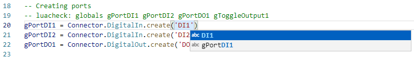

= First Steps Scripting

// add "About this tutorial/article"

# What means scripting in SICK AppSpace?

1. Programmable devices have an Embedded Virtual Machine running, which is able to interpret Lua scripts.
* We support Lua 5.3, a widely spread scripting language for embedded systems.
* See details about Lua at http://www.lua.org.

+

2. Complete API for hardware access (I/O, Com, Sensor) is directly available in Lua without the need to change into a native language.
+

3. A huge API for algorithm access is directly available in Lua.
+

# Lifecycle of scripts

1. Scripts have a *Global Scope*, which runs every time the script is started.
The Global Scope is mainly used for initialization and registration of callbacks, which are then called in...

2. ...the *Function Scope*, which holds the main part of the application.
All functions are finally called by event notifications from the underlying system.

*Exercise: Let‘s have a look on the sample "HelloWorld" and find these scopes*!

# Accessing the API from scripts in a static context

1. Open the sample "HelloWorld" after the https://gitlab.com/sick-appspace/samples/HelloWorld[download from GitLab].

2. Open the lua file "HelloWorld.lua".
+

3. Click on a free place in the lua file. Press *Ctrl+Space*. You will see an intelligent code completion pop up showing all accessible functions for this device.
+

// info: missing, shortcut doesn't work
4. Push enter and the selected item will be taken to the editor followed by a dot. More specific functions are now suggested.
+

// info: missing, shortcut doesn't work
# Accessing the API from scripts in an object oriented context

1. When programming object oriented, the intelligent code completion supports you when typing ":".
Change the function "Timer.start(handle)" to "handle:start()" (You are using the object "handle" created in line 24.).
+

2. The code completion provides partial matching. Type "handle:period" and the code completion presents all API entries for the object handle, containing "period".
+

3. Push enter and the code completion replaces the partial match with the correct function selected from the code completion pop-up.
+
image::media/handle_codeCompletion2.png[]

# Understanding samples

1. Open the sample "Hello World".
2. A timer is created.
3. Use the handle to set properties of the timer.
4. Start the timer.
5. Register a function on the OnExpired event.
+

6. The shoutHello() function is called every time the timer expires.
7. Inside this function there is a *print()* called, which just prints to the console.
+
image::media/function_shoutHello.png[]

8. Test this sample by watching the Emulator console.

# Understanding samples: Digital IO
NOTE: Open the DigitalIO.zip after the https://gitlab.com/sick-appspace/samples/DigitalIO[download from GitLab] to run the App. Please read the information in the DigitalIO.lua for more information about how to run the App.

1. Create access to digital IO-ports.
+

2. IO Ports have names which can be found by using the code completion features (Ctrl+Space) again.
+

3. Register a function on the event OnChange of portDI1 ("DI1").
+

4. See how IO-ports can be read and set.
+

5. Test this sample by pushing Key#1 and Key#2 on the Emulator console.

# Understanding samples: TCPIP Client
NOTE: Open the TCPIPClient.zip after the https://gitlab.com/sick-appspace/samples/TCPIPClient[download from GitLab] to run the App. Please read the information in the TCPIPClient.lua for more information about how to run the App.

1. Create an instance of a TCPIPClient.
+

2. Set parameters of the TCPIPClient (e.g. the IP address of the corresponding TCPIP-Server).
3. Register a function on the event *OnReceive*.
+

4. This function then receives all data which is received from the server.
+

5. Test this sample by running a TCPIP server on your PC. You should make sure that IP-Port and IP-address match to the parameters of this TCP/IP-Client.

6. See also the sample https://gitlab.com/sick-appspace/samples/TCPIPServer[TCPIPServer] if you want to implement a server on your device.

// info: Understanding samples: content changed -->samples not anymore in installation folder but on GitLab https://gitlab.com/sick-appspace/samples

# Understanding samples

* SampleApps for SICK AppSpace programmable devices give guidance for implementation and illustrate API functionality.
* You can find them on https://gitlab.com/sick-appspace/samples[GitLab].
* To use them in AppStudio 3.0.0 (or newer): Download a project via button "download" as .zip and "import" this file within SICK AppStudio.

