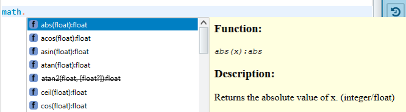

= Lua Basics

# About this article
This paragraph provides a quick overview of the basics needed to get started with Lua. It is not intended to explain Lua in any depth. More detailed information can be found at http://www.lua.org which, in addition to the API documentation, provides details about the various programming concepts and is backed up by its community.

# Working with the language LUA

Lua has some concepts which might be new for programmers who were used to other programming languages such as C or C++. For instance, it has more than one return value and duck typing may also be an unusual feature.

* Print something:
** The Lua print command puts any string onto a "screen". Depending on the device used, print will output the string on the console of that device. However, all print outputs can be seen in the SICK AppStudio console.

+
[source, lua]
----
print("Hello World!")
----

* Find out the Lua version of your device:
+
[source, lua]
----
print(_VERSION)
----

* Work with comments:
+
[source, lua]
----
-- Two dashes start an one-line comment.
--[[
Adding two [ s and ] s makes it a multi-line comment.
--]]
----

* Check out the "Duck Typing" of Lua:
** Because Lua uses duck typing, variable types do not have to be declared and may also be reassigned during runtime. The following code snippets show the assignment and print the relevant type.
+
[source, lua]
----
a = 42
print( type( a ) )    -- "number"
a = true
print( type( a ) )    -- "boolean"
a = "Hello"
print( type( a ) )    -- "string"
a = nil
print( type( a ) )    -- "nil"
a = { 1, 2, 3 }
print( type( a ) )    -- "table"
a = function() end
print( type( a ) )    -- "function"
----

# Operators
* Standard mathematical operators:
+
[source, lua]
----
print( 1 + 2 * 2 )                 -- "5"
print( 2 ^ 2 )                     -- "4"
print( 2 < 1 )                     -- "false"
print( true or false and true )    -- "true"
----
* Concatenating strings using two dots:
+
[source, lua]
----
print( "This is" .. 42 )           -- "This is 42"
----
* Getting length of arrays using hash:
+
[source, lua]
----
print( #"Hello" )                  -- "5"
----

# Assignments
[source, lua]
----
a = 42                              -- Either a single assignment ...
b, c, d = 1, "Hello", true          -- ... or a multiple assignment is possible.
print( a, b, c, d )                 -- "42    1    Hello    true"

-- Also return values can be multiple:
function returnMultiple()
  return "Hello","World"
end
print( returnMultiple() )           -- "Hello World"

-- Take care that the default setting of variables is global.
function func()
  local privatetext = "private"     -- This is just a local assignment.
  publictext = "public"             -- This is a global assignment.
  print( "From function context:" )
  print( privatetext )              -- "private"
  print( publictext )               -- "public"
end

func()                              -- Calling the assignment function.

print( "From global context:" )
print( privatetext )                -- "nil"!!!

aBoolValue = false                  -- Only nil and false are falsy; 0 and '' are true!
if not aBoolValue then print( 'that was false' ) end
----

# Strings
The standard Lua library string supports a convenient function for working with strings.
[source, lua]
----
print( string.byte( "ABCDE", 1, -3 ) )                      -- "65    66    67"
print( string.rep( "w", 3 ) )                               -- "www"
print( string.reverse( "Hello" ) )                          -- "olleH"
print( string.sub( "AppSpace", 6, -1 ) )                    -- "ace"
print( string.format( "%s %f", "Pi is exactly", math.pi ) ) -- "Pi is exactly 3.141593"
----

# Tables
Table also offers a large set of functionalities. Concatenating tables is very efficient in Lua.
[source, lua]
----
aTable = { "one", "two", "three", "four" }
print( table.concat( aTable ) )              -- "onetwothreefour"
print( table.concat( aTable, ":" ) )         -- "one:two:three:four"
print( table.concat( aTable, "-", 2, 4 ) )   -- "two-three-four"
print( table.maxn( aTable ) )                -- "4"
aTable[ #aTable + 1 ] = "five"               -- append an item
table.sort( aTable, function ( a, b ) return a < b end ) -- sort with an inline function
print( table.concat( aTable, "," ) )         -- "five,four,one,three,two"

-- Using tables as dictionaries / maps:
-- Dict literals have string keys by default:
t = { key1 = 'value1', key2 = false }
print( t.key1 )                              -- Prints 'value1'.
t.newKey = {}                                -- Adds a new key/value pair.
t.key2 = nil                                 -- Removes key2 from the table.
----

# Mathematics
The standard Lua library math already provides a large set of functions. Here is just an excerpt.
[source, lua]
----
print( math.sin( math.pi/2 ) )              --> "1"
print( math.min( 56, 4, 76, 23, 2, 76 ) )   --> "2"
print( math.frexp( 255 ) )                  --> "0.99609375 8"
----

Try more by using the "math" library of lua.

# Flow Control
Here are some samples explaining the possibilities for controlling the program flow.
[source, lua]
----
-- If then else decision:
a = 2
b = 1 + 1
if a == b then
  print( "Yes 1+1 is 2" )
else
  print( "a and b are not equal" )
end

-- While loop:
a = 3
b = 0
while( a > b ) do
  print( a .. " is still greater then " .. b )
  b = b + 1
end

-- Numerical for loop:
for i = 0, 10 do
  print( i .. ( ( i % 2 == 0 ) and " is even" or " is odd" ) )
end

-- For loop based on a generic array:
for i,v in ipairs( { 1, 4, 9 } ) do
  print( "Index is " .. i .. ", value is " .. v )
end

-- For loop based on a generic map:
capitals = { Germany = "Berlin", France = "Paris", Norway = "Oslo", England = "London", Spain = "Madrid" }   -- map
for k,v in pairs( capitals ) do
  print( "The capital of " .. k .. " is " .. v )
end

-- Repeat-until loop:
fac = 1
a = 0
repeat
  a = a + 1
  fac = fac * a
until a == 4
print( "4! = " .. fac )   -- 4! = 24

-- Recursive function:
function factorial( n )
  if n == 0 then
    return 1
  else
    return n * factorial( n - 1 )
  end
end
print( "5! = " .. factorial( 5 ) )   -- "5! = 120"
----

# Functions

* Return values, function calls and parameters work also with mismatch in length.
+
[source, lua]
----
x, y, z = 1, 2, 3, 4    -- 4 is thrown away.
function bar(a, b, c)
  print(a, b, c)
  return 4, 8, 15, 16, 23, 42
end
x, y, = bar("zaphod")   -- prints "zaphod nil nil"
                        -- Now x = 4, y = 8, values 15..42 are discarded.
----

* Functions are also variables.
+
[source, lua]
----
function doSomething()
end
-- is the same as
doSomething = function()
end
----

* Functions can be closures and anonymous.
+
[source, lua]
----
function adder(x)
  -- The returned function is created when adder is called, and remembers the value of x:
  return function (y) return x + y end
end
a1 = adder(9)
print(a1(16))   -- "25"
----

# Objects
Lua can also be used for object-oriented programming as it is demonstrated by the following sample:

[source, lua]
----
-- This corresponds to the definition of a class:
Rect = { m_width = 0, m_height = 0,
  create = function ( self, width, height )    -- This create like a constructor.
             self.m_width = width              -- The self is like a this pointer.
             self.m_height = height
             return self
           end,
  getArea = function ( self, width, height )   -- Any other member function.
             return self.m_width * self.m_height
           end
}
myRect = Rect:create( 5, 4 )   -- Creating an object.
print( "Area is " .. myRect:getArea() )   -- "Area is 20"
----

