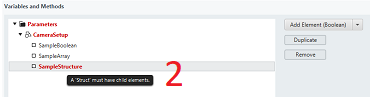

= Parameter handling

# Parameters: Definition

Parameters can be defined for an application and are globally accessible to all running apps and other app components. +
Parameters can hold basic data types like real, uint, bool, or string. +
// explain data types (see comment in mosaic https://mosaicplus.sick.com/display/wikiAppSpace/Parameters)
They can be persisted so that parameters are still valid after a reboot of the device. +
Parameters are described in an XML file which is known as a CID (Communication Interface Description) file. Every CID file which is added to the app is also added to the parameter repository of the device. The AppEngine may need to be restarted after changes have been made to the CID file in order to update changes on the device.
To create and edit a CID XML file, a parameter editor GUI is available.

Parameters have the following *properties and constraints*:

* They can be accessed (read/write) via any interface.
* They must have a system unique name in order to access them from a communication interface or from your application (using Parameters API). +
Recommendation: Prefix your application name in front of the parameter name.
* They must have a default value (DefaultValue).
* They must have a basic type like real, uint, bool, or string (BasicType). Depending on the type, some additional properties are needed, e.g. MinValue, MaxValue, and Length.
* They can have a property which defines the minimum user level needed to write the parameter (WriteAccessRef). The configuration is done via the parameter editor (can be found on the "variables" level) using an input field (see picture below).
+

* They can have a property which instructs a memory to make the parameters persistent. Therefore, their values are available after reboot (VirtualMemoryRef).
* They can easily have a binding to an user interface of your application such as pages and thus be presented to the end user.
* They must have stable names and definitions between app updates, so that they are consistently stored and restored from persistent cloning memory during upgrading/downgrading app versions on a device. +
Recommendation: Add new parameters instead of changing existing ones if you already have released versions in the field.

The following sample CID file is also included in the https://gitlab.com/sick-appspace/samples/ParametersSample[Parameters Sample].

[source, xml]
----
<?xml version="1.0" encoding="UTF-8"?>
<!-- example application cid file which adds application parameters upon runtime -->
<Device xmlns:xsi="http://www.w3.org/2001/XMLSchema-instance" xsi:noNamespaceSchemaLocation="..\..\..\..\Docu\Parameter.cid.xsd">
  <UserLevel/>
  <IFD>
    <CID>
      <Block Name="ParametersSample">
        <Group Name="General">
          <Variable Name="ASampleIntegerVar" WriteAccessRef="Run" VirtualMemoryRef="ApplicationParameters">
            <BasicType>
              <UInt DefaultValue="0" MaxValue="99" MinValue="0"/>
            </BasicType>
          </Variable>
          <Variable Name="ASampleFloatVar" WriteAccessRef="Run" VirtualMemoryRef="ApplicationParameters">
            <BasicType>
              <Real DefaultValue="30.0" MaxValue="1000.0" MinValue="0.0"/>
            </BasicType>
          </Variable>
          <Variable Name="ASampleStringVar" WriteAccessRef="Run" VirtualMemoryRef="ApplicationParameters">
            <BasicType>
              <String FixedLength="False" Length="80" DefaultValue="A sample string parameter"/>
            </BasicType>
          </Variable>
          <Variable Name="ASampleStructVar" WriteAccessRef="Run" VirtualMemoryRef="ApplicationParameters">
            <Struct>
              <BasicType Name="MyBool">
                <Bool DefaultValue="False"/>
              </BasicType>
              <BasicType Name="MyInt">
                <UDInt DefaultValue="10"/>
              </BasicType>
            </Struct>
          </Variable>
        </Group>
      </Block>
    </CID>
  </IFD>
  <Hardware>
    <VirtualMemory Name="ApplicationParameters"/>
  </Hardware>
</Device>
----

# Parameters editor: New parameter definition

1. If your app was created without a "parameters" component: create a new "parameters" component within your app by right clicking on the app in the "Working directory".
+

2. Create a "New Parameter definition" and input a filename, e.g. parameters.cid.xml.
+

3. The "*.cid.xml" file is created and automatically opened within the parameter editor.
+

# Parameters - types: New parameter definition

1. The first step is to create one or more groups to structure the variable definitions of the parameters using the "Add Group" menu button.
+

2. In the next step you can create variables using the menu button.
+

3. The details of each element can be changed in the details section on the right of the parameter editor.
+

# Parameters editor: General

1. The parameter editor provides instant validation on each field. You can get detailed information about the problem by hovering over the "X" symbol.
2. Hovering over the "?" symbol will provide documentation on the related field.

# Parameters - types: Accessing basic types
* The basic types are Boolean, String, Integer, Real.
* Once a parameter with a basic type is defined via a "*.xml.cid" file using the parameter editor (see above) and the app is deployed onto the device, the parameter is added to the parameter repository of the device. It can be accessed via script and UI-Builder in the following way:

Access from scripts:
[source, lua]
----
Parameters.get("SampleBoolean")
Parameters.set("SampleBoolean",value)
----

Access with UI-Builder:

# Parameters - types: Array definition

The array definition is the correspondent of the array definition in C.

1. It carries the mandatory attribute "Length".
2. The element type of an Array can be a BasicType, a Struct, a UserType or another array.

# Parameters - types: Accessing arrays

*An array is accessible from script via Node or directly:*

Access from Scripts (direct): +
[source, lua]
----
Parameters.get("MyArray[0]/MyVariable")
Parameters.set("MyArray[0]/MyVariable", value)
----

Access from Scripts (with Node):
[source, lua]
----
myNode = Parameters.getNode("MyArray[0]")
myNode:get("MyVariable")

yNode:set (value,"MyVariable")
Parameters.setNode ("MyArray[0]", myNode)
----

*Alternatively, arrays are also accessible from the user interface:*

Access with UI-Builder:

[NOTE]
====
The array field index starts with 0 and is hexadecimal, therefore a conversion may be necessary!
====

# Parameters - types: Struct definition

1. The struct definition is the correspondent of the struct type of C. It contains a number of child types. Each child type has a name.
The member type of Struct can be a BasicType, an Array, a UserType or another Struct.
+

2. A struct has to have at least one child. If not, it is presented in red. The tooltip gives information about what the problem is.
+

# Parameters - types: Accessing structs

*A struct is accessible from script via Node or directly:*

Access from Scripts (direct):
[source, lua]
----
Parameters.get("MyStruct/MyVariable")
Parameters.set("MyStruct/MyVariable")
----

Access form Scripts (with Node):
[source, lua]
----
myNode = Parameters.getNode("MyStruct")
myNode:get("MyVariable")

myNode:set (value,"MyVariable")
Parameters.setNode ("MyStruct", myNode)
----

*Alternatively, structs are also accessible from the user interface:*

Access with UI-Builder:

[NOTE]
====
The array field index starts with 0 and is hexadecimal, therefore a conversion may be necessary!
====

// information that needs to be added (see comments on mosaic https://mosaicplus.sick.com/display/wikiAppSpace/Parameters)
// * example how to access a parameter array
// * information about the role of blocks and groups
// * update example regarding unique parameter names

