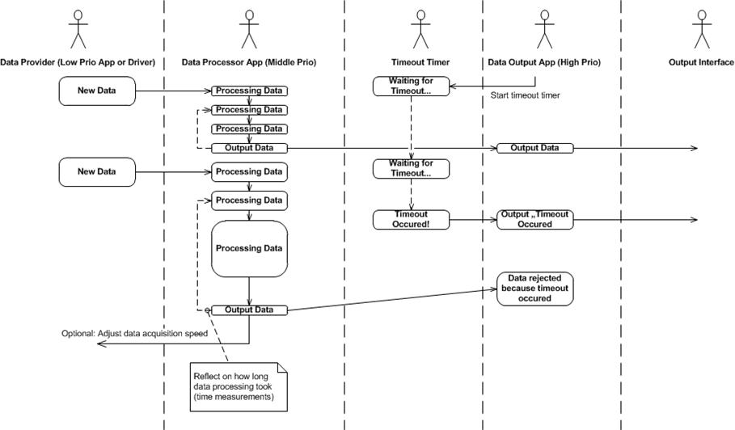

= Multiple apps

# How to design multiple apps I

*Task:* Pass data from one app to another app.

*Solution A:* Create an event using the 'Serve event' dialog.

Right click anywhere (for high availability within the global scope) in the script of the data producer to open the context menu and choose the 'Serve event' option to open the dialog.

Select an event name, add one or multiple desired parameters and click 'Serve' to automatically declare the event and insert the ServeEvent code into the script.

In the data consumer, start typing the name of the crown where the event was created, select the desired event and hit enter to insert the event registration code snippet.

[IMPORTANT]
====
Be aware of the fact, that if you change e.g. the handle for the event within the code at a later point in time, you have to manually adjust the app properties accordingly. They are not updated automatically. (See screenshots in "Solution B").
====

Solution B: Declare an event in the "App properties" dialog of the data producer app.

In the data producer app, serve the previously declared event and provide data.

Note: Any type of payload data can be passed, not only "int"!

In the data consumer app, register to the event of the producer app.

# Alternative solution
Alternative to events: Call a function of the data consumer in the data producer.

*But:* Be aware of the fact that functions *block* the calling app until the function execution has finished. Also, this way the producer is no more independent from the consumer and there is no simple way to dispatch generated data to multiple consumers automatically.

*So:*

* Prefer events to pass data to a consumer while continuing processing.
** Events are asynchronous.
** Data can be dispatched to multiple clients without writing any code in the producer.
* Use functions *only when* the producer has to wait for the consumer to finish some tasks.
** Tight coupling of producer and consumer.

# How to design multiple apps II
*Task:* There is a need to pass more than one data item at once.

*Possible solutions:*

1. Use serve dialog to create serve for multiple parameters (as shown above in solution I/A).
+
*or*
+
2. Declare and use events with more than one parameter (as shown above in solution I/B).
+
*or*
+
3. When things get too complicated, use CROWNs with "Properties" to group data together, like in a "struct" in C and pass the grouped data via events.

See also SampleApp https://gitlab.com/sick-appspace/samples/Properties[Properties] for a new data type called "Address" which is a compound of address-related information (first name, last name, street, city etc.).

# How to design multiple apps III
*Task:*  There is a data processing which takes different amounts of time to process data, leading to jitter effects, but you want real-time behavior.

*Solution:* Decouple data output from data processing by splitting the solution into two separate apps.

* One app processes data (here called "DataProcessor").
* The other app (here called "DataOutput") waits for the DataProcessor to provide data.
* The DataOutput app has a Timer to detect time-outs in case that the DataProcessor took to long to process data.
* In case of a time-out, report that to the output interface instead of the data.
* The DataProcessor can do time measurements to adapt to high load scenarios, for example:
** Choose other processing algorithms that are less time consuming.
** Control the data source to deliver less data.

Use case /flow chart diagram:

* The DataOutput app should be given a higher priority than the DataProcessor app, so it has a chance to handle time-out scenarios even when there is heavy processing.

* For further information see also the following samples:
+
https://gitlab.com/sick-appspace/samples/MultipleAppEvents[Multiple App Events] +
https://gitlab.com/sick-appspace/samples/MultipleAppFunctions[Multiple App Functions]

