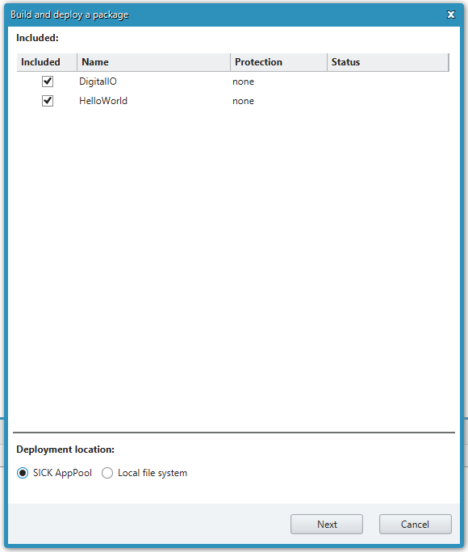

= Application Packaging in SICK AppStudio

# Overview : What does application packaging mean?

Application Packaging means packing applications into the SAPK file format which can be distributed to the end customer for installation on the sensor using SICK AppManager.
All active apps shown in your Working directory are considered for packaging.

Building a package is possible from within SICK AppStudio directly after development. This process packs active apps into a single package. A dialog guides the user through the necessary steps, including choosing which of the apps will end up in the package, the option to fill out version information as well as to include extended release notes. Within SICK AppStudio, single apps are handled as a collection of files; Since using SICK AppStudio requires a valid SICK AppStudio license, these files cannot be deployed on a device without such a license. Thus apps should be packaged either by SICK AppStudio's upload process or by the package creation process. Therefore, packed SAPK files must be distributed to the end customer. Since each app within the package is handled separately when it is deployed on a device, it must be ensured that each app is named appropriately so that it can run alongside existing apps without being overwritten.

# What is inside a package?

A package (*.sapk file, *.stpk file) contains all applications which you include.

A package also contains the *meta-information* which have been defined within the app properties.

Before deployment, it must be ensured that every app is assigned the correct property settings. This includes things like author and version information as well as its protection state. The protection is necessary to protect the apps or their codes after deployment to the target device. However, it must be noted that the protection is only activated after the package has been deployed on the device.

# Building and deploying SensorApps

Note: during the process, you can either choose to deploy the packaged SensorApp on the SICK AppPool - an online repository for SensorApps, or to save the package locally.

## Starting the package creation

. Open one or more samples after the https://gitlab.com/sick-appspace/samples[download from GitLab] (e.g. https://gitlab.com/sick-appspace/samples/HelloWorld[HelloWorld] and https://gitlab.com/sick-appspace/samples/DigitalIO[DigitalIO]).

. They are then shown in the "Working directory" tab.
+

. Press the button "Build/Deploy package" on the toolbar (or via the menu "Build").
+

. Then the "Build and deploy" window appears.
+

. Select the applications you want to include.
+

## Deployment option: Deploying to the SICK AppPool

One option of package deployment is publishing the SensorApp on the SICK AppPool. This webservice allows for sharing and monetizing published apps by using secure SICK online services.
Please follow these steps to set up package deployment on SICK AppPool, after completing the steps described in the section Starting package creation.

. Select the option "SICK AppPool".
+

. Then click on the button "Next".
+
image::media/clickNext_AS.png[]

. If you are not yet logged into the SICK ID service, the log-in dialog appears.
+

. Select the preferred settings in case the cookies pop-up appears.
. If you do not have an account, press the "Register" button.
+

. Enter your SICK ID credentials and press the "Log In" button.
+
image::media/sickID_login_AS.png[]

. In the next step you can select the app in the SICK AppPool, to which you want to upload a new version - you can only select apps that you own.
+

** If your app is not represented in the SICK AppPool, click the "Create new App" link if you want to create a new app - This link will take you to the corresponding SICK AppPool page, which leads you through the process of creating a representation of your app on the SICK AppPool. During the process you will be able to define e.g. a detailed description, an icon, the pricing, contact data, documentation, access rights and device compatibility.
+
image::media/appPoolAppSelection_newApp_AS.png[]

. Press the button "Next" in the packaging dialog in SICK AppStudio.

## Deployment option: Deploying to the local file system

Building and deploying a package to a local file system is very similar to the process for publishing the SensorApps on the SICK AppPool. Instead of choosing an online app on the SICK AppPool, you just need to select an output directory. The difference is that this process will result in an ".sapk" file that can be shared manually.
The described steps follow the steps mentioned above in <<Starting package creation>>, choose "Local file system" and press "Next".

## Building a packaged application

. After having completed the steps either for deployment described above (either to SICK AppPool or to your local file system), you can define the version number of the newly uploaded SAPK as well as release notes. In the case of local deploy, you can also select an output directory and a file name. By selecting the option "Create documentation", the CROWN / API documentation will be created and added to the package. By selecting the "Deploy UI source code" option, you can make your UI editable, if someone downloads your app to their working directory (only if the app is editable by other users). Note: the following screenshots are taken from the deployment process to the SICK AppPool, the dialog is almost identical in the case of a local deployment.
+

+
NOTE: The release notes are stored in the packaged file (*.sapk). They are also available "offline" after downloading the version from SICK AppPool.

. If you are uploading to the SICK AppPool, there's an extra step: you can check the summary of the app creation. If everything is in order, press the "Upload" button to upload the package to the SICK AppPool. If changes are needed you can navigate back to previous wizard pages.
+

. If the upload is successful, you will be able to see a new version of the app on the SICK AppPool or in the chosen directory.
+

# Validation
It is possible to add information to the app manifests about the used functions and events. This information will be used when installing the apps onto the device to validate whether or not the device has all the capabilities to allow the SensorApp to run. The "uses" section must therefore be filled out in the "App properties" tab accordingly.

# Automated SAPK Building with the SICK AppStudio CLI
SICK AppStudio comes with a CLI tool which enables the user to create jobs to automatically build SAPKs based on apps located in a SICK AppStudio working directory. The SICK AppStudio CLI allows the addition of release notes, an icon etc. and the encryption of deployed SensorApps prior to the distribution in order to ensure that intellectual property is protected. Please note that a valid SICK AppStudio license is required to build SAPKs.
Please refer to the https://supportportal.sick.com/tutorial/sick-appstudio-cli/["SICK AppStudio CLI" tutorial on the SICK Support Portal] in order to find more details on the CLI and how it works.

