= Application Packaging in SICK AppSpace SDK

# Overview : What does application packaging mean?

Application Packaging means packing applications into the SAPK file format which can be distributed to the end customer for installation on the sensor using SICK AppManager or other software.

Building a package is possible from within SICK AppSpace SDK directly after the SensorApp development. This process packs selected apps into a single package. A dialog guides the user through the necessary steps, including choosing which of the apps will end up in the package, the option to fill out version information as well as to include extended release notes. For SICK AppSpace SDK, the apps are unpackaged collections of files; these files cannot be deployed on a device without first packaging them, either by using the upload process of SICK AppSpace SDK or by the package creation process. Therefore, packed SAPK files must be distributed to the end customer. Since each app within the package is handled separately when it is deployed on a device, it must be ensured that each app is named appropriately so that it can run alongside existing apps without being overwritten.

# What is inside a package?

A package (*.sapk file, *.stpk file) contains all applications which you include.

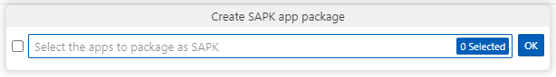

A package also contains the *meta-information* which have been defined within the app properties.

Before deployment, it must be ensured that every app is assigned the correct property settings. This includes things like author and version information as well as its protection state. The protection is necessary to protect the apps or their codes after deployment to the target device. However, it must be noted that the protection is only activated after the package has been deployed on the device.

NOTE: SICK AppSpace SDK currently does not provide the possibility to activate read or copy protection.

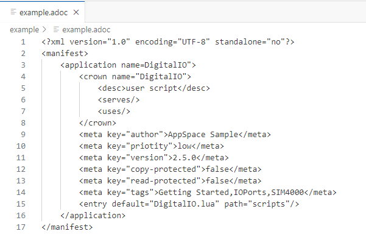

//TODO: Replace image once the properties editor is in

# Building and deploying SensorApps

Packaging and deploying is done in two steps: first, you need to package the apps as an SAPK file, then you need to distribute them. For distribution, you can either choose the SICK AppPool - an online repository for SensorApps, or to store the package locally and distribute it manually.

## Building an SAPK file

. Download and unpack into your working directory one or more samples from https://gitlab.com/sick-appspace/samples[sample repository on GitLab] (e.g. https://gitlab.com/sick-appspace/samples/HelloWorld[HelloWorld] and https://gitlab.com/sick-appspace/samples/DigitalIO[DigitalIO]).

. Start Microsoft Visual Studio code with SICK AppSpace SDK plugins installed and go to the "SICK AppSpace SDK" view.
+
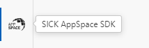

. Press the button "Create SAPK app package" next to the title of the "WORKSPACES" section.
+
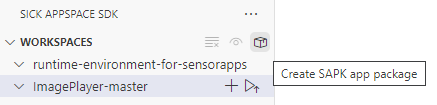

. The build package menu appears. Select the applications you want to include and click 'OK' or press "Return" on your keyboard to continue.
+

. Next, select a name for your package and continue.
+
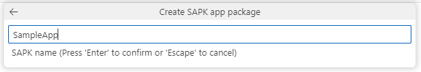

. In the next step, you need to select a version number for your app. It needs to fit the X.Y.Z format, or so called https://semver.org/[Semantic Versioning] format.
+
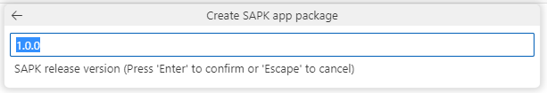

. Next, you are able to add a "Release notes file". It is recommended to include it in the html format. To do so, provide a path to the file in the text field. This step is optional and can be skipped by not providing any path and pressing "Return".
+
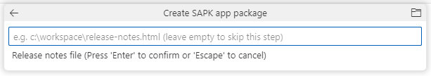
+
NOTE: The release notes are stored in the packaged file (*.sapk). They are also available "offline" after downloading the SensorApp version from the SICK AppPool.

. Finally, you need to select a directory where the SAPK file will be saved upon creation. By default, it will be the same working directory the apps are coming from. Please note, that you need to provide a path to the already existing directory.
+
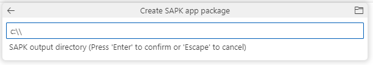

. Upon completing this step, the build process will start. At the end you will find the SAPK file in the selected output directory. It is ready for deployment.
+
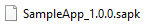

## Deploying to the SICK AppPool

One option of package deployment is publishing the SensorApp on the SICK AppPool. This webservice allows for sharing and monetizing published apps by using secure SICK online services.

. Go to https://apppool.cloud.sick.com[SICK AppPool] and login with yor SICK ID.
+
NOTE: If you don't have a SICK ID account yet, please register a new account and log into the account.

. On the SICK AppPool you can add a new SensorApp to publish your SAPK or upload the package to an already existing SensorApp.

** To add new SensorApp:

... Press the "Add new SensorApp" button and follow the guided process. During the process you will be able to define e.g. a detailed description, an icon, the pricing, contact data, documentation, access rights and device compatibility.
+
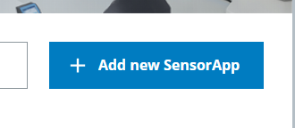

** To add the packaged file to a SensorApp, which is already represented on the SICK AppPool:

... In SICK AppPool, select "Owned by me" filter in the "Explore" section. This will show you all the SensorApps you are the owner of and therefore can add new SAPKs to.
+
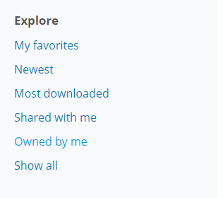

... Click on the SensorApp to which you want to add the new SAPK to. On the SensorApp page, press the "Edit" button and add the new file within the "Versions" tab.
+
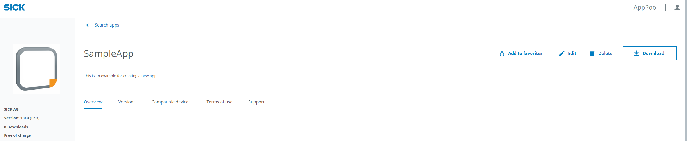
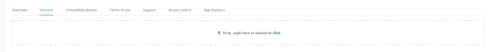

. Now, you can find the uploaded file in the "Versions" tab of the SensorApp page.
+
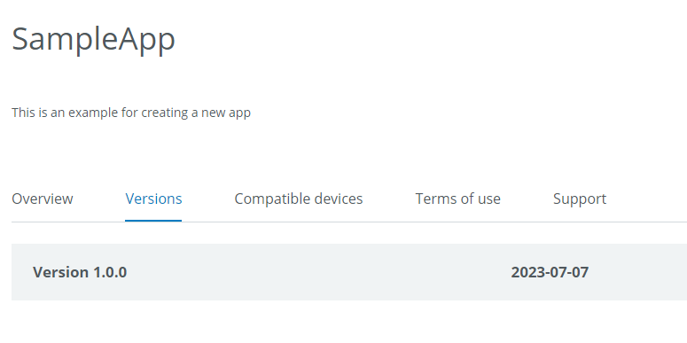

# Validation
It is possible to add information to the app manifests about the used functions and events. This information will be used when installing the apps onto the device to validate whether or not the device has all the capabilities to allow the SensorApp to run. The "uses" section must therefore be filled out in the app properties accordingly.

