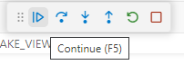
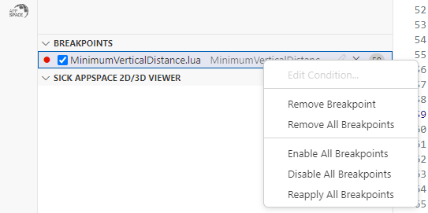

= Debugging in SICK AppSpace SDK

## About this tutorial

This tutorial shows how to use a debugger in Microsoft Visual Studio Code with SICK AppSpace SDK plugins. It will use a https://gitlab.com/sick-appspace/samples/MinimumVerticalDistance[Minimum Vertical Distance] sample from our https://gitlab.com/sick-appspace/samples[samples repository] as an example.

## Open a sample application

. First you need to start Microsoft VS Code with SICK AppSpace SDK plugins and to connect to the emulator.
+

. Open the sample application Minimum Vertical Distance after you  https://gitlab.com/sick-appspace/samples/MinimumVerticalDistance[downloaded it from GitLab] as a .zip file.

. This sample includes recorded scans as resources.
+

## Understand the sample application
NOTE: Please read the included "readme.md" for information about how to run the app.

. In the global scope of this script, a file provider is created that will use recorded files from the resources directory to provide data to the script.
+

. The function handleNewScan() is then called for every scan. The scan is given as function parameter to this callback.
+

## Run the Application: Viewing PointClouds

. First, you start the application.
. At the end of the handleNewScan() callback the filtered scan is given to a viewer.
+

. Open the device page to see the Point-Cloud.
+

. The calculated "smallest vertical distance" of each scan is printed in the console.
+

## Debug the application: Control the debugging

. To debug an app, click F5 on your keyboard or select the "Start Debugging" option from the "Run" menu.
+
NOTE: Please note that you just can debug one application at once.
+

. From the help menu, select the App you want to debug with arrow keys and press Return or click on it with a mouse cursor. Select the service run level and confirm the password by pressing Return if prompted.
+

. You will see the debugger stopping at the first line.
+

. Toggle a "Breakpoint" by clicking on the place left to the line number in the handleNewScan() function. You will see a dot if done correctly (blue dot in SICK AppStudio, red dot in Microsoft VS Code).
+
image::media/toggleBreakpoint_SDK.png[]

. Resume the application using the "Continue" button (F5).
+

. You will see the script stopping at the position of the breakpoint and you will also see the processing times in the end of the code line.
+

. You can also step script one line at the time by clicking the "Step over" or "Step into" button (F10 and F11 respectively).
+

+
When used at the line with the lua function the step over button will execute the function, the step into will go inside the function and continue the debug there.

. To stop debugging, click on the Stop button or press Shift + F5.

## Editing Breakpoints

. Breakpoints can be set by clicking on the place left to the line number or alternatively by pressing F9 - this will toggle a breakpoint on the line in which the caret currently is.

. You can manipulate breakpoints in the designated area in the "Run and Debug" view.
+

. Deleting: select a breakpoint or breakpoints and press "Delete" on your keyboard, or right click on a breakpoint and select "Remove breakpoint", or click on the X button in the line with the breakpoint entry.

. Activating and deactivating: click on the check mark on the left of the breakpoint entry in the list.

. Defining breakpoint conditions (debugging needs to be stopped first): Click on the pencil button in the line with the breakpoint entry or right click on the breakpoint and select Edit Condition...
+
NOTE: Conditions can only 'see' those variables that are available in the scope of the context where the breakpoint is placed, i.e. if the breakpoint is placed within a function, the conditions can be based on the variables that are global or were declared locally in the function. Conditions use the same expressions as in lua.

. Deleting all breakpoints: Click on the "Remove All Breakpoints" button on the right to the "Breakpoints" section title or right click on any breakpoint and select "Remove All Breakpoints".
+

. Activating and deactivating all breakpoints: click on the "Toggle Activate Breakpoints" button on the right of the "Breakpoints" section title.
+

## Watch variables during debugging

. Go to the "Run and Debug" view and expand the "Variables" section.
+ 

. You will find there all the variables relevant to the current scope and their actual values.

. To see the variables change, use debugging controls to step the script.

## 2D Debugging: Variables tab and image preview

. Load the sample "ImagePlayer" after you https://gitlab.com/sick-appspace/samples/ImagePlayer[downloaded it from GitLab] and start debugging.
+
NOTE: Please read the included "readme.md" for information about how to run the app.

. Define a breakpoint in the handleNewImage() function and resume debugging.
+

. In the "Variables" subsection of the "Run and Debug" view: right click on the "img" variable and select watch to see the image preview:
+

## 2D Debugging: Control the Watch section and SICK AppSpace 2D/3D Viewer

. Use the context menu to add a variable to the "Watch" section.
+

. You can copy the current value of the variable, remove it from watch or remove all variables from watch by right clicking on the item or inside the Watch section and selecting appropriate entry from the context menu or by using assigned hotkeys.
+

. You can watch any variable. For iconic variables, e.g. the "img" variable, the image is presented in full resolution in the viewer area.

. You can zoom in and out of the image using the scroll wheel.

. You can open the Viewer in full screen by clicking the button on the right of the title of the SICK AppSpace 2D/3D Viewer section.
+

## 2D Debugging: Adding shapes
. Add the following lines of code at the start of the handleNewImage() function and restart the debug session. Jump to the Breakpoint defined previously (see above).
+
[source, lua]
----
local point1 = Point.create(60,27)
local shape = Shape.createRectangle(point1, 105, 38, 0)
----

. In addition of the image the rectangle is shown as a preview. Add the shape variable to the "Watch" tab.
+

. The rectangle is stacked on top of the image in the viewer area. You can see how the image and shape relate.
+

## 3D debugging: Variables tab and PointClouds

. Load the sample "PointCloudPlayer" after you https://gitlab.com/sick-appspace/samples/PointCloudPlayer[downloaded it from GitLab] and start a debug session on it.
+
NOTE: Please read the included "readme.md" for information about how to run the app.

. Define a Breakpoint in the handleNewPointCloud() function and resume debugging.
+

. You will see the dimensions of the "pointcloud" variable in the "Variables" tab.
+

## 3D debugging: Watch 3D iconic variables during debugging

. Use the context menu to add the "pointcloud" variable to the "Watch" section.

. Open the SICK AppSpace 2D/3D Viewer.

. Choose the 3D viewer.
+

. You will see the pointcloud appear in the viewer.
+

## 3D Debugging: Control the 3D viewer

. Dragging the model with left mouse key will *rotate* the view around the focus point freely.

. Dragging the model with right mouse key will *move* the view along the current plane of focus.

. Scrolling the mouse wheel or dragging the model up and down with mouse wheel click will *zoom in and out* moving the focus point.

. Dragging the model left and right with mouse wheel click will *rotate* the model along the plane of focus.

. Clicking on the optional views or moving the XYZ-axis, *moves* the view to the indicated position.

## Samples
* https://gitlab.com/sick-appspace/samples/ImagePlayer[Image Player]
* https://gitlab.com/sick-appspace/samples/MinimumVerticalDistance[Minimum Vertical Distance]
* https://gitlab.com/sick-appspace/samples/PointCloudPlayer[Point Cloud Player]

