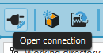
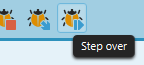
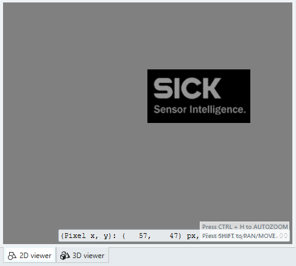
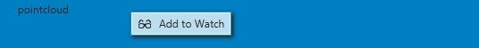
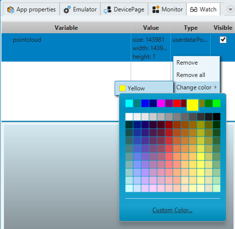

= Debugging in SICK AppStudio

## About this tutorial

This tutorial shows how to use a debugger in SICK AppStudio. It will use a https://gitlab.com/sick-appspace/samples/MinimumVerticalDistance[Minimum Vertical Distance] sample from our https://gitlab.com/sick-appspace/samples[samples repository] as an example.

## Open a sample application

. First you need to start SICK AppStudio and connect to the emulator.
+

. Open the sample application Minimum Vertical Distance after you  https://gitlab.com/sick-appspace/samples/MinimumVerticalDistance[downloaded it from GitLab] as a .zip file.

. This sample includes recorded scans as resources.
+

## Understand the sample application
NOTE: Please read the included "readme.md" for information about how to run the app.

. In the global scope of this script, a "file provider" is created that will use recorded files from the resources directory to provide data to the script.
+

. The handleNewScan() function is then called for every scan. The scan is given as function parameter to this callback.
+

## Run the Application: Viewing PointClouds

. First, you start the application.
. At the end of the handleNewScan() callback the filtered scan is given to a viewer.
+

. Open the device page to see the Point-Cloud.
+
image::media/devicePage.png[]

. The calculated "smallest vertical distance" of each scan is printed in the console.
+

## Debug the application: Control the debugging

. To debug an application select it in the "Working directory" tab.
+
NOTE: Please note that you just can debug one application at once.
+

. Click on the "Start debugging selected App" button (or F7).
+

. You will see the script is loaded again into the AppEngine and stops at the first line.
+

. Toggle a Breakpoint by clicking on the place left to the line number in the handleNewScan function. You will see a dot if done correctly (blue dot in SICK AppStudio, red dot in Microsoft VS Code).
+

. To resume the application click the Resume button (Ctrl + F7).
+
image::media/debug_controlButtons_AS.png[]

. You will see the script stopping at the breakpoints position and you will also see the processing times to the left of line number.
+

. You can also step script one line at the time by clicking the "Step into" or "Step over" button (F11 and F10 respectively).
+

+
When used at the line with the lua function the step over button will execute the function, the step into will go inside the function and continue the debug there.

. To stop debugging click on the "Terminate" button (Alt + F7). Alternatively, clicking Run all Apps (F5) will stop debugging and run all active apps.
+

## Editing Breakpoints

. Breakpoints can be set by clicking on the place left to the line number or alternatively by pressing F9 - this will toggle a breakpoint on the line in which the caret currently is.

. You can manipulate breakpoints in the designated area in the "Breakpoints" tab.
+

. Deleting: select a breakpoint or breakpoints and press "Delete" on your keyboard, or right click and select "Remove breakpoint(s)".
. Activating and deactivating: Right click on the breakpoint(s) and select "Activate/Deactivate breakpoint(s)" or click on the check mark on the left of the breakpoint entry in the list.
+
NOTE: You can remove and activate/deactivate multiple breakpoints at once by selecting them by holding SHIFT key and using left mouse click. This will select all breakpoints in range between selected entries. You can also use Ctrl + Left mouse click to select or deselect additional breakpoints individually.

. Defining breakpoint conditions: Right click on the breakpoint and select Edit breakpoint conditions.
+
NOTE: Conditions can only 'see' those variables that are available in the scope of the context where the breakpoint is placed, i.e. if the breakpoint is placed within a function, the conditions can be based on the variables that are global or were declared locally in the function. Conditions use the same expressions as in lua.

## Watch variables during debugging

. Open the "Variables" tab:
+

. You will find there all the variables relevant to the current scope and their actual values.

. To see the variables change, use debugging controls to step the script.

## 2D Debugging: Variables tab and image preview

. Load the sample "ImagePlayer" after you https://gitlab.com/sick-appspace/samples/ImagePlayer[downloaded it from GitLab] and start debugging.
+
NOTE: Please read the included "readme.md" for information about how to run the app.

. Define a breakpoint in the function "handleNewImage" and resume debugging.
+

. You will see an image preview in "Variables" tab:
+

## 2D Debugging: Watch 2D iconic variables during debugging

. Use the context menu or "drag-and-drop" to add the img variable to the "Watch" tab.
+

. If the "Watch" tab is not already opened, it will open automatically.
+

. You can watch any variable. For iconic variables, e.g. the img variable, the image is presented in full resolution in the viewer area.
+

. You can zoom in and out of the image using the scroll wheel.

. Dragging the image with left mouse click while holding the SHIFT key will pan the view of the image.

. Clicking Ctrl + H will return the view to the original position and zoom.

. When positioning the mouse on a pixel of the image, you get the position of the pixel and its RGB value.
+

## 2D Debugging: Adding shapes

. Add the following lines of code at the start of the handleNewImage() function and restart the debug session. Jump to the Breakpoint defined previously (see above).
+
[source, lua]
----
local point1 = Point.create(60,27)
local shape = Shape.createRectangle(point1, 105, 38, 0)
----

. In addition of the image the rectangle is shown as a preview. Add the shape variable to the "Watch" tab.
+

. The rectangle is stacked on top of the image in the viewer area. You can see how the image and shape relate.
+

. It is possible to change the color of shapes. Right-click on the variable and choose "Change Color".
+

## 3D debugging: Variables tab and PointClouds

. Load the sample "PointCloudPlayer" after you https://gitlab.com/sick-appspace/samples/PointCloudPlayer[downloaded it from GitLab] and start a debug session on it.
+
NOTE: Please read the included "readme.md" for information about how to run the app.

. Define a "Breakpoint" in the handleNewPointCloud() function and resume debugging.
+

. You will see the dimension of the "pointcloud" variable in the "Variables" tab.
+

## 3D debugging: Watch 3D iconic variables during debugging

. Use the context menu to add the "pointcloud" variable to the "Watch" tab.
+

. Open the "Watch" tab.
+

. The "3D viewer" should be automatically selected. If not, choose "3D viewer".
+

. You can change the point size of the model by using the slider control.
+

. When positioning the mouse on a pixel in the 3D model, you get the position of the pixel and its intensity value.
+

. It is possible to change the color of pointclouds. Right-click on the variable and choose "Change color". It will only have effect when the color mode of the pointcloud is RGBA.
+

## 3D Debugging: Control the 3D viewer

1. Dragging the model while pressing the Shift key, *moves* the model with the mouse cursor.

2. Dragging the model while pressing the Ctrl key, *rotates* the model.

3. Using the mouse wheel *zooms* in to the model.

4. Clicking the "Home" symbol in the view, *resets* the view to startup settings.
+

5. Clicking on the optional views, *moves* the view to the indicated position.
+

## Samples
* https://gitlab.com/sick-appspace/samples/ImagePlayer[Image Player]
* https://gitlab.com/sick-appspace/samples/MinimumVerticalDistance[Minimum Vertical Distance]
* https://gitlab.com/sick-appspace/samples/PointCloudPlayer[Point Cloud Player]

