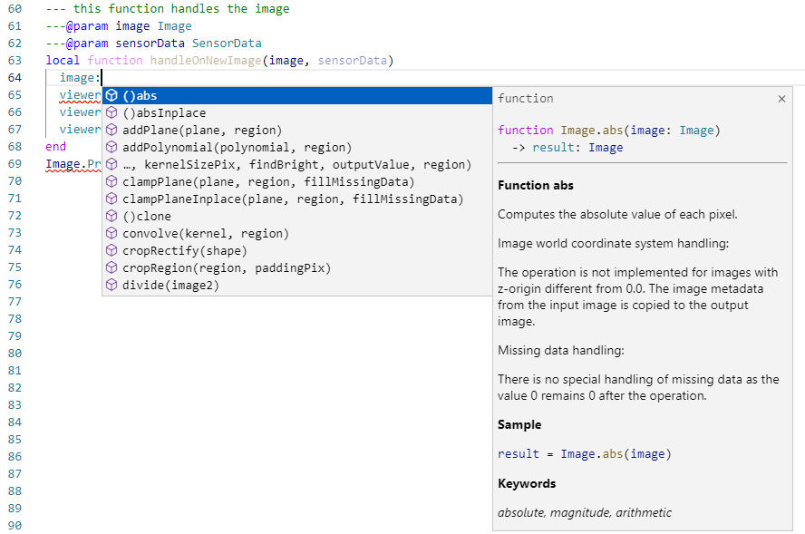
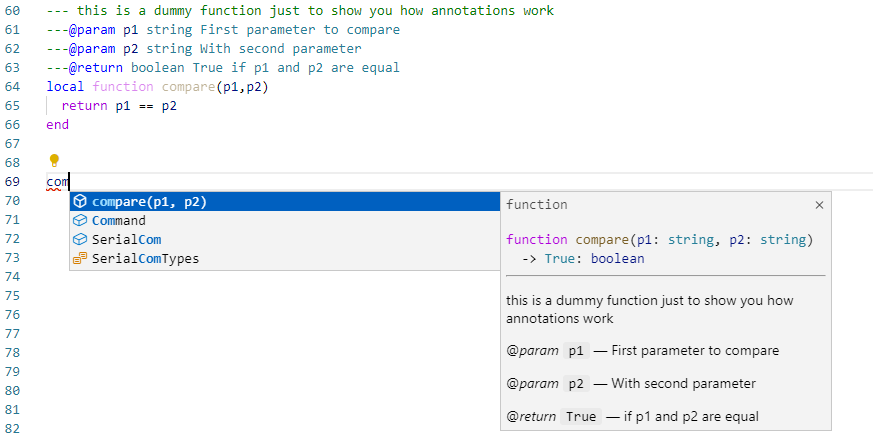

= Programming SensorApps: Lua annotations

## About this tutorial
This tutorial explains the basics of how to annotate classes and functions.
Annotations allow to define the type of a field, parameter or return value. Because of this, the code completion in SICK AppStudio can offer you full support if you are e.g. using the respective parameter while programming within the function (since its type is known):

You can also add documentation to your lua code. If you, e.g., define a function and annotate its parameters and return values, the code completion of SICK AppStudio will show the defined documentation in case you are using the respective function:

## Legacy annotations and how to update
Old versions of SICK AppStudio (3.6.0 and older) use a different annotation format. This annotation format only enabled you to define the types of parameters and return values of functions.
From version 3.7.0 on, the new annotation system - as described in this tutorial - is being used.
Here is how to update the previous annotation:

Example from AppStudio 3.6.0 or older:
[source, lua]
----
--@compare(p1:string,p2:string):bool
local function compare(p1, p2)
  return p1 == p2
end
----

Converted to the format used in AppStudio 3.7.0 or newer, this looks as follows:
[source, lua]
----
---This is a dummy function just to show how annotations work
---@param p1 string First parameter to compare
---@param p2 string With second parameter
---@return boolean True if p1 and p2 are equal
local function compare(p1, p2)
  return p1 == p2
end
----

## General information
Documentation and comments start with -- or --- and support Markdown. Annotations always start with ---.
In the following, type locations accept single and multiple type names. In case of multiple types, they are separated by a |. Additionally, array types are declared by appending a [] to a type.

## Annotations
### Types
#### @class
Defines a new class. After its declaration, it can be used as a type. The annotation can be placed right before a table so that the type of the table equals the class or the annotation can stand alone.

Syntax:
---@class <name>

#### @field
Defines fields in classes.

Syntax:
---@field <name> <type> [documentation]

Example:
[source, lua]
----
---@class Plugin
---@field name string Name of the plugin.
----

#### @type
Defines the type of a table or of a field within a table. The type name must equal an existing type (built-in or declared by a previous class annotation).

Syntax:

---@type <type-name>

Example:
[source, lua]
----
local Plugin = {
    ---@type boolean
    Activated = false;
}
----

#### @param
Documents a parameter of a function. If the parameter is optional, it can be denoted by adding a ? after the parameter name. If the last parameter of a function is a vararg parameter (...), the name equals ....

Syntax:

---@param <name>[?] <type> [documentation]

Examples:
[source, lua]
----
---@param path string Path to the plugin.
---@param param2 number Second parameter.
---@param ... number Additional parameters.
function Plugin.load(path, param2, ...)
end

---@param optionalParam? string | number This is an optional parameter which can be a string or a number.
function Plugin.doSomething(optionalParam)
end
----

#### @vararg
Alternative documentation for a vararg function parameter.

Syntax:

---@vararg <type>

#### @return
Specifies the return values of a function. The name of the return value is optional. It can be omitted by writing @ or # after the return type and ahead of the documentation or by leaving the name and documentation out. Adding a ? after the return type, marks the return value as optional.

Syntax:

---@return <type>[?] [name] [documentation]

---@return <type>[?] [<@|#> <documentation>]

---@return <type>[?] [name][, <additional-type>[?] [additional-name]]

Examples:
[source, lua]
----
---@param measureTime boolean Indicates if the time to unload the plugin should be measured.
---@return boolean success Indicates the success of the function.
---@return number # Time for unloading the plugin.
function Plugin.unload(measureTime)
end

---@return boolean, string, string?
function Plugin.getState()
end
----

#### @deprecated
Marks a function as deprecated.

Syntax:

---@deprecated

#### @overload
Allows to define multiple signatures for a function.

Syntax:

---@overload fun([<parameter-name>: <parameter-type>[, <additional-parameter-name>: <additional-parameter-type>]])[: <return-type>[, <additional-return-type>]]

Example:
[source, lua]
----
---@param param1 number An execution parameter.
---@return boolean @ Indicates if the execution was successful.
---@overload fun(): number
function Plugin.execute(param1)
end
----

#### @alias
Defines an alternative name for an existing type.

Syntax:

---@alias <alternative-name> <type>

It can also be used to define a type which consists of multiple string alternatives and can be used as a parameter type.

Syntax:

---@alias <name> "'<string>'" [| "'<additional-string>'"]

---@alias <name>
---| "'<string>'" # <documentation>
[---| "'<additional-string>'" # <additional-documentation>]

Examples:
[source, lua]
----
----@alias PluginState "'LOADED'" | "'UNLOADED'" | "'EXECUTING'"
---@alias PluginState
---| "'LOADED'" # Plugin is loaded.
---| "'UNLOADED'" # Plugin is unloaded.
---| "'EXECUTING'" # Plugin is executing.
----

#### @diagnostic
Controls the application of diagnostics. They can be disabled for the next line (option disable-next-line), the current line (option disable-line), or the remaining file (option disable), and enabled for the remaining file (option enable). In addition, only specific diagnostics can be disabled or enabled by appending their name to the selected option.

Syntax:

---@diagnostic <disable-next-line|disable-line|disable|enable>[:<diagnostic-name>[,<additional-diagnostic-name>]]

Example:
[source, lua]
----
---@diagnostic disable:undefined-global,lowercase-global
----

### Order of Annotations
The order of comments and annotations influences how they are displayed. If, for example, @return annotations are placed before @param annotations, the @return annotations are also displayed before the @param annotations in the documentation. However, @field annotations must be located directly after @class annotations.

## Download Tutorial as PDF

