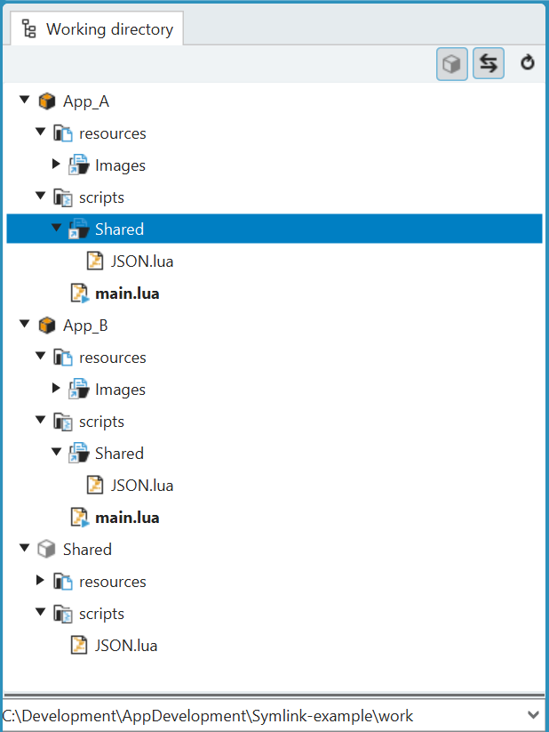
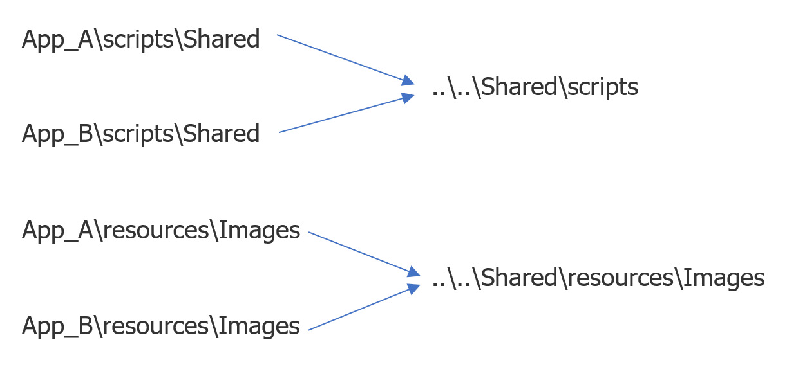

= Programming SensorApps: Symbolic links

## About this tutorial
In this tutorial you will learn how you can use symbolic links (also symlinks) to share lua script files or other resources between different apps.

## General information
In some SensorApps it could be necessary to use the same lua code in multiple apps. Duplicating your code makes it very hard to make changes and to maintain your code. To solve this problem symbolic links can be used.

*NOTE:*
symbolic links are fully supported only from SICK AppStudio version 3.6.0 on. Please update if you are using an older version of SICK AppStudio and want to use symbolic links.

## What are symbolic links and how to create them
A symbolic link is a file, which contains a reference to another file or folder in the form of an absolute or relative path.

You can create a symbolic link in the Windows Command Prompt by using the following command:

[source]
----
mklink /D Link Target

----

Explanation:

* Link:    Specifies the new symbolic link name.

* Target:  Specifies the path (relative or absolute) that the new link refers to.

The SICK AppStudios working directory tab shows a symbolic link to a file or folder by using a dedicated icon.

## Symbolic link example
In this example you see three apps: App_A, App_B and Shared.

The symbolic links were created with the following commands relative to the working directory path using a Windows Command Prompt:

[source]
----
mklink /D App_A\resources\Images    ..\..\Shared\resources\Images
mklink /D App_A\scripts\Shared      ..\..\Shared\scripts

mklink /D App_B\resources\Images    ..\..\Shared\resources\Images
mklink /D App_B\scripts\Shared      ..\..\Shared\scripts
----

As you can see these commands create four symbolic links containing the relative path to Shared\scripts and Shared\resources.

The advantage of creating a link to a directory is, that all files created in (in this case) Shared\scripts can automatically be used in e.g., App_A\scripts\Shared. This includes files in sub folders.

E.g., the JSON.lua file can then be required in the main.lua file of App_A (or App_B) in the same way as if it were a regular lua file within a normal subfolder called Shared:
[source]
----
require('Shared.JSON')
----

Also, all files copied into Shared\scripts will be automatically added to the scripts\Shared folder of both apps.

## App deployment
When you transfer apps to the device, all symbolic links will be resolved. This means on the device the apps will no longer contain symbolic links but the target of the link will be copied.
Therefore, the apps on the device are still self-contained.

*WARNING:*
this also means, that if you transfer apps from the device e.g. into a new working directory, the apps will contain no more symbolic links.

Packaging your apps e.g., to upload them to SICK AppPool, will also resolve all links. This means, that inside a sapk file all apps are self-contained.

Recommendation: in the example above you should only deploy App_A and App_B. App Shared should not be transferred to the device and therefore can be kept inactive within the working directory. All resources from app Shared will be copied into both apps during deployment.

## Git and symbolic links
If you are working with git and want to commit your symbolic links, you have to make sure that the property "core.symlinks" is set to "true". Otherwise, the symbolic links will be checked out as plain files which contain the link text. This is useful on file systems like FAT, where symbolic links are not supported.

The default of the "core.symlinks" setting is "true". But here is how you can check its value:

[source]
----
git config --get core.symlinks
----

You can change the property with the following command:
[source]
----
git config --global core.symlinks true
----

## Download Tutorial as PDF
