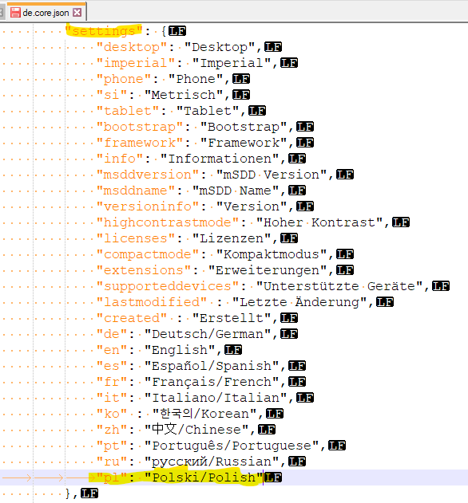

= UI-Builder: Application specific UI

# About this tutorial

:source-highlighter: highlightjs

Apps can include a web-page which represents the user interface of the application. It is advised to create an application specific user interface (UI) if you want to have human machine interaction of any kind. Creating a custom UI also ensures that the UI works independently from the firmware of the device. 

We do not recommend you to rely on the the Default User Interface (explained in the next paragraph), which comes with the firmware of each device since this standard user interface and its API can change with newer firmware versions. Consequently, the default user interface might not work as expected after a firmware update.

# Default User Interface

You can connect to a SICK AppSpace programmable device or the SICK AppEngine via a browser by typing in the IP address of the device (e.g. https://192.168.0.1[192.168.0.1]) or the SICK AppEngine (http://127.0.0.1[127.0.0.1] or http://localhost[localhost]).

In *SICK AppStudio*: alternatively, you can use the "DevicePage" tab to view the UI of the currently connected device.

Depending on the device, different pages are shown (e.g. screenshot above: INFO, 2D VIEWER, 3D VIEWER, DIAGNOSIS, ...). The shown viewers (2D / 3D) can be accessed within the app code by creating a view handle without ID:

----
-- Default 2D or 3D viewer
local viewer = View.create()
----

For further information on how to use the 2D and 3D viewer, please take a look into the "Visualization and graphical interaction" tutorial https://supportportal.sick.com/tutorial/visualization-and-graphical-interaction/[on the Support Portal].
// TODO: Add links to github once available
 
# Create an Application UI
 
## Create a Page
If you want to create a page, you need to create the pages file structure first.
For this you have the following options.

* In *SICK AppStudio*: 
** Select "Pages" when creating an application, then right click the "pages" folder of the app and select "New UI files".
+

** If you created an application without a "pages" folder just right click onto the application and select "Create component" -> "pages".
+

* In *SICK AppSpace SDK*:
** The SensorApps are automatically created with all the available components, including pages

In case you already have created the file structure and just want to create another page

* in *SICK AppStudio*: right click the "page" folder (e.g. pages/pages/pages01) and select "New page"
+

+
A dialog will appear asking for a name for the newly created page:
+

* in *SICK AppSpace SDK*: right click the "page" folder, select "New file" and define the file extension as ".html":

The name of the page will later be used for the navigation bar in the UI.

*Hint:* If you want to add a new page which uses a different style css than the one saved under "page01": create a new page folder by right clicking on "pages/pages", selecting "Create folder" and creating a new page in that folder. For more information see 
the paragraph "File Structure".

## File Structure
The base of the created UI is always the "pages" folder, a page placed in another folder will not be visible on the device.

Files directly located in the pages folder are:

* "global.css" - This is the global style file. Styles defined in here will be applied to all pages.
* "package.json" - In here, dependencies to elements used by the UI-Builder are defined. For example @sick-davinci/basic-elements contains the basic layouts, buttons, checkboxes,...

Subfolders located in pages are:

* "assets" - Resources like images are located in here, but also legacy parameters which might be needed.
* "i18n" - This folder contains localizations if the UI is multi lingual, for more information see the paragraph "Using multiple Languages".
* "pages" - In here are the actual page files, clustered in further subfolders. Each subfolder may contain a style.css file which defines the styling for pages in this folder, as well as one or more html files. Furthermore, this folder contains the navigation file (see "Page Navigation").
* "src" - The src folder contains typescript files used by the user interface, for example to be used for converter functions.

## Open the UI-Builder
To open the UI-Builder, simply double click on the html file you want to edit.
Please make sure that the html file is located somewhere in pages/pages, otherwise you will not be able to use the UI-Builder.

In *SICK AppStudio*: You can maximize/restore the UI-Builder by double clicking the tab of the UI-Builder, by pressing F4, or by using the respective button in the upper right corner of SICK AppStudio.

# UI-Builder Overview

After opening a page the UI-Builder should be visible and look similar to this:

The different areas / parts of the UI-Builder (from left to right) are described in detail in the following paragraphs.

## Elements
This tab (located in the bottom left corner) contains the elements you can use to build a UI. There are layout elements like "RowLayout" and "ColumnLayout" as well as basic control elements like buttons, checkboxes, sliders, spinners,...

To add them to the UI, drag and drop the elements into the destination layout.

*Hint:* Use the search box to find the desired element faster.

## Page tree
The page tree (second tab in the top left corner) displays the structure of the page, the currently selected element is highlighted in blue.

## Structure View
In the structure view (located in the center) you see a graphical visualization of the structure of the UI.

In this view, you have several options to manipulate the page content and its structure.

* Change the structure of the UI via drag and drop
* Add elements via the plus button
* Delete selected elements by pressing delete on your keyboard.
* You can revert changes using Ctrl + z.

The selected element is highlighted in blue.

## Code View
The code view (second tab in the center) provides you with a rich editor for creating and manipulating the html code of the UI page.
The code view allows you to assign values and ids, create and remove elements or add styles directly in the code.

image::media/codeview.png[]

### Messages
The messages area (located at the bottom) gives more detailed information about problems which might appear regarding the code.

## Properties
In the properties tab (located in the top right corner) you can edit the values of the currently selected element.
If you, for example, edit the properties of a button element, you can change its label or define an icon or a css class.

## Bindings
The binding tab is located in the top right corner of the UI-Builder.

Bindings are the connection between most UI elements and the Lua code which is running on the device.
A binding might trigger a function if a button is pressed, change the value of a text if an event is received from the device or change a property of the device.

For detailed information about the binding mechanisms consult the "UI-Builder: UI bindings" tutorial https://supportportal.sick.com/tutorial/ui-builder2-bindings/[on the Support Portal].
//TODO: Add links to github once available.

## Help
The help icon in the top right corner provides information about the selected element to you.

# Using the UI-Builder
 
## Adding Elements
There are three basic ways to add elements, i.e. layouts or controls, to the UI.

### Drag and drop

### Use the structure view

* Click the plus button at the location where you would like to add a new element.

* Use the different tabs to select the desired element. Confirm the selection by using the "Insert" button on the lower right, or by double clicking on the element.

### Use the code view

Enter the html code that describes the element in the code view editor.

## Open Preview
You can open a preview of the page by either selecting the preview button in the toolbar (will only be enabled if the focus is in the UI-Builder or a page file is selected),

or by right clicking on the respective page file in the working directory and selecting "Preview page".

In both cases a preview will be opened, displaying what the UI will look like. Note, that not all elements can be fully redered in the UI preview. Depending on the current state of the app and the involved elements, the final UI page may differ. 

*Hint:* As long as you leave the preview open, it will refresh as soon as you make (and save) changes in the page, or style files affecting it. 

*Note:* Bindings as well as internationalization is currently not supported in the preview.

## Page navigation
You can adjust the UI navigation by using the navigation.json file in the folder "pages/pages".
This file might look like the following example.

[source,json]
----
{
  "version": "1.0",
  "pages": [
    {
      "category": "My Category",
      "pages": [
        {
          "path": "pages01/main.html",
          "name": "My main Page"
        },

        {
          "path": "pages01/secondPage.html",
          "name": "My second Page"
        }
      ]
    }
  ]
}
----

In this case a category with the name "My Category" was created. It contains two pages of which the first page should be displayed as "My main Page" and the second one as "My second Page" (in this order).

As there is a third page in the "pages01" folder called "thirdPage.html" it will be put in the default category "Device" because it was not mentioned in the navigation file.

You can now move the third page into its own category by creating a new one called "My second Category". In addition, you can set the display name of the third page to "Another page" as shown below.

[source,json]
----
{
  "version": "1.0",
  "pages": [
    {
      "category": "My Category",
      "pages": [
        {
          "path": "pages01/main.html",
          "name": "My main Page"
        },

        {
          "path": "pages01/secondPage.html",
          "name": "My second Page"
        }
      ]
    },
    
    {
      "category": "My second Category",
      "pages": [
        {
          "path": "pages01/thirdPage.html",
          "name": "Another page"
        }
      ]
    }
  ]
}
----

The resulting navigation looks like this:

## Using multiple Languages

### Define translations

Translations for the UI can be defined in the "i18n" folder. Each language has its own language file, for example German: "de.json", English: "en.json", Italian: "it.json",...
    

In the language files you can define groups, keys and values, for example:

.en.json
[source,json]
----
{
  "page": {
    "first": "My main page",
    "second": "My Second page"
  },
  
  "category": {
    "maincategory": "My only category" 
  },

  "checkbox": {
    "option1": "Do this",
    "option2": "Do that"
  },

  "button1": "Button"
}
----

.de.json
[source,json]
----
{
  "page": {
    "first": "Meine Hauptseite",
    "second": "Meine zweite Seite"
  },
  
  "category": {
    "maincategory": "Meine einzige Kategorie" 
  },

  "checkbox": {
    "option1": "Tu dies",
    "option2": "Tu das"
  },

  "button1": "Knopf"
}
----

In the example above, there are three groups: "page", "category" and "checkbox". Note that "page" as well as "category" are groups which are necessary if you want to translate the page titles (see paragraph "Page navigation").

Groups can also be nested which can be helpful for structuring the language keys for the application. For example:

[source,json]
----
{
  "group": {
    "subgroup1": {
      "value": "1"
    },

    "subgroup2": {
      "value": "2"
    }
  }
}
----

A key can be part of a group (e.g. "option1" in group "checkbox"), or directly in the root like "button1". Each key has a value associated with it, which will be displayed in the UI for the appropriate key (e.g. "Button" or "Knopf" for key "button1", depending on the language).

### Usage in UI

* *Page elements* + 
To use the keys from the language file in a UI, put a hash sign (#) in front of the key in the code of the user interface. In the case of groups, use the group as a prefix (repeat for nested groups: group.subgroup.subsubgroup.key) +

[source,html]
----
<davinci-button id="Button1" type="primary">
  #button1
</davinci-button>

<davinci-checkbox id="Checkbox1">
  #checkbox.option1
</davinci-checkbox>

<davinci-checkbox id="Checkbox2">
  #checkbox.option2
</davinci-checkbox>
----

* *Page navigation* +
To translate the navigation, use the keys as names of the page or category (keys in page group = page names, keys in category group = category names): +

[source,json]
----
{
  "version": "1.0",
  "pages": [
    {
      "category": "maincategory",
      "pages": [
        {
          "path": "pages01/main.html",
          "name": "first"
        },

        {
          "path": "pages01/secondPage.html",
          "name": "second"
        }
      ]
    }
  ]
}
----

### Available languages

The "SETTINGS" page of the UI of a SensorApp automatically offers the user to choose between several predefined languages in which the UI can be displayed.

*Note:*
Even though these languages are automatically listed, there are no language files for the UI. Thus it is not possible to change the language of the UI via the SETTINGS page. To enable the user to change the language of the UI, you have to create / add the respective language file for your specific UI in the "i18n" directory.

The predefined languages (including extension codes) are:

* German - "de"
* English - "en"
* Spanish - "es"
* French - "fr"
* Italian - "it"
* Korean - "ko"
* Portuguese - "pt"
* Russian - "ru"
* Chinese - "zh"

You are free to add any language by putting .json files with the translations into the "i18n" directory using the file name "<two letter extension code>.json". The two letter convention should follow https://www.iso.org/iso-639-language-codes.html[ISO 639-1] standard. Example: "pl.json" for Polish. The name of the language will be displayed as "#core.settings.<extension code>". 

Please note, that the core UI (see highlighted basic UI structure in the screenshot below) will not be translated into the newly added language. To add the translation also for this part of the UI, you need to copy a core language file from "_<AppStudio installation dir>_/UIBuilderService/node_modules/@sick-davinci/sopasjs/resources/i18n/" and edit it to provide your own translations.

// TODO: Add path for SICK AppSpace SDK once available.

*Core UI (marked yellow):*

*Location of core language files:*

*Example of an edited core language file:*

In the next step, you need to save the edited core language file either in the directory it was copied from or in the "i18n" directory of the app and add references to the new language into each of the other language core setting files.

*Note:*
By saving the edited core language file in the *SICK AppStudio* directory as mentioned above, this setting will be automatically available as long as you are using the same *SICK AppStudio* installation. Any changes to the core files will show only after restarting *SICK AppStudio*. Using an unmodified *SICK AppStudio* to edit and deploy an app, which has been developed with such a modified version of *SICK AppStudio*, will lead to errors and an incomplete translation.

## UI Deployment

The UI you created needs to be converted to a runnable package that can be deployed on the device. 
Therefore, it has to be packaged together with the _SopasAIR_ framework. This packaging process is performed by the UI-Builder when building an SAPK file or when transferring the app onto the device.

*SICK AppStudio* will inform you about the current status of the UI packaging progress in the deploy dialog as shown below.

*Note:*
The UI-Builder will incrementally build the UI in the background to speed up the deployment when transferring the app to the device.

*SICK AppStudio* tracks the build process of the UI. If there is no update within a specified time, the following dialog will pop up:

If you ever encounter this dialog, those are your options:

* *Continue*: This option will close the dialog and reset the timeout for the UI deployment.
* *Cancel deployment*: Choosing this option will cancel the deployment process. Please keep in mind that Apps which are already transferred to the device will stay there.
* *Restart UI build*: SICK AppStudio will restart the build process of the UI and continue the deployment.

In case this dialog appears too often, you can increase the UI deployment timeout in the SICK AppStudio preferences:

You can manually restart the UI build at any time using the "Build" -> "Clean" command, this will also mark the App as "not in sync" to force a new full deployment:

Select the projects to clean or clean all projects:

