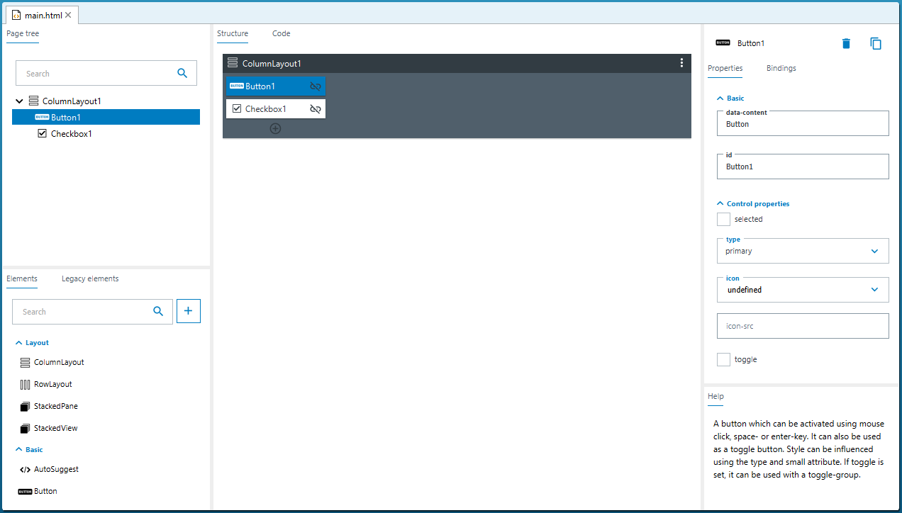
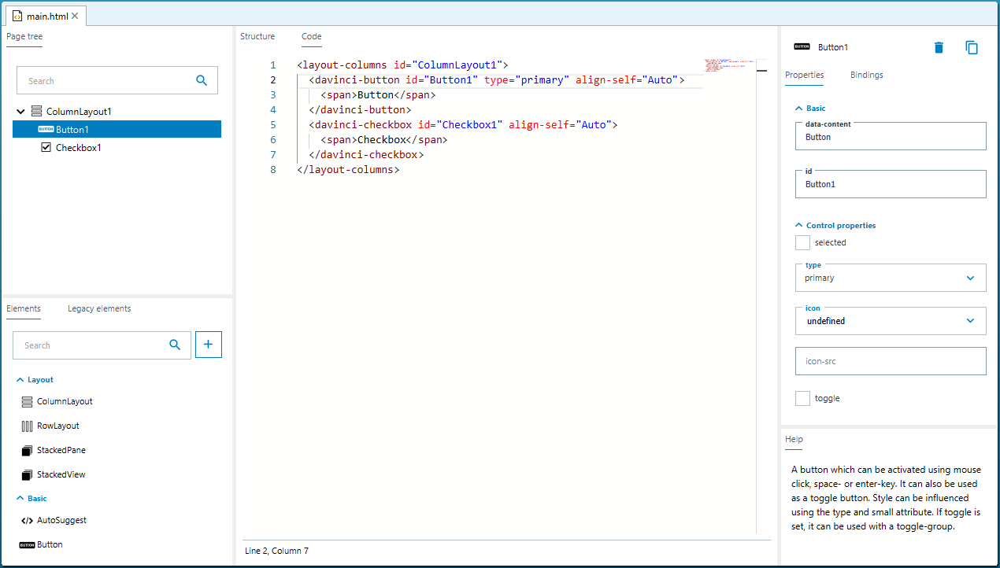
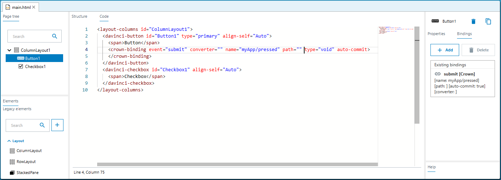
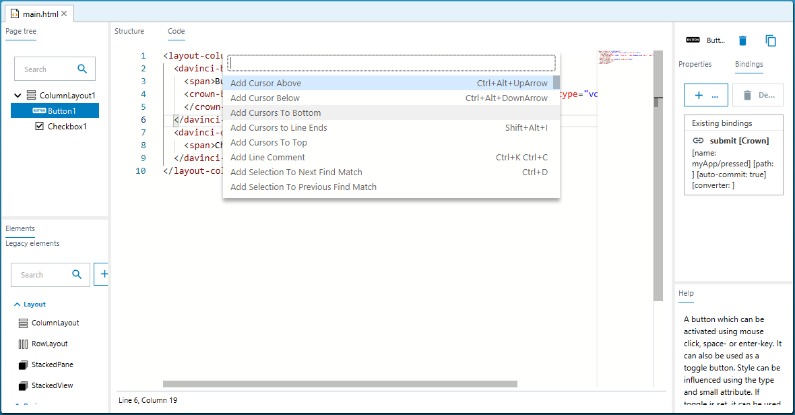
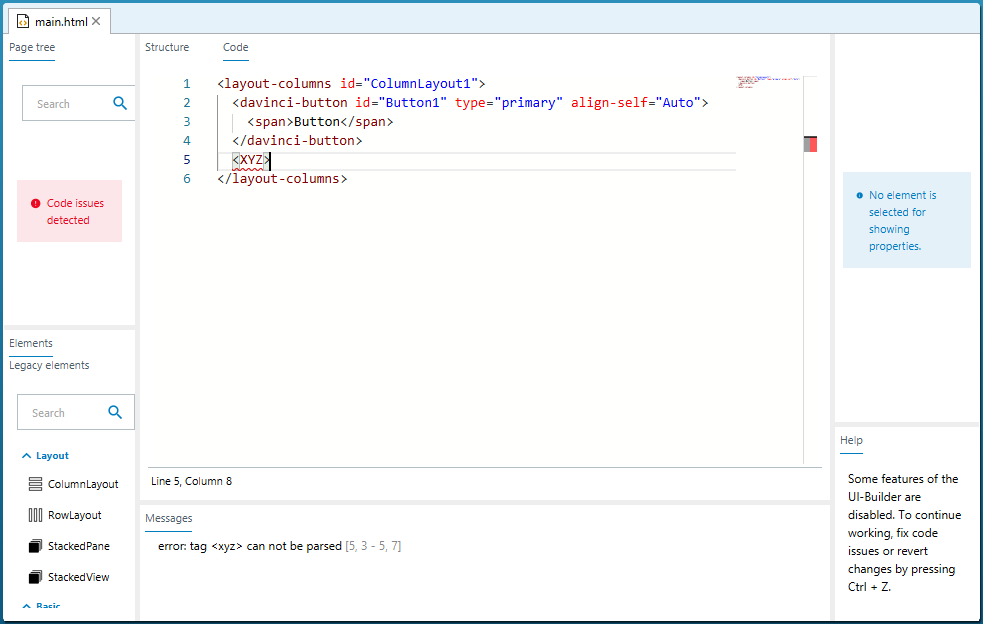

= UI-Builder: CodeView

# About this tutorial
In this tutorial you will learn how to use the integrated code editor to directly implement the application specific UI page. 

# UI-Builder Code Editor
Besides the possibility to graphically create and edit user interface pages, the SICK UI-Builder provides a code editor which allows you to directly edit the html source code. Below you can see the "Structure" view of a simple UI page and the corresponding UI source code in the "Code" view.

## Element source code
As shown in the example above, all UI layout elements (see tutorial on https://supportportal.sick.com/tutorial/ui-builder2-elements/[supportportal]) are represented by html tags. You can use the editor to directly create, manipulate, copy&paste or delete elements. An update of the UI source code directly results in an update of the "Page tree" of the "Structure" view, the "Properties", and the "Bindings" tab. For each element that is added via the "Structure" view, the corresponding entry in the UI source code is created. In addition, all changes of properties which you enter via the "Properties" tab on the right, directly result in an update of the UI source code.
//TODO: Add link to github once available.
 
## Element properties
All element properties that are offered in the "Properties" tab correspond to an html attribute of the element tag. You can see this correspondence in the screenshot above: The button's property type is set to primary in the "Properties" tab and the type attribute of the "davinci-button" element is specified accordingly with type="primary". Many elements offer the Basic property "data-content" which is treated differently since it defines the data that is used for displaying the element. In the example above, you can see that the "data-content" is specified with "Button" which corresponds to the string "Button" which is enclosed by the elements tag "<davinci-button>" and "</davinci-button>". Note, that all strings which are defined this way must be enclosed by the "" html element which is a generic inline container for phrasing content.
 
## Element bindings
Bindings are also defined by html tags with attributes. In the example below, you can see how a "crown-binding" is added to a button. The definition binds the submit event to the "pressed()" function of the App "myApp".

## Command palette
The html code editor offers a command palette which allows you to list all available commands and to search for key shortcuts. The command palette can be accessed by pressing "F1" in the html editor.

## Error handling
The html code editor provides a real-time syntax check, which warns you in case of issues with the UI source code. in the example below, you can see, that an unsupported tag "<xyz>" was entered and a warning is printed in the "Messages" tab. Since the UI source code is invalid, you are not allowed to switch to the "Structure" view until the issues are fixed to avoid inconsistencies. The "Page tree", the "Properties", and "Bindings" tabs are also disabled due to the incorrect UI definition. Once you fixed the issue (or reverted your input by pressing ctrl-z), all features of the UI-Builder will be available again.

