= UI-Builder: UI elements

//TODO: when we wrote this tutorial, we were discussing tables for the elements containing all properties. This could be done in the future.

# About this tutorial

With the SICK UI-Builder, you are enabled to build web pages which represent the user interface of an application. Web pages usually consist of UI elements (layout information and a set of control elements) optionally accompanied by styling information and scripts. In this tutorial, we will focus on control elements and their usage within the SICK UI-Builder.

All screenshots in this tutorial are from the sample app link:https://gitlab.com/sick-appspace/samples/Elements[Elements].

# Architecture
The SICK UI-Builder supports various elements (layout and control elements) that follow the "Web Components" standard.

With "Web Components", developers create encapsulated and scalable custom HTML components (custom elements) which makes them highly reusable. Since it is a web standard, it is supported by frameworks and browsers natively, which means no library overhead and a small memory footprint.
"Web Components" are written in plain JavaScript / TypeScript + HTML + CSS. The final product is just a simple new HTML tag in kebab case: "<my-custom-element>" which can be referred from within an HTML document. Typically, small components are combined - using the atomic design approach - in bigger components. Further information can be found here: https://en.wikipedia.org/wiki/Web_Components[Wikipedia - WebComponents].

Usually, UI elements provide properties and events, which can be used for configuration and interaction. The properties of an element can be changed in the Properties tab on the right side of the UI-Builder (see tutorials "UI-Builder: Application Specific UI" https://supportportal.sick.com/tutorial/ui-builder2-application-specific-ui/[on the Support Portal] and "UI-Builder: Bindings" on https://supportportal.sick.com/tutorial/ui-builder2-bindings/[on the Support Portal].
//TODO: Add link to github once available.

# UI elements
The SICK UI-Builder provides an initial set of UI elements that cover the major use cases in App UI development. As shown below, the available UI elements are listed in the Elements tab of the SICK UI-Builder. The UI elements are grouped into the following types:

* Layout elements (see the tutorial "UI-Builder Layout" https://supportportal.sick.com/tutorial/ui-builder2-layouting/[on the Support Portal])
//TODO: Add link to github once available.
* Controls
** Basic elements (see description below)
** Html elements (standard html controls like <h1> or )
** Visualization elements (2D and 3D viewers)
** Wrapper elements (used to wrap legacy packages of former SICK AppStudio versions, i.e. below 3.0.0; only shown in the "Elements" tab if added manually)
** Auxiliary elements (reserved for future usage and advanced applications)
** Legacy packages (Legacy packages that were used in former SICK AppStudio versions)

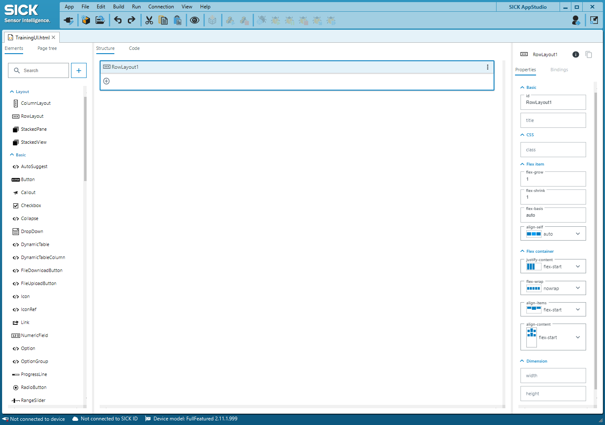

# Controls: Basic Elements

## AutoSuggest
Auto-suggest is a specialization of the drop-down with auto suggestion. Searches a list for related keywords, phrases, and items, which may match the input string.

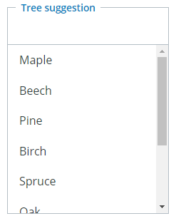

//AutoSuggest still contains several bugs. The option tag doesn't work in UI-Builder because there is some  tag added which is then also shown in the UI.
// more info: Apparently, AutoSuggest should be removed from basic-elements 6. There seems to be some option to use the DropDown as Auto-Suggest then, but I don't see how to do this inside the UI-Builder.

## Button
A button which can be activated using mouse click, space- or enter-key. The text on the button can be adjusted via the property "data-content". Please take a look at the hover information shown in the UI-Builder for more information on the other properties of this element.

The button can also be used as a toggle button. Its style can be influenced using the type and small attribute. If the toggle is set, it can be used with a toggle-group.

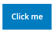

## Callout
A callout is used to inform the user. It shows information in different visual styles which are defined by using the type property:

* info: callout color is blue with information icon
* warning: callout color is yellow
* error: callout color is red
* success: callout color is green.

The text can be adjusted with the property "data-content". For more information on other properties, take a look at the hover information shown in the UI-Builder.

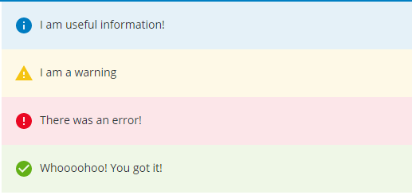

## Checkbox
Checkboxes are selection controls that allow the user to select multiple options from a list of choices, including all or none. The text can be adjusted with the property "data-content". For more information on other properties, take a look at the hover information shown in the UI-Builder.

Checkboxes can be used within a toggle-group.

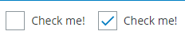

## Collapse
A collapse can be used to show and hide content. It has two titles: One which is shown in collapsed mode ("collapsed-title") and one which is shown if it is expanded ("expanded-title"). Default values are "Show" for the collapsed title and "Hide" for the expanded title.

To ensure a consistent layout it is recommended to use "ColumnLayout" or "RowLayout" inside this element.

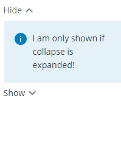

## DropDown
A simple dropdown list and combo-box. If used as a combo-box (property "editable" activated), the content of the text-field displays the value instead of the slot.

Data can be added by using the elements Options and Option groups. A default value can be set by using the "value" property. For more information on other properties, take a look at the hover information shown in the UI-Builder.

### Advanced use case

The DropDown can also be filled dynamically or statically with data from lua. Take a look at the sample app link:https://gitlab.com/sick-appspace/samples/DropDown[DropDown] to see the implementation.

//property "icon-src" is not explained anywhere and I didn't find any example for it. Additionally, the property field "data" is not usable at the moment because the UI-Builder uses double-quotes where the davinci-control would expect single ones and vice versa.

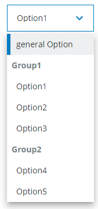

## DynamicImage
This element can be used as a lightweight way to load and update images from an app. Data can be loaded in a static way similar to  (via the source property), but can also be bound to lua code by using the data property. For the latter, the origin can either be a base64 encoded- or a binary-image.

Examples of usage can be found in the sample apps link:https://gitlab.com/sick-appspace/samples/Elements[Elements] and link:https://gitlab.com/sick-appspace/samples/DynamicImage[DynamicImage].

## DynamicTable (Advanced)
This element allows realizing tables with dynamic content. In order to do his, the columns need to be specified with the DynamicTableColumn elements. In addition, the data property needs to be bound to a served lua-function that returns the current content of the table as a JSON string.

The screenshot below is from the sample app link:https://gitlab.com/sick-appspace/samples/Elements[Elements]. Take a look at page 2 and the script "dynamicTable.lua" of the sample to get an idea of the basic functions. To see how to fill the table dynamically, check out the sample app link:https://gitlab.com/sick-appspace/samples/DynamicTable[DynamicTable].

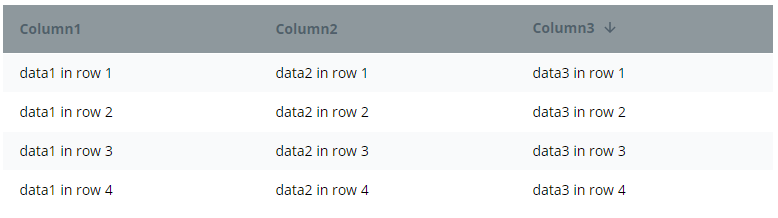

## DynamicTableColumn
This element needs to be placed inside a DynamicTable. It specifies a column of the respective table.

The header can be set via the "header" property while the content will be filled via data-property binding of the parent element "DynamicTable". The id of DynamicTableColumn needs to match the identifier used in the JSON string.

## FileDownloadButton
Button for downloading files. The file-path property describes the path and the filename on the device (no access to private folders). If the user of the final UI page activates this button, a local file selection dialog will be opened and the file that is specified with the file-path property will be transferred from the device to the local file system to the place that the user selected via the file selection dialog.

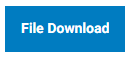

## FileUploadButton
Button for uploading files. The path property describes the path (and optionally the filename) on the device (no access to private folders). If the user of the final UI page activates this button, a local file selection dialog will be opened and the selected file will be uploaded to the device and stored at the specified path.

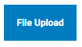

## Icon
Wrapper for material-icons so that they can be used in an application. Set the "icon" property by the format `<category>/<name>`. See https://material.io/tools/icons/?style=baseline for available categories and names. Example: icon="action/delete"

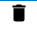

## Link
A link is an interactive element that indicates that it can be clicked. Links are used to allow users to navigate through content such as web pages, files or images. When clicking the link, users are automatically directed to the linked page or object, which is specified by the "href" property. The link text can be adjusted via "data-content".

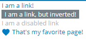

## NumericField
A NumericField is a text field that only allows to enter numbers. The value can also be changed using up-/down-buttons.

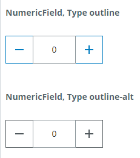

## Option
Can be used to insert content to a "dropdown". An option has the property "data-content", which specifies the text which is shown to the user and the property "value" which identifies the option internally and is emitted by the change event.

## OptionGroup
Can be used to group Option elements inside a "dropdown". The name of the group can be set via "Label" and will be shown as a header.

## ProgressLine
A progress line is used to display the current progress of a task. Per default, the percentage is shown below the progress line. If the property "message" is set, the defined message is shown instead of the percentage.

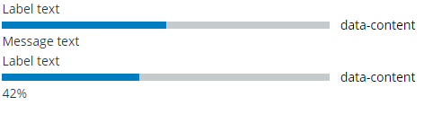

## RadioButton
Radio buttons are selection controls that allow the user to switch between options or to turn a setting on or off. It can be used within a toggle-group.

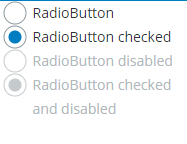

## RangeSlider
A range-slider can be used to define a value range (within a specific range). The defined range is given by the "value" property as an array [lowerValue, upperValue].

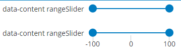

## Slider
A slider can be used to choose a value within a specific range.

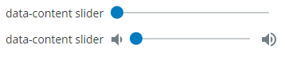

## Spinner
A spinner is used if the duration of the operation is completely unknown. A spinning circle is displayed to which a label can be added either to the right or below. The spinner can be performance consuming, so it is advised to use it carefully.

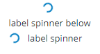

## StatusIndicator
The status indicator visualizes a boolean data type, which can be set by the "status" property. The default circles (red for false, green for true) can be replaced with custom icons from link:https://material.io/resources/icons/?style=baseline[material.io].

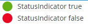

## StatusLine
The status line informs the user about the status of a process. The status icon can be changed by setting the value attribute to pending, success and error.

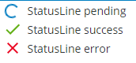

## Tabs
A Tabs control shows a tab bar which is used to switch between various content tabs. The "type" property specifies the tab style:

* modern: tabs with a lightweight and plain design
* classic: tabs with surrounding border. Similar to browser tabs. These tabs can be closable.

An example of the styling can be seen in the image below.

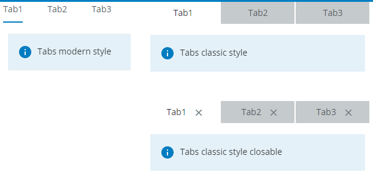

## TextArea
With a text area, users can enter or edit text like they can with a text field. A text area can collect a large amount of text. It is taller than a text field to indicate that more than one line of text can be entered. A text area does not support different input types like e-mail or password, etc.

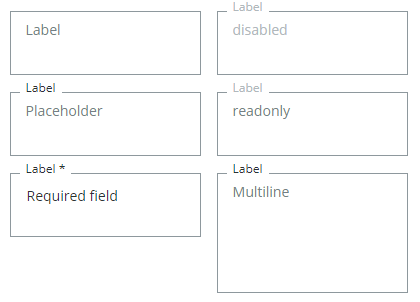

## TextField
With a text field, users can enter or edit text. There are several properties which influence behavior or styling (see screenshot). Also, there is a possibility to check for a pattern specified by a regular expression. Changes to this check will be emitted on "pattern-match-change".

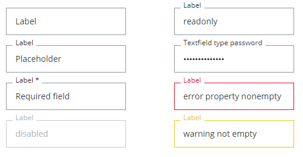

## ToggleGroup
A toggle group wraps multiple toggleable / selectable elements like Button, Checkbox, RadioButton or ToggleSwitch. If one of them is selected (set to "true"), the others are deselected (set to "false"). The `value` of the selected element is emitted by the "changed" event.

To get notified that another element has been selected, you can either bind to the ToggleGroup's "changed" event to receive the value string of the selected element or you can bind separately to each "change" event of all individual elements so that your corresponding functions are executed.

//Supports all elements with a `value` and a `selected` or `checked` property.
//TODO: Add: No binding is needed for the change event to work. Should this be stated explicitly? ("not needed" is an understatement: weird things happen if bindings are added here...)

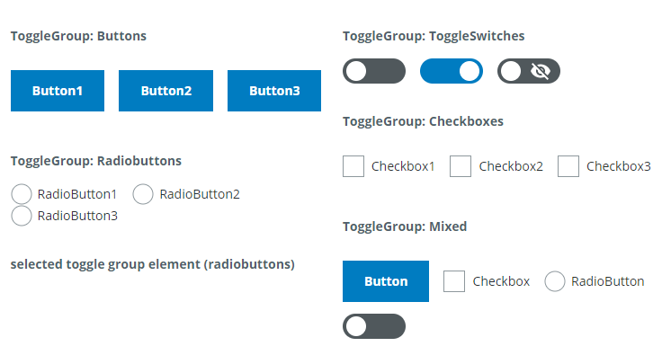

## ToggleSwitch
Toggle switches are used to switch between two states, such as turning a setting on or off, with immediate effect. The state can be changed via mouse click, space- or enter-key while the switch is in focus. The style can be influenced using the icon-* attributes.

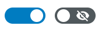

## ValueDisplay
A value-display element displays text. It can be used to show a value with its unit.

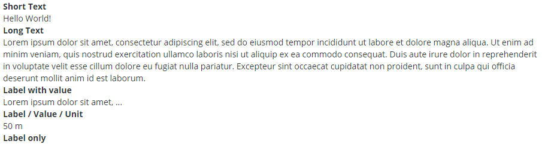

# Controls: HTML Elements

## Heading
The Heading1 - Heading6 elements can be used to add the default <h1> - <h6> heading tags to the page.

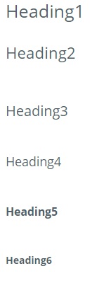

## Image
The Image element provides a convenient possibility to add images to the page. Internally the standard html  tag is used. Its "src" property can be a hyperlink or a path to a file in the UI file structure. The path must be given relative to the pages/pages folder (e.g. `assets/image.png`).

## Other HTML elements
Standard HTML elements are also supported to be used in the UI. They must be added in the code view of the UI-Builder.

*Note:* HTML elements (other than heading or image) inserted in the code view are currently not visible in the structure view. When deleting the last element of the parent layout in the structure view, also the HTML elements defined in the code view are removed.

# Controls: Viewers

The UI element library contains several viewers that can be used to visualize 2D and 3D data such as images or point clouds. Details can be found in the tutorial 
"Visualization and Graphical Interaction" link:https://supportportal.sick.com/tutorial/visualization-graphical-interaction/[on the Support Portal].
//TODO: Add link to github once available.

# Controls: Legacy Elements

If you need to use controls of legacy packages which have been released for SICK AppStudio version <=2.4.2, you can use the Legacy section. Legacy packages (.package files) can be added to the elements library with the "+" button. Note that legacy controls are wrapped with SJSWrapper elements. This means that all properties and attributes of the control can only be changed by editing the JSON string in the options property field. The Legacy Elements group is only visible after adding the first legacy package.

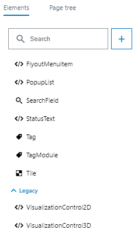

