= UI-Builder: How to integrate an existing WebComponent

# Overview

:source-highlighter: highlightjs

If you need a special functionality for your UI, which is not covered by the elements and controls provided by the UI-Builder, you can add new WebComponents to the UI-Builder. 
The goal of this article is to describe a way to make use of existing WebComponents by integrating them into the UI-Builder.

The paragraph "General information" documents the used API. It is followed by two step-by-step examples which guide you through the whole process of installing packages and adding files in the right places.

*Pre-requisites:* +
Knowledge:

* Basic skills in SICK App Designer (e.g. how to serve functions) 
* Basic programming skills (scripting)

Software:

* npm installed and configured (https://www.npmjs.com/get-npm)

# General information
To use an existing WebComponent in the UI-Builder, you first need to install it into the node_modules folder of the UI-Builder: "%USERPROFILE%\.vscode\extensions\sickag.appspace-ui-builder-<version number>\out\bundle\uiextensionrepository"

There are two files from which the UI-Builder gets all the information needed to integrate the WebComponent with all its possibilities:

In the "package.json" file, which is included in all WebComponent packages, the entry point for using the WebComponent can be specified by "main":$entrypoint (see link:https://docs.npmjs.com/files/package.json#main[]). If this information is not given in the WebComponent which you want to use, you will have to add it manually. Consult the documentation of the specific WebComponent for further information.

The "components.json" file provides the information about adjustable parameters for the UI-Builder and needs to be added to the WebComponents' folder which you just installed. It has the following definition:

[source, javascript]
----
/** componets json definition */

interface Definition {
    /** name of the exported class (es export) 
    - appears as name of element in the UI-Builder
    */
    className: string;

    /** file which exports the class */
    from?: string;

    /** html tag (as defined in code of web-component) */
    tag: string;

    /** super class 
    - needs to be set to {"identifier": "CustomElement", "from":""} to be included in 
    the UI-Builder
    */
    superClass: {

      /** name of the exported super class 
      - "CustomElement" for UI-Builder
      */
      identifier: string;

      /** file which exports the super class */
      from?: string;
    },

    /** dependencies of the web-component */
    dependencies?: Array;

    /** documentation of the web-component 
    - used in the UI-Builder to give hover information and to categorize the element 
    */
    documentation: {
      
      /** short description for the component 
      - appears as hover information in the element list in the UI-Builder
      */
      description: string;

      /** category 
      - used to categorize the element in the UI-Builder
      */
      category: string;

      /** tags may contain slot information, examples, etc 
      - in the UI-Builder, slot information is used to determine if elements can be stacked;
      examples are rendered for the hover information of the "i"-icon in the control view panel
      */
      tags?: Array;
    },

    /** properties of the custom element 
    - are rendered as input fields in the control view panel of the UI-Builder
    */
    properties: {

        /** name of the property */
        name: string;

        /** name of html attribute as defined in code of web-component 
        - appears as label of the input field in the UI-Builder
        */
        attributeName: string;

        /** default value */
        defaultValue: unknown;

        /** if multiple types are possible the type of the default value can be 
        specified here
        */
        defaultValueType?: string;

        /** description of the property */
        description: string;

        /** type: (typescript type, eg: string, boolean, Object, union types, etc) */
        type: string;

        /** does the value reflect to the attribute */
        reflectAsAttribute?: boolean;
    }[],

    /** event fired by the element 
    - events of the elements can be seen in the add binding dialog of the UI-Builder
    */
    event: {

        /** name of the event */
        name: string;

        /** type of the "details" property (CustomEvent API) *typescript* type
        eg: string, boolean, Object - mapped to Crown type by the UI-Builder
        */
        type: string;

        /** description of the event */
        description: string;
    }[]
}
----

# Example: Calendar
In this section you will learn how to integrate an existing Calendar (URL: https://www.webcomponents.org/element/mpachnis/mp-calendar, License: MIT) into the UI-Builder.

## Integration into the UI-Builder

### Install the WebComponent via npm
First, install the Library into your node_modules folder (see paragraph <<General information>>). To do this, open a console in the folder and run the following command:

[source, bash]
----
npm install @mpachnis/mp-calendar
----

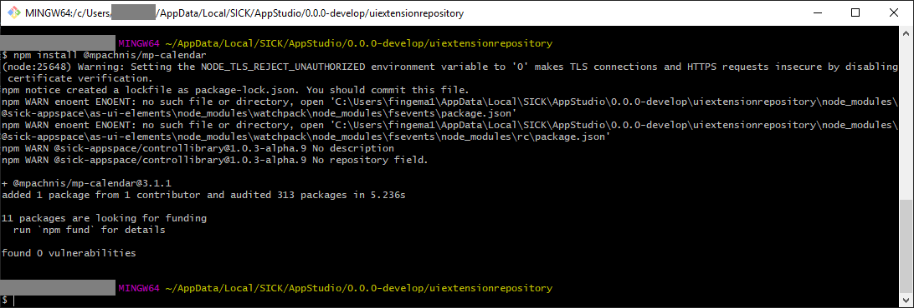

### Define the components.json file
Next, the WebComponent needs to be described in the correct format for the UI-Builder. To do so, create a description file "components.json" in "<uiextensionrepository location (see paragraph <<General information>>)>\node_modules\@mpachnis\mp-calendar\" and insert the following content:

[source, json]
[
  {
    "className": "Calendar",
    "tag": "mp-calendar",
    "superClass": {
      "identifier": "CustomElement",
      "from": ""
    },
    "dependencies": [],
    "documentation": {
      "description": "mp-calendar is a web component, providing calendar date functionality and events support. For quick navigation between month and year, you can select one from the list.",
      "category": "CustomElement",
      "tags": []
    },
    "properties": [
      {
        "name": "eventsObject",
        "attributeName": "events-object",
        "defaultValue": null,
        "defaultValueType": "Array<{title: string; content: string; date: string; category: string; color: string}>",
        "description": "Set an object containing events. ex. events-object='[{\"title\":\"Red style category\",\"content\":\"Skype call at 15:40\",\"date\":\"2018-07-20\",\"category\":\"red\", \"color\": \"#000\"}]'",
        "type": "Array<{title: string; content: string; date: string; category: string; color: string}>",
        "reflectAsAttribute": true
      },
      {
        "name": "minYear",
        "attributeName": "min-year",
        "defaultValue": 5,
        "defaultValueType": "number",
        "description": "Set the min year list.",
        "type": "number",
        "reflectAsAttribute": true
      },
      {
        "name": "maxYear",
        "attributeName": "max-year",
        "defaultValue": 5,
        "defaultValueType": "number",
        "description": "Set the max year list.",
        "type": "number",
        "reflectAsAttribute": true
      }
    ],
    "events": []
  }
]

### Check information about main script in the package.json
Check that the "package.json" file (in "<uiextensionrepository location (see paragraph <<General information>>)>\node_modules\@mpachnis\mp-calendar\") contains the information about the main entry point as described in the general section.

### Use the WebComponent in UI-Builder
After starting or restarting your IDE it is possible to add the calendar control within the UI-Builder. Try this with any app of your choice.

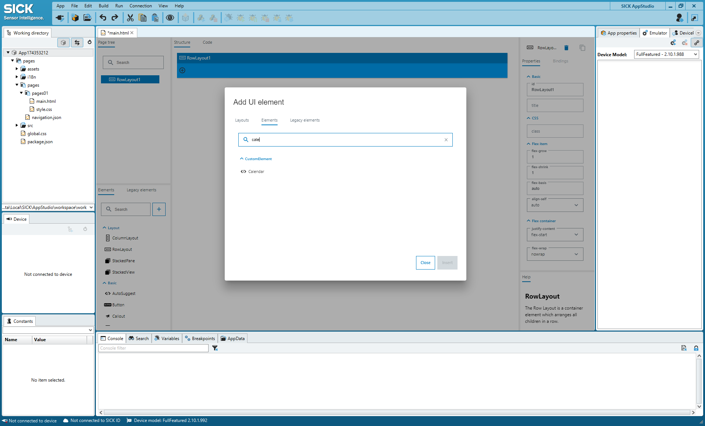
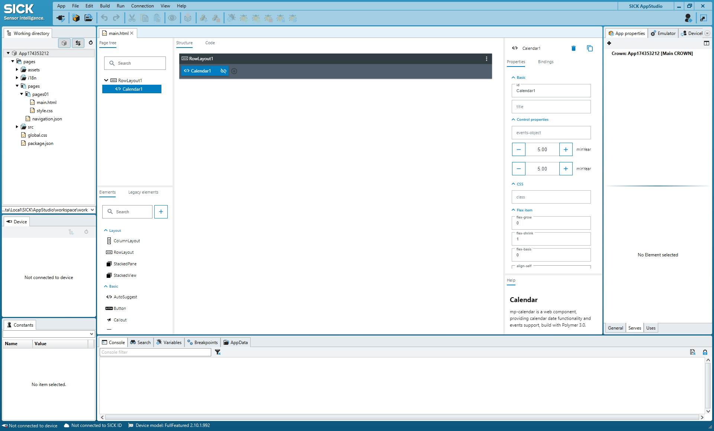

### Display the WebComponent (without additional data) in the UI of the app
Start the emulator, run the app on the emulator and open the device page. There you will see the newly added calender component:
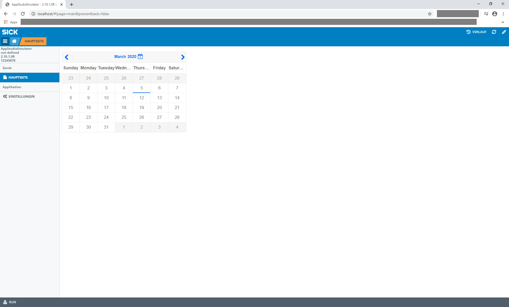

## Providing data for the calendar
To provide data for the calendar, create a lua function named getCalendarData() and serve it (e.g. via "serve function" from the context menu):

[source, lua]
----
local function main()
  -- write app code in local scope, using API
end
Script.register('Engine.OnStarted', main)
-- serve API in global scope
 
--@getCalendarData():string
function getCalendarData()
  return '[{"title":"My Birthday", "content":"Party with friends", "date":"2020-03-05", "category":"birthdays", "color":"#ff0000"}, {"title":"Family", "content":"Family", "date":"2020-03-07", "category":"default", "color":"#00ff00"}]'
end
Script.serveFunction('App174353212.getCalendarData', getCalendarData)
----

## Filling the calendar with data

### Add a binding
To fill the calendar with the provided data, switch back to the UI-Builder and add a binding from the eventsObject property of the calendar to the served function:

* eventsObject is of a "complex" object type and the return value of "getCalendarData" is a string, so "filter by type" needs to be unchecked to find the function in the list of available Crown-bindings:
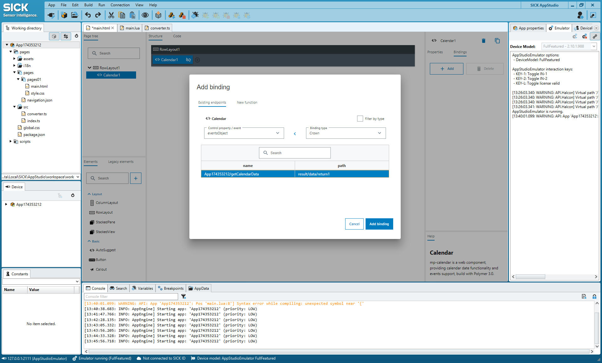

* To convert the returned string into the "complex" object of eventsObject, add a converter function to pages/src/converter.ts:
[source, typescript]
export function convertToJson(value) {
  const data = JSON.parse(value);
  return data;
}

* Reference this converter function in the created binding (it is a good idea to set the auto-update to 10000, otherwise the tooltip will blink): +
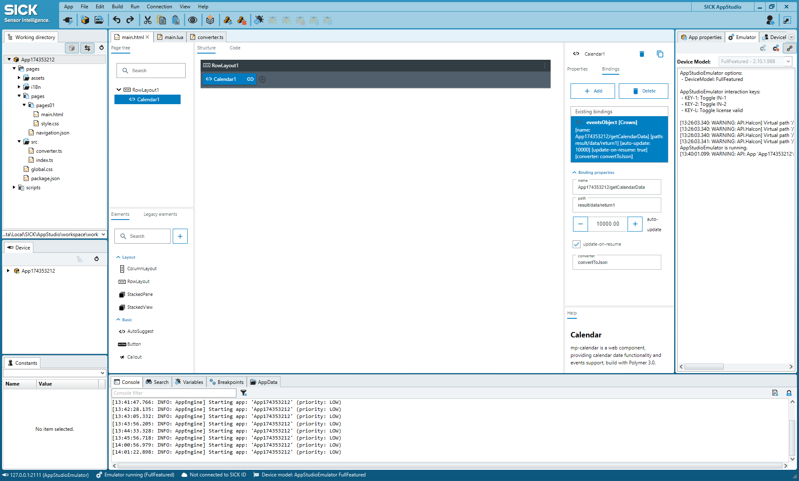

### Display the WebComponent (with the newly added calendar data) in the UI of the app
Now, the device page shows the imported calendar component with two appointments:
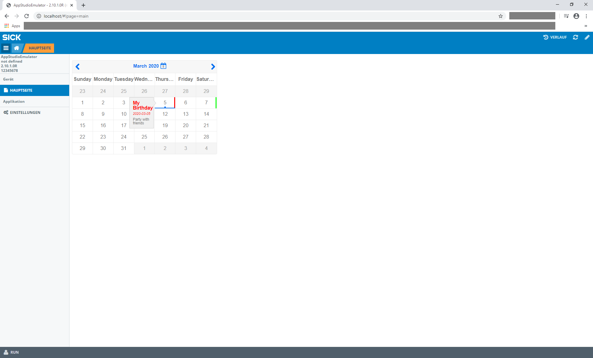

# Example: ColorPicker
In this section you will learn how to integrate an existing ColorPicker (URL: link:https://www.webcomponents.org/element/@fooloomanzoo/color-picker/elements/color-picker[], License: MIT) into the UI-Builder.

## Integration into the UI-Builder

### Install the WebComponent via npm
First, install the Library into your node_modules folder (see paragraph <<General information>>). To do this, open a console in the folder and run the following command:

[source, bash]
npm install @fooloomanzoo/color-picker

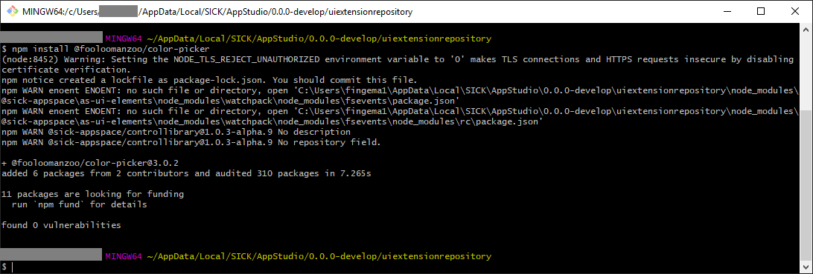

### Define the components.json file
Next, write a description file ("<uiextensionrepository location (see paragraph <<General information>>)>\node_modules\@fooloomanzoo\color-picker\components.json") for the component:
[source, json]
[
  {
    "className": "ColorPicker",
    "tag": "color-picker",
    "superClass": {
      "identifier": "CustomElement",
      "from": "@sick-davinci/ce-decorators"
    },
    "dependencies": [],
    "documentation": {
      "description": "*color-picker* is a picker for color for Polymer that can use the native input, too. If the native picker is chosen and is not supported, this element uses the polyfill datetime-picker. The *<calendar-element>* and the *<time-element>* will come in place if the native picker is not available or is not explicitly wanted. *css-value* will give you directly the css-string.",
      "category": "CustomElement",
      "tags": []
    },
    "properties": [
      {
        "name": "colorString",
        "attributeName": "color-string",
        "defaultValue": null,
        "defaultValueType": "string",
        "description": "value as color-string",
        "type": "string",
        "reflectAsAttribute": true
      }
    ],
    "events": [
      {
        "description": "input-picker-closed Fired after a picker has been closed.",
        "name": "input-picker-closed",
        "type": "unknown",
        "eventOptions": {
          "bubbles": true,
          "cancelable": false,
          "composed": false
        }
      },
      {
        "description": "input-picker-opened Fired when a picker has been opened.",
        "name": "input-picker-opened",
        "type": "unknown",
        "eventOptions": {
          "bubbles": true,
          "cancelable": false,
          "composed": false
        }
      }
    ]
  }
]

### Specify the main script in the package.json
In this case you also have to add "main": "color-picker.js" (line 37) into the package.json ("<uiextensionrepository location (see paragraph <<General information>>)>\node_modules\@fooloomanzoo\color-picker\") as mentioned in the general section:

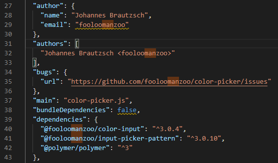

### Use the WebComponent in the UI-Builder
After starting or restarting your IDE it is possible to add the ColorPicker control within the UI-Builder:
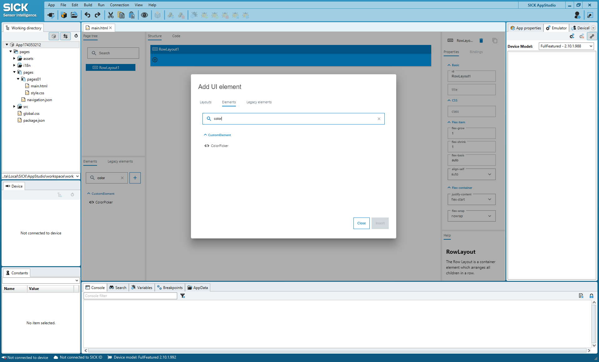

As depicted in the following screenshot, the color-string attribute of the ColorPicker can be accessed within the UI-Builder to set the default color (#00ff99) +
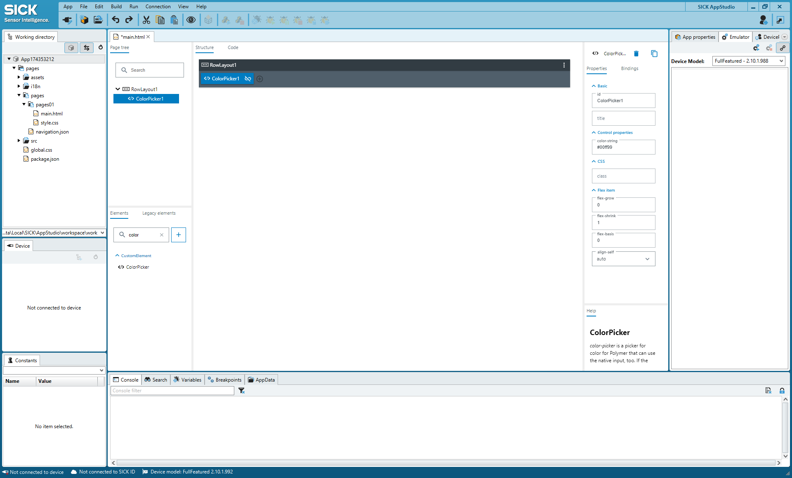

### Display the WebComponent in the UI of the app
Start the emulator, run the app on the emulator and open the device page. It shows the newly added color-picker component: +
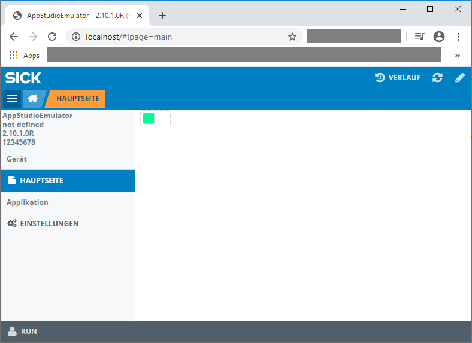

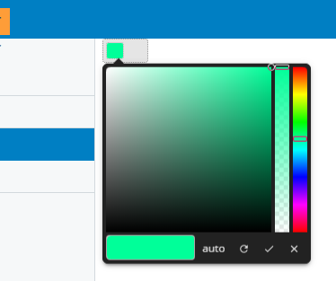
