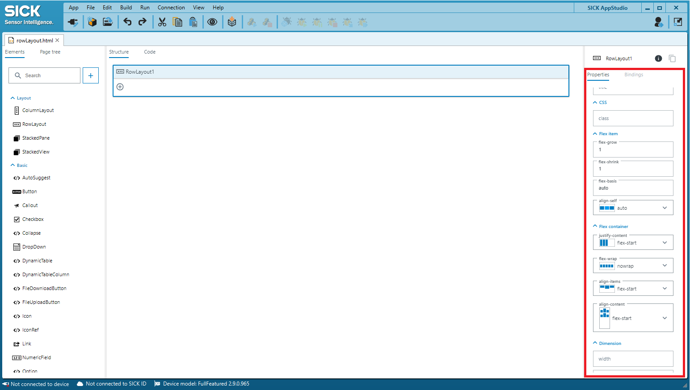
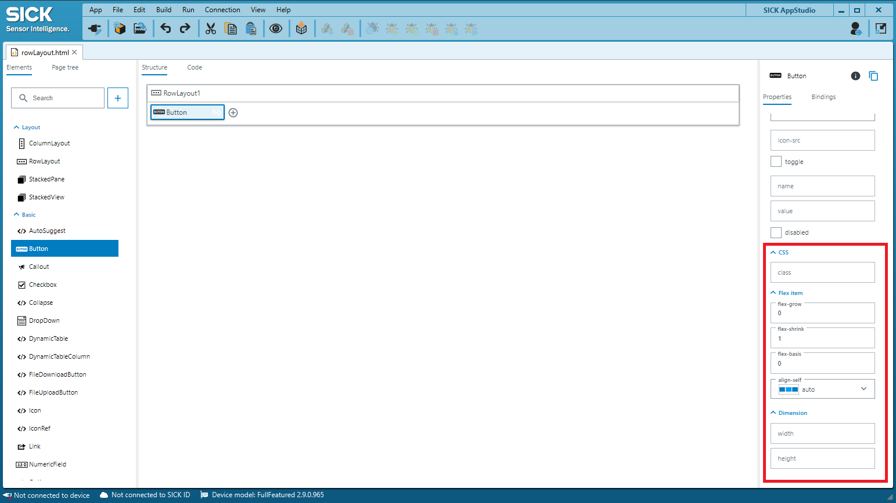
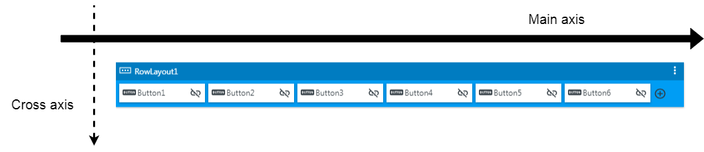
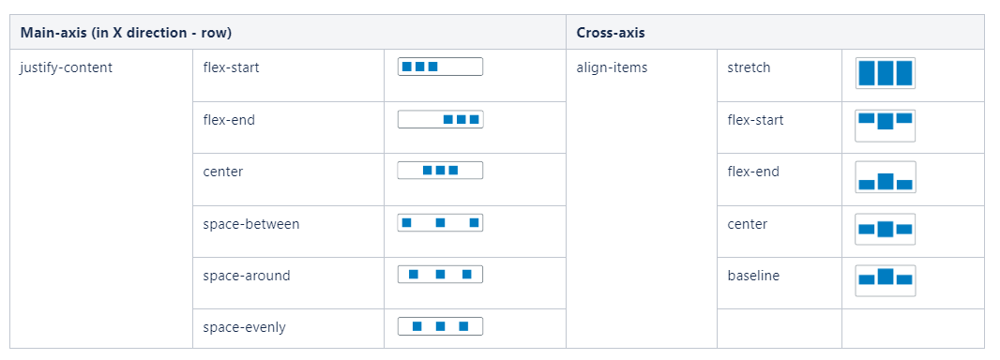
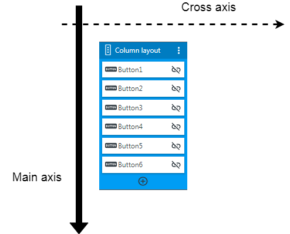
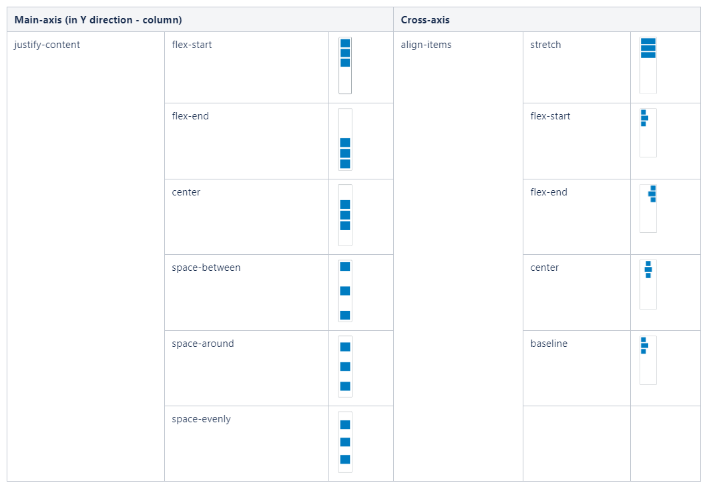
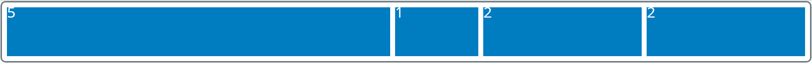
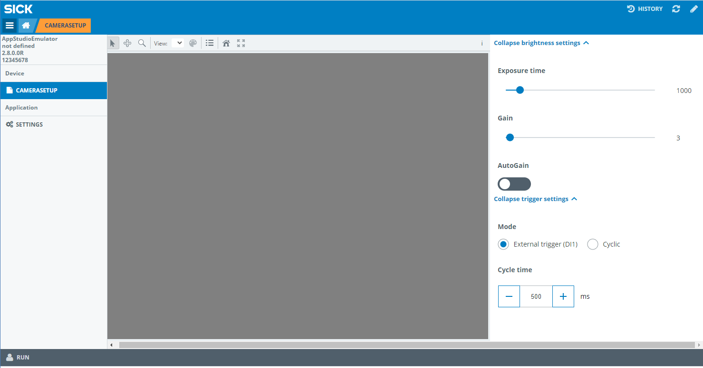
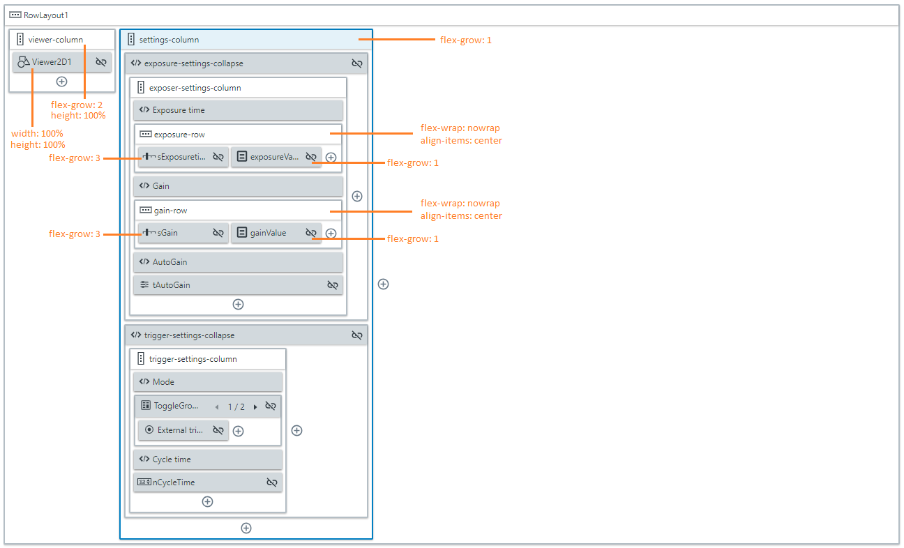
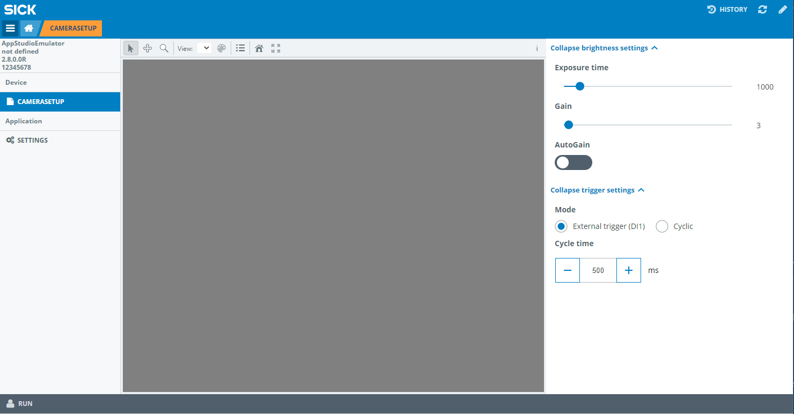

= UI-Builder: Layouting

# About this tutorial
In this tutorial you will learn how to lay out your page using the UI-Builder. It builds on the knowledge of the tutorial link:https://supportportal.sick.com/tutorial/ui-builder2-application-specific-ui/["UI-Builder: Application specific UI"]. It is recommended to take a look at said tutorial first, which will lead to a basic understanding of the UI-Builder and how to use it.

This tutorial will provide an insight into css flexbox and how to use it within the UI-Builder to build customized layouts.

# Underlying principle: CSS Flexbox 
Flexbox is a CSS module which makes it easier to build flexible, responsive layouts.

The basis for the layout of the elements used in the UI-Builder is the differentiation of flex containers and items. All elements act as containers and / or items. Flexbox differentiates between two directions / axes. +
Note: while you would define the axes manually in standard CSS Flexbox, the directions of axes are predefined for the elements in the SICK AppStudio UI-Builder.

In short:

* You have to keep track in which direction the main and cross axis are pointing. There are properties which are working on the main axis and other properties on the cross axis.
* There are different properties for flex container and flex item.
* The layout elements "RowLayout" and "ColumnLayout" can be a flex container and flex item at the same time. 
* Container properties affect all its children (elements put into the container).
* Item properties affect only the item itself.

## List of flex properties

[cols="20%,25%,13%,42%"]
|===
|*Container* | | *Item* |
| justify-content +
(main axis)
| Distributes extra space on the main axis.
| flex-grow
| Define how each item is growing in regard to the available space.

| flex-wrap
| Wraps items (or not) if they do not fit on one line
| flex-shrink
| Allows an item to shrink.

| align-items +
(cross axis)
| Defines how items are laid out on the cross axis.
| flex-basis
| Defines the size of an item before remaining space is distributed.

| align-content
| Defines how whole lines are laid out.
| align-self
| Sets the alignment for the individual item. (e.g. if the item it self should be flex-end while the rest is flex-start)

| flex-direction _(1)_
| Establishes the direction of the main axis.
| order _(1)_
| Allows to explicitly sets the order each item should appear in.
|===

_(1) These properties are implicitly defined either by custom elements like RowLayout and ColumnLayout (flex-direction) or by how the controls are laid-out within the structure view of the UI-Builder (order)._

For more detailed information, please refer to one of the many good documentations available online:

* In depth documentation (e.g.): link:https://css-tricks.com/snippets/css/a-guide-to-flexbox/[]
* Cheat sheet: link:http://flexbox.malven.co/[]
* Tool to play around with flexbox: link:https://the-echoplex.net/flexyboxes/[]

# UI-Builder and layouting

For laying out your page, the UI-Builder provides the following elements:

* Row layout
* Column layout
* Stacked view with stacked pane inside
* Tabs with tab inside
* Collapse element

All of these elements can contain any other element and can therefore be used to structure the page.

## Properties of row and column layout

All properties except the title property of row and column layout elements can be used for layouting. Available layout properties are:

* flex item properties
* flex container properties
* dimension (width and height)
* the id 
* css class definition

## Properties of all elements

The following layouting properties are also available for all other elements:

* flex item properties
* dimension (width and height)
* css class
* id field

As soon as you place any element within the structure view and select it, its properties are shown in the properties tab on the right.

The flex properties are most important for your layout. Take a look at the next paragraph to learn how to use them. The class or id definition can be used if you want to create CSS definitions to further customize the appearance of one or multiple elements. 

Please take a look at the link:https:/supportportal.sick.com/tutorial/ui-builder-2-theming/[css/theming tutorial] for more information.

# Flex container (RowLayout and ColumnLayout)
Note: Please keep in mind that the UI-Builder wraps the flex-direction property depending on the layout you choose - row layout or column layout. This predefines the direction of the main axis.

The flex container properties are: justify-content, flex-wrap, align-items and align-content.
The different flex container properties affect only one specific axis.

To illustrate how the axes are defined and affected, the properties "justify-content" and "align-items" are explained in relation to RowLayout and ColumnLayout in the following paragraphs.
For more detailed information on all flex container properties, please have a look at the detailed Flexbox documentation (see link in the Flexbox paragraph).

//TODO: explain flex-wrap and align-content?

## RowLayout
A row should be used if you want to lay out your controls horizontally beside each other and as the name says "in a row". 

In this layout the main axis points to the right. The cross axis points downwards.

The different flex container properties affect only one specific axis.

The following image illustrates this effect on the different axes using the properties justify-content (main axis) and align-items (cross axis):

## ColumnLayout

A column layout should be used if you want to lay out your controls below each other in a column. 

The main axis points downwards while the cross axis points to the right.

Revisiting the justify-content and align-items properties in case of the column layout results in the following:

# Flex items (all elements)

The flex item properties are: flex-grow, flex-shrink, flex-basis and align-self. 

## Flex-grow
Flex-grow takes a natural number as a parameter. This number defines how much of the available space of the surrounding container an element will take up (or at least try to) in proportion to all other elements within the container (siblings). 

In the following "RowLayout" 4 items were added with a flex-grow setting of 5, 1, 2, 2. All items together occupy 100% of the space of the parent container. As the total number of all items combined is 10 which means 1 = 10% of the available space. This e.g. results in the first item with flex-grow set to 5 taking 50% of the space.

For more detailed information on the other flex item properties (flex-shrink, flex-basis, align-self), please have a look at the detailed Flexbox documentation (see link in the Flexbox paragraph).

# Dimension (all elements)

By default, the size of an element will be automatically calculated by the browser based on the surrounding elements.

But the UI-Builder also enables you to set the width and height of an element explicitly. You can define those values in px, % or any other unit which is defined in css.

*Note*:  The property width (respectively height) does *not* set the properties min-width (respectively min-height) and max-width (respectively max-height). Depending on the element, those values might aswell be needed to enforce changes on height and width.

*Be careful*: The width (respectively height) of an element does not include padding, borders or margins. So if you set the width to 100% and there is some padding, border or margin added to the element, the width (respectively height) of the element will be the size of the parent element *plus* the size of the padding, border or margin. The element will therefore overgrow its parent element in this case.

# Example: Viewer with settings column on the side

## HTML-content in structure view

In the following example, we define the layout of a camera setup page as shown below. 

The page consists of two sections: The viewer on the left taks two quarters of the page to show the current camera picture while the third quarter is reserved to enter the camera settings. The layout is realized with two "ColumnLayout" elements. The first with the flex-grow set to 2 and the second with flex-grow set to 1.

Within the camera settings column, collapse elements are used to group the brightness settings and the trigger settings.

To directly import this example into SICK AppStudio, you can either copy the following html-code into the code view of the UI-Builder or download the app which is linked further down in this tutorial:

[source, html]
----
<layout-row id="RowLayout1" style="flex-wrap:wrap">
	<layout-column id="viewer-column" style="flex-grow:2;height:100%">
		<sick-viewer2d id="Viewer2D1" style="width:100%;height:100%">
		</sick-viewer2d>
	</layout-column>

	<layout-column id="settings-column">
		<davinci-collapse id="exposure-settings-collapse" collapsed-title="Expand brightness settings"
			expanded-title="Collapse brightness settings" open style="width:100%">
			<layout-column id="exposer-settings-column">
				<h6 id="Heading61">Exposure time</h6>
				<layout-row id="exposure-row" style="flex-wrap:nowrap;align-items:center">
					<davinci-slider id="sExposuretime" min="60" max="10000" ticks="10" unit="us" value="1000"
						style="flex-grow:3">
						
					</davinci-slider>
					<davinci-value-display id="exposureValue" value="1000" style="flex-grow:1">
					</davinci-value-display>
				</layout-row>

				<h6 id="Heading62">Gain</h6>
				<layout-row id="gain-row" style="flex-wrap:nowrap;align-items:center">
					<davinci-slider id="sGain" min="0" max="100" ticks="1" value="3" style="flex-grow:3">
						
					</davinci-slider>
					<davinci-value-display id="gainValue" value="3" style="flex-grow:1">
					</davinci-value-display>
				</layout-row>

				<h6 id="Heading63">AutoGain</h6>
				<davinci-toggle-switch id="tAutoGain" tabindex="0">
				</davinci-toggle-switch>
			</layout-column>
		</davinci-collapse>

		<davinci-collapse id="trigger-settings-collapse" collapsed-title="Expand trigger settings"
			expanded-title="Collapse trigger settings" style="width:100%">
			<layout-column id="trigger-settings-column">
				<h6 id="Heading64">Mode</h6>
				<davinci-toggle-group id="ToggleGroup1" value="1">
					<davinci-radio-button id="rbExternalTrigger" value="1">
						External trigger (DI1)
					</davinci-radio-button>
					<davinci-radio-button id="rbCyclic" checked value="2">
						Cyclic
					</davinci-radio-button>
				</davinci-toggle-group>

				<h6 id="Heading65">Cycle time</h6>
				<davinci-numeric-field id="nCycleTime" type="outline" min="0" max="10000" ticks="10" group-separator=","
					decimal-separator="." format-pattern="0" unit="ms" value="500">
				</davinci-numeric-field>
			</layout-column>
		</davinci-collapse>
	</layout-column>
</layout-row>
----

## Further modification with the help of the style.css file

As you can see, the distances between the headings and the following items are very large whereas the distance between the last element of the "brightness settings" collapse element and the heading of the "trigger settings" collapse element is very small. To improve the layout, you can add a new file called "style.css" directly next to the html file which you already created. 

Insert the following code into this:
[source, css]
----
#settings-column {
  margin-right: 20px;
}

#viewer-column {
  min-width: 300px;
}

#settings-column {
  min-width: 440px;
}

#exposure-settings-collapse {
  margin-bottom: 20px
}

h6 {
  margin-top: 10px;
  margin-bottom: 10px;
}
----

The entries (called selectors) beginning with the character "#" refer directly to the element which has the specified id, whereas entries without a special character at the beginning (e.g. "h6") refer to every element with this html tag (e.g. to every <h6> element in the html file).

After you added the above style.css file and reloaded the app, the page looks like this:

Since explaining css in general would go beyond the scope of this tutorial, please refer to general documentation about css which is available online, for example link:https://www.w3schools.com/Css/[].

## Download the source code

The source code of this example can be found here:

https://gitlab.com/sick-appspace/samples/UILayouts/blob/master/UILayouts/pages/pages/CameraSetup/CameraSetup.html +

You can also download the whole sample and import it into SICK AppStudio:

https://gitlab.com/sick-appspace/samples/UILayouts

// commented since Stacked view as outermost layer isn't working at the moment. Needs to be redone with more explanation and updated screenshots
// ## Stacked view

// A StackedView gives you the possibility to lay out different panes and decide which pane to show e.g. via a binding to an app. 

// A StackedView contains one or many StackedPane layout elements. The StackedPane of which the value matches the value of the StackedView is presented on the page.

// StackedView and StackedPane do only provide flex item properties within the properties list in the UI-Builder. By default the children of a StackedPane are laid out from left to right.

// It is always possible to use a RowLayout or ColumnLayout if you should need to arrange the controls further within the StackedPane.

// Layouts like the one shown in the following picture are easily possible:

// image::media/stackedView.png[stacked-view]

# Download Tutorial as PDF