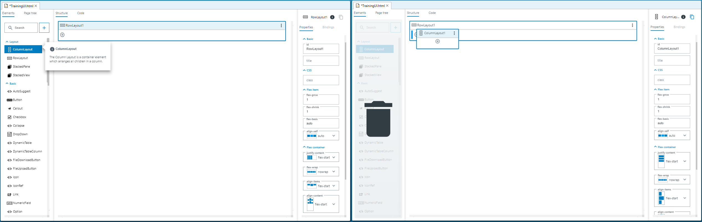
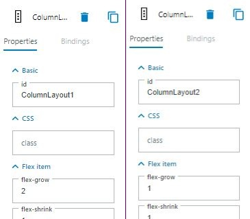

= UI-Builder: Application specific UI - a step by step example

# Introduction

:source-highlighter: highlightjs

In this tutorial you will learn how to use the UI-Builder to create customized UI pages for your sensor application. To do this, we will show you how to create an UI for a given app ("TrainingApp1", download available in paragraph "Preparation").
Additional information and explanations can be found in the following tutorials: 

* Tutorial "UI-Builder: Application specific UI" https://supportportal.sick.com/tutorial/ui-builder2-application-specific-ui/[on the Support Portal]
* Tutorial "UI-Builder: Layouting" https://supportportal.sick.com/tutorial/ui-builder2-layouting/[on the Support Portal]
* Tutorial "UI-Builder: UI Bindings" https://supportportal.sick.com/tutorial/ui-builder2-bindings/[on the Support Portal]

// TODO: add links to github once available

The provided app "TrainingApp1" receives images of barcodes, decodes them and returns their content. It includes functions to set the cycle time in which new images are received or to take snapshots immediately.

## Prerequisites
* Basic skills in using *SICK AppStudio* or *SICK AppSpace SDK*, mainly how to connect to a device or emulator, deploy "SensorApps" onto it and open the device page. Consider the tutorials "AppStudio introduction" link:https://supportportal.sick.com/tutorial/appstudio-introduction/[on the Support portal] or "AppStudio essentials" link:https://supportportal.sick.com/tutorial/appstudio-essentials/[on the Support Portal] for more information.
// TODO: add links to github once available
//TODO: SICK AppStudio essentials is missing the opportunity to open the device page in the browser yet.

# Goal:
Create a UI which will show the received images, show their content and bind to the other functions to make them easily accessible for the user.

Screenshot of the finished UI:

image::media/pageviewallcontrols.png[pageviewallcontrols]

# Preparation

. Download the training app from 
https://supportportal.sick.com/file/0483c6f0-0989-4ee0-9562-19e40f3f06ed/[supportportal]
// TODO: add links to github once available
. Open the IDE (SICK AppStudio or SICK AppSpace SDK), start the *SICK AppEngine* and connect to it.
. Import the downloaded SensorApp
** In *SICK AppStudio* there are three possibilities to do this: use drag & drop, click "App" → "Import" or right click into some empty space in your working directory and choose "Import App"
** In *SICK AppSpace SDK*: extract the zip file in the selected workspace
. If you are interested in the code itself, you can open the source code in "scripts/App1.lua"

# Creating the UI step by step

## Add a new page 

To add a new page component to the SensorApp:

* In *SICK AppStudio*:
. Right-click on the app → "Create component" → "pages"
+
image::media/newpagecomponent.png[newpagecomponent]

. A dialog will appear where you can enter a name for the new page. Name the page "TrainingUI" and press OK
+
image::media/newpagename.png[newpagename]

. The UI-Builder will open automatically
+
image::media/uibuilder2.png[uibuilder]

* In *SICK AppSpace SDK* there is no way of automatically adding the components to existing SensorApps as of yet. For now please follow the steps described below:
. Download the zipped pages component
// TODO: Add link to the component
. Unzip the package in the SensorApp, so the "pages" directory is in the same level as "scripts" and "project.mf.xml"
. In the explorer tab, open "pages/pages/page01/TrainingUI.html" file. The UI-Builder editor will open.
+
image::media/uibuilder2.png[uibuilder]

## Add main layout

Now, create a 3-column layout for the page and adjust the widths:

. Select "ColumnLayout" from the "Elements" area and drag it into "RowLayout1"
+

. Repeat this step three times

. Select "ColumnLayout1" and set flex-grow to 2, set flex-grow to 1 for "ColumnLayout2" and "ColumnLayout3". +
This will lead to a 2:1:1 ratio between the columns, which means that column 1 takes 50% of the available space and columns 2 and 3 take 25% each.
+

## Define Headings
The next step is to add headings to the columns. Search for "Heading4" in the "Elements" section and drag one display into each column layout.

Set the data-content of

. the first heading to "Visualization"
. the second heading to "Control"
. the third heading to "Result"

## Add the viewer

After the layouting is done, you are ready to fill the columns with content.

Search for "Viewer2D" and drag it into the first column. Set the "height" property (last element in the "Properties" tab on the right) of the "Viewer2D" element to 700px.

image::media/viewer.png[]

If you run the App now, you see that the visualization control shows images of barcodes.

[NOTE]
====
If you look into the lua code, you see that we created a viewer there and added every new image to it. This viewer automatically connects to the viewer from the UI via a default-id:

[source,lua]
----
local viewer = View.create()

...

--- Function is called every time a new image is provided
---@param image Image
---@param sensorData SensorData
local function handleOnNewImage(image, sensorData)
  Log.info("New image received")

  -- Adding image to viewer and update
  View.addImage(viewer, image)
  View.present(viewer)

  -- Variable to store content string
  local content = "[No code found]"

...
----
====

## Add numeric field to configure the cycle time

If you want to change the cycle time in which new pictures are taken, the code offers a function to do that. Connect the UI to this function:

. Insert a "Heading5" to the second "ColumnLayout" and set its value property to "cycle time".
+
image::media/cycletime.png[cycle_time display]
. Insert a numeric field into "ColumnLayout2"
. Set the:
* "min" property to 20
* "max" property to 10000
* "unit" property to ms
+
image::media/numericfield.png[numeric1_4, 800]
. Click onto the binding symbol on "NumericField1" or switch to the "Bindings" tab and then click "+ Add" to add a new binding
. In the binding dialog:
* Select "change event" as Control property / event
* Select "Training/setCycleTime", then click "Insert Binding" to insert the binding

image::media/numericfieldwithbinding.gif[]

## Show the current cycle time 

Until now, the numeric field will always show the default value (which is the min value) on reload. To show the current cycle time instead, add another binding which sets the value to the current cycle time:

. Select the "NumbericField" and open the binding dialog.
. In the binding dialog:
* Select Control property "value"
* Select the binding type "Function (Crown)" (you may need to disable the "filter by type" checkbox)
* Make sure that "Training/getCycleTime" is selected
* Click "Insert Binding"

image::media/BindingCycleTime.png[]

## Add value display to show result of barcode scan

It would be nice to see not only see the barcodes, but also their content. Add a "ValueDisplay" to show the content:

. Add a "ValueDisplay" to column 3 and open the binding dialog.
. In the binding dialog:
* Select property "value" and binding type "Event (CrownEDPWS)""
* Make sure that "Training/OnProcessingFinished" is selected
* Click "Insert Binding"

image::media/BindingQR.png[]

## Add button to take snapshots

Add a button to be able to take snapshots:

* Add a button to the second column
* Change data-content to "take snapshot"
* Open the binding dialog, choose property "submit" and bind it to "Training/takeSnapshot"

image::media/snapshotbuttonadded.gif[]

image::media/bindingButton.png[]

# Resulting App

The final app can be downloaded here:

https://supportportal.sick.com/file/910ba0d5-9c74-4119-9423-e15f69de3b8d/[TrainingAppComplete.zip on support portal]

//TODO: Add link once available
