= UI-Builder: CSS Styles and Theming

# About this tutorial
In this tutorial you will learn how to change the appearance of the user interface using CSS definitions. It builds on the knowledge of the tutorial link:https://supportportal.sick.com/tutorial/ui-builder2-application-specific-ui/["UI-Builder: Application specific UI"]. It is recommended to take a look at said tutorial first, which will lead to a basic understanding of the UI-Builder and how to use it.

To change the styling of your UI, the UI-Builder offers you several options based on the Cascading Style Sheets (CSS) mechanism. CSS offers you the possibility to define styles (e.g. colors, margins or borders) for single UI elements or themes that are applied on the whole UI page.

# Using CSS to change the style of UI elements

It is possible to apply CSS styles to change the appearance of single UI elements (see <<StyleElement>>), of all UI elements of a specific type (see <<StyleType>>), or of all UI elements that define a specific CSS class (see <<StyleClass>>). 

The styling of HTML elements such as +
+ or +<h1>+ can be fully controlled via CSS definitions. Note that the possibility to style other UI elements like buttons or checkboxes is limited. It is possible to apply external style definitions (e.g. margins and borders), while the internal style of these elements can only be addressed via theming variables as described in the paragraph <<Theming>>.

To define CSS settings, the following files are relevant:

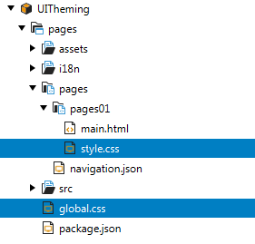

## Global CSS definitions
The CSS definitions you are adding to the global.css file are applied to all html pages within your UI.

## Local CSS definitions

The CSS definitions of the styles.css file are only applied to all pages, which are located within the same folder as the styles.css file. 
In addition, the definitions within the styles.css are more specific than the ones in the global.css file. If the same selector is used in both files, the definition in the style.css determines the appearance of the page.

//This gives you the possibility to have a more specific CSS definition for all pages which are located in the same folder as the styles.css file.

## Set the style of a specific UI element [[StyleElement]]

CSS properties can be applied to a specific element with standard CSS syntax as shown in the example below.

.Example UI page
[source,html]
----
<layout-row id="RowLayout1">
	<h3 id="Heading31">Text1</h3>
	<h3 id="Heading32">Text2</h3>
    <davinci-numeric-field id="NumericField1">
    </davinci-numeric-field>
    <davinci-numeric-field id="NumericField2">
    </davinci-numeric-field>
</layout-row>
----
Without any CSS settings, the resulting page looks like this:

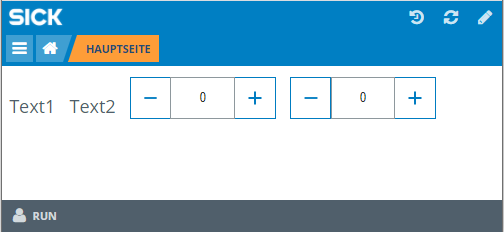

Applying the following CSS settings to the page's style.css file results in a changed styling of the first +<h3>+ element with id +Heading31+.

Content of the style.css file:
[source,css]
----
#Heading31 {
  background-color: blue;
  color: white;
  margin: 1px 1px 1px 1px;
}
----
The resulting UI page looks as follows:
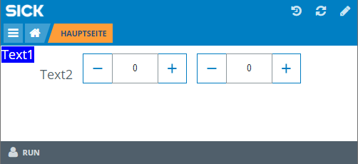

## Set the style of a UI element type [[StyleType]]

It is also possible to modify the style of all elements of the same type. Consider the following example:

Content of the style.css file:
[source,css]
----
h3 {
  background-color: blue;
  color: white;
  margin: 1px 1px 1px 1px;
}

davinci-numeric-field {
  border-color: red;
  border-width: 5px;
  border-style: dashed;
  margin: 1px 1px 1px 1px;
}
----

As shown in the resulting UI page below, all +<h3>+ and +<davinci-numeric-field>+ elements are affected by the CSS styling definition.

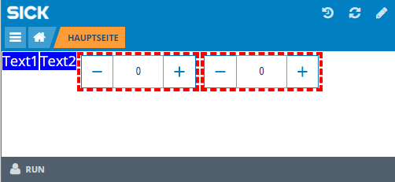

## Define a style class [[StyleClass]]

You may want to apply a styling setup to several UI elements. In this case you can use the CSS class property. The property can be accessed in the element's Properties tab. In the example below, two classes (+color+ and +margin+) are specified.

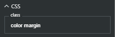

In the following CSS definition you can see, that CSS classes are specified by adding a dot in front of the class name. There are three classes in the example which specify color, margin and border properties. The class names (+color+, +margin+, +border+) can be chosen freely.

Content of the style.css file:
[source,css]
----
.color {
  background-color: blue;
  color: white;
}

.margin {
  margin: 1px 1px 1px 1px;
}

.border {
  border-color: red;
  border-width: 5px;
  border-style: dashed;
}
----

In the listing below, these classes are applied to the UI elements. Note that also multiple classes can be used.

Example UI page with classes:
[source,html]
----
<layout-row id="RowLayout1">
	<h3 id="Heading31" class="margin">Text1</h3>
	<h3 id="Heading32" class="color margin">Text2</h3>
    <davinci-numeric-field id="NumericField1" class="margin">
    </davinci-numeric-field>
    <davinci-numeric-field id="NumericField2" class="border margin">
    </davinci-numeric-field>
</layout-row>
----

The resulting UI page looks as follows:

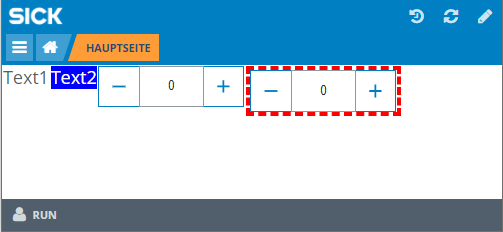

# Define a UI color theme [[Theming]]
## Pages (SampleApp)
If you intend to edit the internal colors of UI elements (e.g. change the button's color from blue to red), you have to overwrite theming variables. 

To show the effect of defining a color theme, we will use the Pages SampleApp that you can download here: link:https://gitlab.com/sick-appspace/samples/Pages[Pages SampleApp]  

The normal UI page of this app looks as follows:

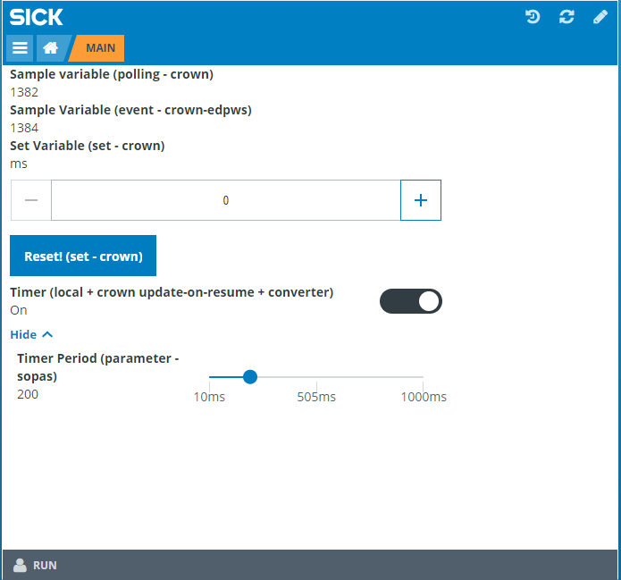

In the following listing of the global.css file several theming colors are overwritten:

Content of the global.css file:
[source,css]
----
/* Add project wide CSS settings here */
:root {
  --davinci-color-primary: #FF0000;
  --davinci-color-text-on-primary: #000;
  --davinci-color-text: blue;
}
----

The theme is applied as shown in the resulting UI page:

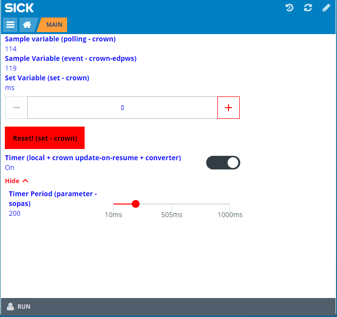

As shown in the paragraph <<StyleClass>>, you can design elements individually by defining a css class containing the davinci-color settings. You then apply this class to the element you want the theme applied to. The other elements on the page will then not be affected by the color theme.

# Modify the style of the UI frame

If you intend to change the styling of the UI frame, you have the possibility to overwrite the standrad CSS definitions of the framework within the global.css and styles.css files.

The following snippet of CSS code changes the background color of the header to light grey:

Content of the global.css file:
[source,css]
----
/* Add project wide CSS settings here */
.sopasjs-ui-header-toolbar-wrapper {
  background-color:lightgrey;
}

.sopasjs-ui-header>.app-logo {
  margin-right:0px;
}

.app-logo {
  background-color: lightgrey;
}

.sopasjs-ui-header-toolbar-button>a {
  color:red;
}
----

The resulting UI page looks as follows:

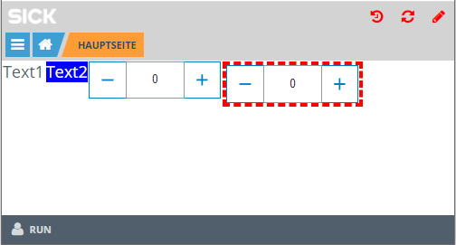

If you don't know the appropriate CSS selector for an element, the integrated developer tools in Chrome or Firefox can be helpful. They also enable you to test changes on the fly.
Check out the following paragraph for more details.

## Lookup CSS selectors (advanced)
* Open the app specific UI for which you want to change CSS styles in e.g. Google Chrome.

* Right-click on the element you want to change the style of and press Inspect.

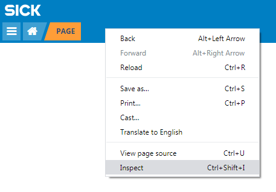

* The developer tools will open and show you the element. The developer tools will provide you information about CSS classes and defintions. You are also able to change the CSS settings on the fly to directly inspect the effects of any changes on the rendered UI page.

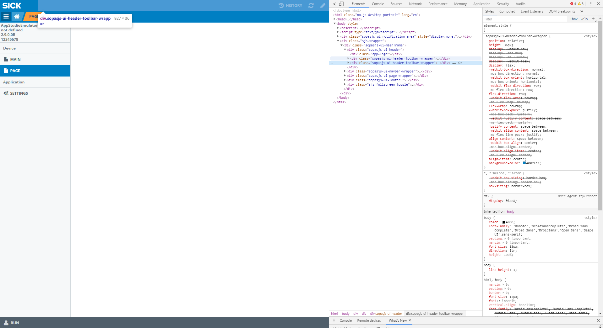

// todo: when the tutorial is published, we can upload the COLORS.html file and add a download link it
//# Theming: CSS variables reference

//The following refernce shows an examplary SASS/CSS integration and a reference of all supported CSS theming variables.

//link:media/COLORS.html[COLORS-davicni-theme-base.1.3.1.html]

# Links

https://www.w3schools.com/css/default.asp

https://cssreference.io/

# Download Tutorial as PDF