= Visualization and Graphical Interaction

# Introduction
## Goal
After completing this tutorial you will have basic knowledge in visualization and graphical interaction, including

* View
* Image
* Shape 2D and 3D
* Text
* Graph
* Profile
* Heightmap
* PixelRegion
* PointCloud
* Interaction (pointer, change and connection events)

## Pre-requisites
* General introduction to SICK AppSpace (see link:https://supportportal.sick.com/tutorial/appstudio-introduction/[AppStudio Tutorial])
* Basic skills in SICK AppStudio
* Basic programming skills (scripting)

# View

## Overview

The View CROWN API together with the View GUI controls are used to graphically visualize image based sensor data and analysis results

* Visualize different data types (sensor data, shapes, graphs, etc.)
* Manipulate shapes graphically

## Available GUI controls

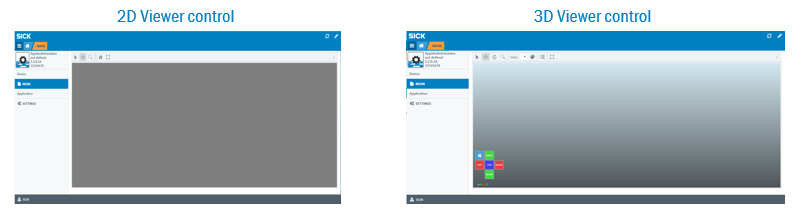

## Viewer controls

The view control is added to the MSDD (Mobile Sopas Device Driver). +
It is possible to assign an ID to each viewer to allow multiple viewer controls in a GUI.

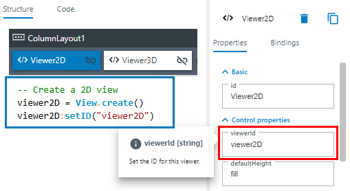
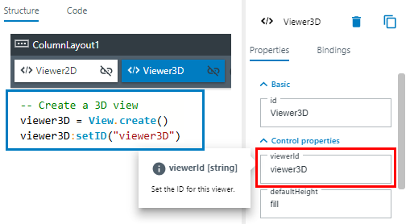

## Skeleton structure
Create a 2D view or 3D view
----
viewer = View.create()
----

Give an ID to the view
----
viewer:setID(“...”)
----

Clear the view
----
viewer:clear()
----

Add data to the view (shapes, text, images, etc.)
----
viewer:add...
----

Present all data added to the view
----
viewer:present()
----

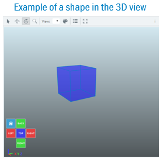

## Present

To be able to see any added data in the view, all data first need to be presented.

Data added to the viewer is stored to a “queue”
----
viewer:addImage()
viewer:addShape()
viewer:addText()
----

Whenever the view is presented, all commands in the queue are sent to the viewer
----
viewer:present()
----

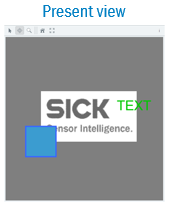

## Scene graph

The scene graph is a tree structure to organize items to be visualized. It is used to control what is displayed in the viewer control.

Each iconic in the scene graph is assigned an ID later used to refer to the iconic.

* If an ID is not specified, it is automatically generated by the CROWN and returned by the ”add” function
* It is possible to remove an iconic and all its child iconics with one operation

Modify the scene graph using the View API
----
viewer:addShape(…) -- Add a 2D or 3D shape
viewer:addText(…) –- Add text
viewer:addImage(…) -- Add a 2D image
viewer:addPointCloud(…) -- Add point cloud
viewer:addHeightMap(…) -- Add a heightmap
viewer:addPixelRegion(…) -- Add a pixel region
viewer:clear(…) -- Remove all items currently in the scene graph
viewer:remove(…) -- Removes a specific object from the scene graph
viewer:present() -- Presents all added objects and images
----

# Visualize Data

## Image

Display an image in the 2D view 
----
viewer:addImage(image)
----

Control contrast by setting the range (no effects on RGB24 images)
----
decoration = View.ImageDecoration.create()
decoration:setRange(1000, 5000)
viewer:addImage(image, decoration)
----

Replace image by using an ID (a string)
----
viewer:addImage(image, nil, “myImage”)
viewer:addImage(image2, nil, “myImage”) -- Will replace the previous image with the same ID
----

Remove an image using an ID 
----
viewer:remove(”myImage”) -- Removes the image from the view
----

## 2D Shape

Create a shape
----
rectangle = Shape.createRectangle(Point.create(0, 0), 50, 50)
----

Create a shape decoration
----
decoration = View.ShapeDecoration.create()
decoration:setFillColor(59, 156, 208) -- light blue
decoration:setLineWidth(1)
decoration:setLineColor(59, 100, 255) -- dark blue
----

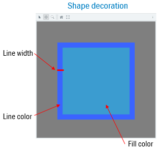

Hint: Shapes are added to the Scene Coordinate System by default.

Create a shape and add it to origin of the scene
----
rectangle = Shape.createRectangle(Point.create(0, 0), 50, 50)
viewer:addShape(rectangle, blueDecoration)
----

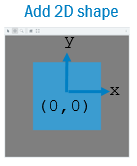

Update a shape by giving it an ID
----
viewer:addShape(rectangle, blueDecoration, ”myShape”)
viewer:addShape(rectangle, greenDecoration, ”myShape”)
----
_Replace the blue rectangle with the green rectangle in the view_

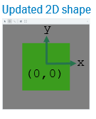

Remove a shape
----
viewer:addShape(rectangle, greenDecoration, ”myShape”)
viewer:remove(”myShape”)
----
_Remove the green rectangle from the view_

## Image and 2D shape

Shapes can also be shown in the Image Coordinate System

Hint: The image coordinate system (C.S.) has by default the origin in upper left corner of the image, with the y-axis downwards. The Image Coordinate System is controlled by the image’s pixel size and pixel origin
----
viewer:addShape(rectangle,blueDeco,”myRectangle”) -> Added to origin of Scene C.S
viewer:addImage(image,nil,”myImage”) -> Added to origin of Scene C.S
viewer:addShape(rectangle2,greenDeco,”myRectangle2”,”myImage”) -> Added to origin of Image C.S
viewer:addShape(rectangle2,greenDeco,”myRectangle2”,”myImage”) -> Added to origin of Image C.S
----
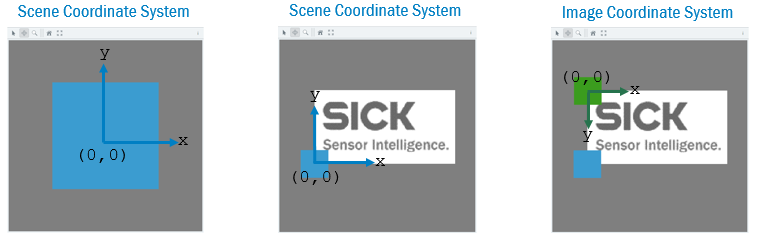

## Text
Create and add a text to the view
----
viewer:addText(“TEXT”,nil,”myText”)
----

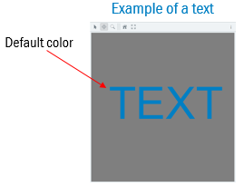

Create a text decoration
----
textDecoration = View.TextDecoration.create()
textDecoration:setColor(0,200,0) -- Green
textDecoration:setPosition(-280,20)
textDecoration:setSize(12)`
----

Create and add a text with decoration to the view
----
viewer:addText(“This is a green text with point size 12”, textDecoration, “myText”)
----

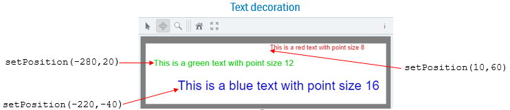

## Graph
Create and add a graph to the view
----
viewer:addGraph(values, coordinates, nil, “myGraph")
----

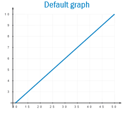

Create a graph decoration
----
decoration = View.GraphDecoration.create()
decoration:setGraphType("DOT")
decoration:setGraphColor(0, 255, 0)
decoration:setDrawSize(0.25)
decoration:setGridColor(0,0,0,50) 
----

Create and add a graph with decoration
----
viewer:addGraph({2, 4, 6, 8, 10}, {1,2,3,4,5}, decoration, “myGraph")
----

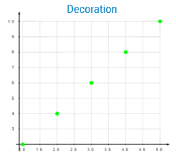

## Profile

Add a profile to the view
----
viewer:addProfile(profile, decoration, “myProfile")
----

Create a polar profile decoration
----
decoration = View.GraphDecoration.create()
decoration:setPolarPlot(true)
----

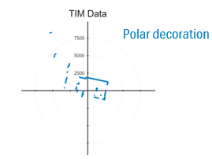

Create a bar profile decoration
----
decoration = View.GraphDecoration.create()
decoration:setGraphType("BAR“)
----

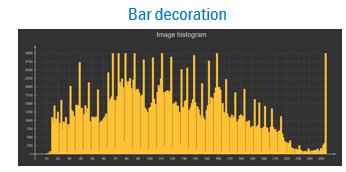

Create a line profile decoration
----
decoration = View.GraphDecoration.create()
decoration:setGraphType(“LINE“)
----

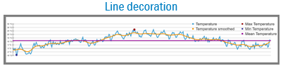

## 3D Shape

Create a 3D shape and add it to the scene
----
rectangle = Shape3D.createRectangle(100, 200)
viewer:addShape(rectangle, blueDecoration)
----

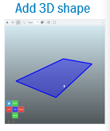

Update a shape by giving it an ID 
----
viewer:addShape(rectangle, blueDecoration, ”myShape”)
viewer:addShape(rectangle, greenDecoration, ”myShape”) – Will replace the blue rectangle with the green rectangle in the view
----

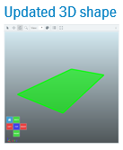

Remove a shape 
----
viewer:addShape(rectangle, greenDecoration, ”myShape”)
viewer:remove(”myShape”)
----

## Heightmap

Add heightmap
----
viewer:addHeightMap({heightMap, intensityMap})
----

Each image can have its own image decoration specifying ranges and color map
----
viewer:addHeightMap({heightMap, intensityMap}, {heightDecoration, intensityDecoration})
----

Set labels 
----
viewer:addHeightMap({heightMap, intensityMap}, nil, {”Texture 1”})
----

Update heightmap using ID
----
viewer:addHeightMap({heightMap, intensityMap}, nil, nil, ”myHeightMap”)
----

Remove heightmap using ID
----
viewer:remove(”myHeightMap”)
----

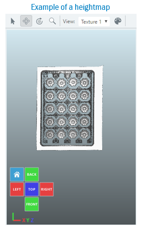

## PixelRegion

Create a pixel region
----
pixelRegion = Image.PixelRegion.createRectangle(x0, y0, x1, y2)
----

Add pixel region to the view
----
viewer:addPixelRegion(pixelRegion, decoration, ”myPixelRegion”)
----

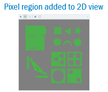

Pixel regions can be added to an image
----
viewer:addPixelRegion(pixelRegion, decoration, ”myPixelRegion”, ”myImage”)
----

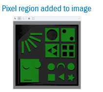

Pixel regions can be added to a heightmap
----
viewer:addPixelRegion(pixelRegion, decoration, ”myPixelRegion”, ”myHeightmap”)
----

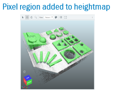

## PointCloud

Define a point cloud
----
pointCloud = PointCloud.create()
pointCloud:appendPoint(x,y,z)
----

Add a point cloud to the scene 
----
viewer:addPointCloud(pointCloud, nil, ”myPointCloud”)
----

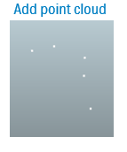

Set ranges, point size, and color map using decoration
----
decoration = View.PointCloudDecoration.create()
decoration:setXRange(0, 1000)
decoration:setYRange(1500, 2500)
decoration:setZRange(-1000, 1000)
decoration:setIntensityColormap(2)
decoration:setPointSize(4)
----

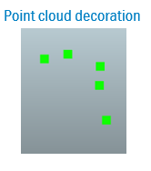

Update a point cloud using the same ID
----
viewer:addPointCloud(pointCloud, nil, ”myPointCloud”)
viewer:addPointCloud(pointCloud2, nil, ”myPointCloud”)
----

Remove a point cloud from scene
----
viewer:remove(”myPointCloud”)
----

Define a point cloud and add it to the scene +
----
pointCloud = PointCloud.create()
pointCloud:appendPoint(x,y,z)
----

Add a point cloud to the scene +
----
viewer:addPointCloud(pointCloud, nil, ”myPointCloud”)
----

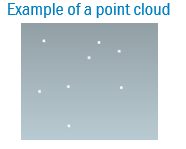

Different color scales can be chosen from the Color drop-down. 

Different image data visualization can be chosen from the Viewdrop-down

* Intensity: Show the 3D image with the intensity (reflectance) along the laser line as an overlay
* X: Color is proportional to x-coordinate
* Y: Color is proportional to y-coordinate
* Z: Color is proportional to depth (z-coordinate)

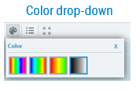

# Interaction

## Overview

Graphical interaction to edit shapes 

* Editors to graphically manipulate shapes
* Shape editors are used to graphically edit 2D shapes as well as 3D shapes

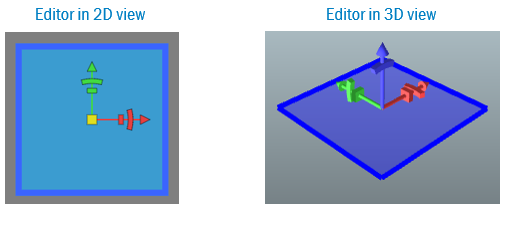

## 2D shape

Create a rectangle and install an editor using its ID +
----
rectangle = Shape.createRectangle(Point.create(0, 0), 50, 50)
viewer:addShape(rectangle, blueDecoration, ”myRectangle”)
viewer:installEditor(”myRectangle”)
viewer:present()
----
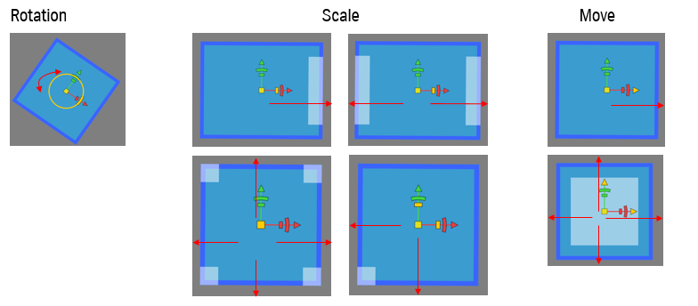

## 3D shape

Create a rectangle and install an editor using its ID
----
rectangle = Shape3D.createRectangle(50, 50)
viewer:addShape(rectangle, blueDecoration, ”myRectangle”)
viewer:installEditor(”myRectangle”)
viewer:present()
----
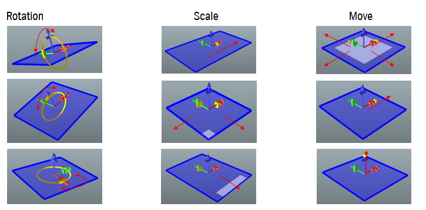

## Pointer event 

Use a pointer event to trigger actions when user is interacting with scene objects

Example: Install an editor when user clicks on a shape 
----
rectangle = Shape3D.createRectangle(100, 200)
viewer3D:addShape(rectangle, decoration, "myRectangle")
viewer3D:present()
viewer3D:register("OnPointer", OnPointer)

function OnPointer(iconicId, actionType, pointerType)
    if pointerType =="PRIMARY" then
        viewer3D:installEditor(iconicId)
        viewer3D:present()
    end
end
----
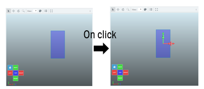

## Change event

Use a change event to trigger actions when user is modifying a scene object

Example: React when a user modifies a shape 
----
rectangle = Shape3D.createRectangle(100, 200)
iewer3D:addShape(rectangle, decoration, "myRectangle")
viewer3D:present()

viewer3D:register("OnChange", OnChange)

function OnChange(iconicId, iconic)
    viewer3D:addShape(iconic, decoration, iconicId)
    viewer3D:present()
    print(”Updated rectangle:”..iconic)
end
----

## Connection event

Use the connection event to trigger actions when a new viewer connects to the app

Example: Clear the screen and draw a shape each time a new viewer client connects +
----
rectangle = Shape3D.createRectangle(100, 200)
viewer3D:addShape(rectangle, decoration, "myRectangle")
viewer3D:present()

viewer3D:register("OnConnect", OnConnect)
function OnConnect()
    viewer3D:clear()
    viewer3D:addShape(Shape3D.createRectangle(200,200))
end
----

# Download tutorial as PDF

