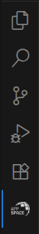

= SICK Sentio App Designer - Overview

//footer: navigation
== Sidebar
//TODO: Renew screenshot as soon as new icons are available
 
The Sidebar is located on the very left of VSCode and contains quick access to various VSCode features and extensions. After installing the *SICK Sentio App Designer* extension, a new icon will appear in the sidebar that provides access to the main features of the extension.

We recommend moving the *SICK Sentio App Designer* icon to the secondary sidebar on the very right, this way all Designer related features can be viewed while also accessing the VSCode file explorer, debugger and additional tools.

---
[cols="<,^,>", frame=none, grid=none]
|===
||xref:../Overview.adoc[Back to Overview]|
xref:../2.1.2-Explorer/Explorer.adoc[Next: Explorer]
|===