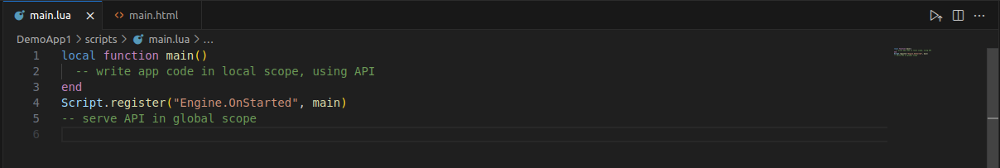
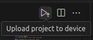

= SICK Sentio App Designer - Overview

//footer: navigation
== Editor
//TODO: Renew screenshot as soon as new icons are available
 
The Editor is located in the center of VSCode and is where users spend most of their time creating and modifying application code. After installing the *SICK Sentio App Designer* extension, new features and tools will be integrated into the editor to enhance the development experience.

We recommend familiarizing yourself with the various editor features, such as code completion, syntax highlighting, and integrated debugging tools, to make the most of the *SICK Sentio App Designer*.

 
At the top right of the editor, you can find a button to quick deploy the current application to a connected device, streamlining the development process.

---
[cols="<,^,>", frame=none, grid=none]
|===
|xref:../2.1.2-Explorer/Explorer.adoc[Back: Explorer]|xref:../Overview.adoc[Back to Overview]|
xref:../2.1.4-Auxiliary-Panel/Auxiliary-Panel.adoc[Next: Auxiliary Panel]
|===