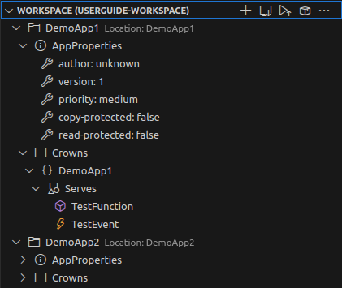
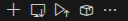
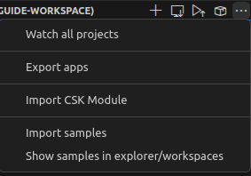
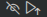
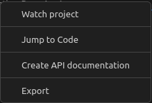
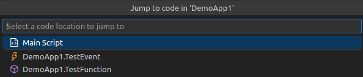
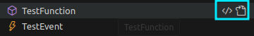

= SICK App Designer - Overview

//footer: navigation
== Workspace View
In the workspace view all your workspaces and projects with their respective metadata are listed. You can create, and manage your projects from here.

//TODO: Renew screenshot as soon as new icons are available

=== Workspace Actions
By selecting or hovering the workspace view, the quickactions will appear in the top right corner of the view:

[%collapsible]
====
|===
a| image::media/new-app.png[New App Action] | Create a new project
a| image::media/import-app.png[Import App Action] | Import an existing project
a| image::media/upload.png[Upload All Action] | Upload all projects to selected device
a| image::media/create-sapk.png[Package Project Action] | Package projects into .sapk
a| image::media/more-actions.png[More Actions] a| Show more actions:

|===

*More actions:*
|===
| Watch all projects | Builds all projects in a watch mode, meaning changes to files will automatically trigger a rebuild.
| Export apps a| Exports projects as `.zip` files for easy sharing.
| Import CSK Module | Import prebuild and ready to use link:https://github.com/SICKAppSpaceCodingStarterKit[CSK] modules.
| Import samples | Import link:https://github.com/sick-appspace-samples[sample applications] to get started quickly.
| Show/Hide samples... | Toggles the visibility of sample applications in the workspace and explorer view.
|===
====

=== App Actions
By selecting or hovering over an app entry, quickactions are displayed on the right side of the entry: 

and via right click the context menu of a project can be accessed:

[%collapsible]
====
|===
a| image::media/unwatch.png[Unwatch App Action] | Stop watch mode build of the project
a| image::media/upload-app.png[Upload App Action] | Upload the project to the selected device
| Watch project | Builds the project in a watch mode, meaning changes to files will automatically trigger a rebuild.
| Jump to Code a| Opens a jump dialog to quickly navigate to code:

| Create API documentation | Creates a standalong HTML documentation of the project API.
| Export | Exports the project as a `.zip` file for easy sharing.
|===

*Only for watched projects:*
|===
| Clean project build artifacts | Cleans the build artifacts of the project.
| Stop watching project | Stops the watch mode build of the project.
|===
====
=== Meta Data Actions
By selecting or hovering over meta data entries (properties, crowns, etc.) quickactions are displayed:

The code icon opens the corresponding LUA code to that element, where the file icon opens the definition in the app manifest.

---
[cols="<,^,>", frame=none, grid=none]
|===
|xref:../2.1.5-Home-View/Home-View.adoc[Back: Home View]|xref:../Overview.adoc[Back to Overview]|
xref:../2.1.7-Device-List/Device-List.adoc[Next: Device List]
|===