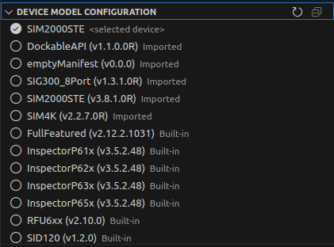
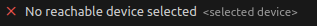

= SICK App Designer - Overview

== Device Model Configuration

In the device model configuration, users can select the device model used for code completion.

 

If a device is selected in the device list, the corresponding device model will be automatically selected in the device model configuration.

If no device is selected, it's indicated in the configuration view and only offline available device models can be selected:

There are three different types of device models:

* **Selected device**
* **Imported**
* **Build-in**

[%collapsible]
====
[cols="1,3"]
|===
|Selected device
a|image::media/connected-device.png[Device model of selected device]

This device model is directly fetched from the currently selected device in the device list. 

The selected device model can be stored for offline use by clicking the save icon on the very right.

|Imported
a|image::media/imported-device.png[Imported device model]

These device models have been imported from connected devices and are available for offline use. 

Imported device models can be deleted by clicking the trash icon on the very right.

|Build-in
a|image::media/built-in-device.png[Build-in device model]

These device models are pre-shipped with the *SICK App Designer* extension and are always available for offline use.

|===
====

//footer: navigation
---
[cols="<,^,>", frame=none, grid=none]
|===
|xref:../2.1.7-Device-List/Device-List.adoc[Back: Device List]|xref:../Overview.adoc[Back to Overview]|
xref:../2.1.9-App-Model/App-Model.adoc[Next: App Model Configuration]
|===