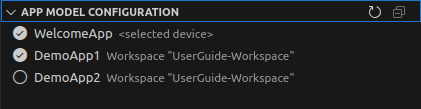

= SICK App Designer - Overview

== App Model Configuration

In the app model configuration, users can select the apps used included in the code completion.

 

In the above example, the models of the `WelcomeApp` App from the device (_selected device_) and the model of the `DemoApp1` App, which is available in the current workspace, will be used for code completion. `DemoApp2` is *not* selected and will therefore not be used for code completion.

The selection state of the used app models is stored between sessions of the *SICK App Designer* and can be changed by simply checking or unchecking the respective app.

//footer: navigation
---
[cols="<,^,>", frame=none, grid=none]
|===
|xref:../2.1.8-Device-Model/Device-Model.adoc[Back: Device Model Configuration]|xref:../Overview.adoc[Back to Overview]|
|===