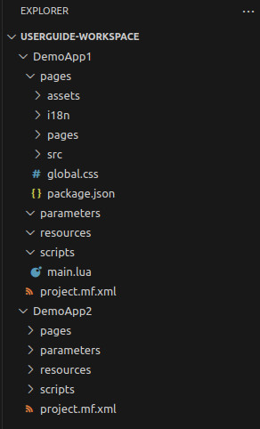

= SICK Sentio App Designer - Overview

//footer: navigation
== Explorer
//TODO: Renew screenshot as soon as new icons are available
 
In the built-in Explorer view of VSCode, users can navigate through their project files and folders.

Here all project related files can be found, including source code files, configuration files, and assets. The Explorer view also provides options to create, delete, rename, and move files and folders within the project.

---
[cols="<,^,>", frame=none, grid=none]
|===
|xref:../2.1-Sidebar/Sidebar.adoc[Back: Sidebar]|xref:../User_Guide.adoc[Back to User Guide]|
xref:../2.3-Editor/Editor.adoc[Next: Editor]
|===