= SICK App Designer - Overview

== Lua Script Editor

The Lua Script Editor is the primary editor for writing and editing Lua scripts for SICK sensor applications. It provides syntax highlighting, code completion, and error checking to help developers write code efficiently and accurately.

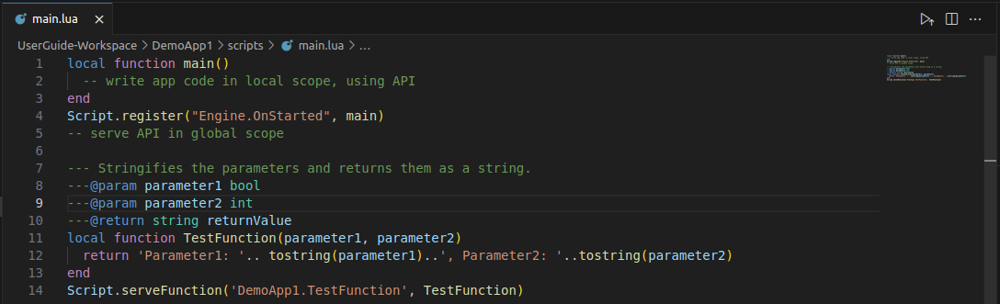

=== Intellisense
The Lua Script Editor features Intellisense, which provides code suggestions and auto-completion as you type. This feature helps speed up the coding process and reduces the likelihood of syntax errors.

Completion suggestions can be triggered manually by pressing `Ctrl + Space` or will appear automatically as you type:

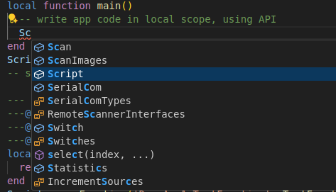

Intellisense is always device and app agnostic, meaning it will only include API supported by the combination of selected xref:../2.1.8-Device-Model/Device-Model.adoc[device model] and selected xref:../2.1.9-App-Model/App-Model.adoc[app models].

A second level of additional information can be triggered by pressing `Ctrl + Space` again:

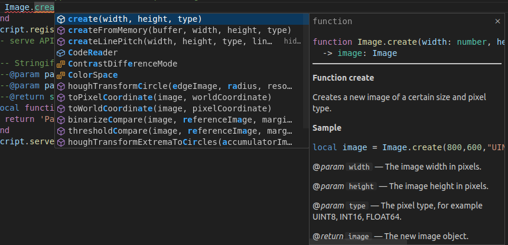

Suggestions are not only limited to Crowns, functions and events, but also provided for code structure, e.g. `for` loops, `if` statements, `function` body and more:

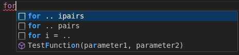

Suggestions can be applied by pressing `Enter` or `Tab`:

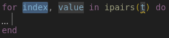

=== Hover Information
By Hovering over certain code elements, additional information is provided, e.g. function descriptions:

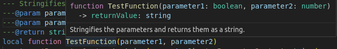
This only works for functions that are properly described via link:https://keplerproject.github.io/luadoc/manual.html[LuaDoc] comments for local functions and manifest documentation for Crown functions.

=== Code Actions
Code actions are available via the lightbulb icon that appears when the cursor is on certain elements. They can also be accessed by pressing `Ctrl + .`:

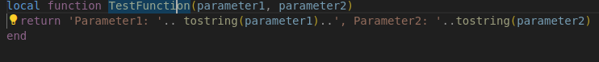
Through code actions it is for example possible to serve a function in the manifest:

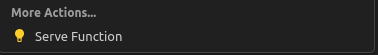

=== Diagnostics
The Lua Script Editor provides real-time diagnostics, highlighting syntax errors and warnings directly in the code. This helps developers identify and fix issues quickly.

* *Errors:*
+
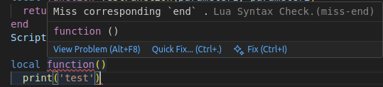
* *Warnings:*
+
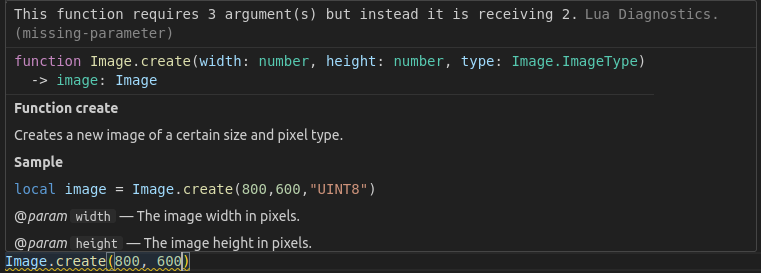
* *Info:*
+
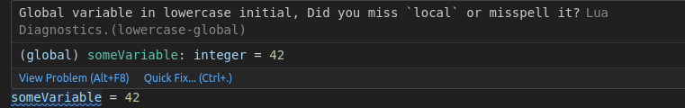

=== Tipps and Tricks
* The current application a user is working on can be quick deployed to the selected device by pressing the upload button in the top right corner of the editor:
+
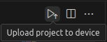
* Navigate quickly through the code by using `Ctrl + Click` on functions, variables or crowns to jump to their definition
* SICK App Designer supports refactoring of function and events names by right-clicking the function/event name and selecting "Rename Symbol" or by pressing `F2`. This also works on served elements:
+
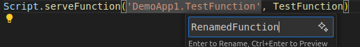

=== Troubleshooting

The current state of the Language Server, which is responsible for providing Intellisense and Diagnostics, can be viewed in the bottom left corner of the VSCode window:

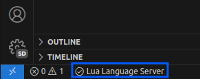

By clicking it a dialog will open providing the possibility to restart the Language Server:

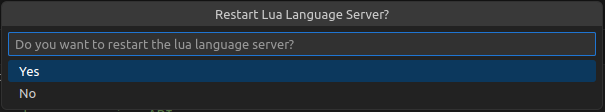

//footer: navigation
---
[cols="<,^,>", frame=none, grid=none]
|===
||xref:../Overview.adoc[Back to Overview]|xref:../2.2.2-UI-Builder/UI-Builder.adoc[Next: UI Builder]
|===