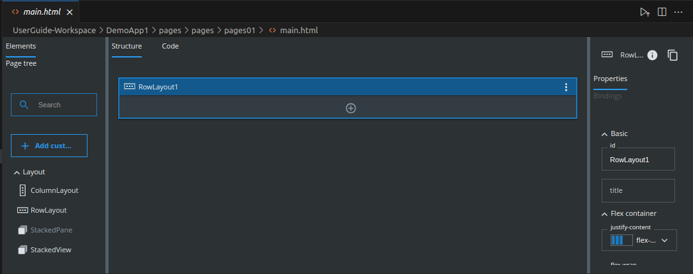

= SICK Sentio App Designer - Overview

== UI Builder

The UI Builder is a visual design tool for creating user interfaces in SICK Sentio applications. It allows developers to design, prototype, and implement user interfaces without writing extensive code.

=== Drag-and-Drop Interface
The UI Builder features a drag-and-drop interface, enabling developers to easily add and arrange UI elements on the canvas. This intuitive approach simplifies the design process and allows for rapid prototyping.

=== Component Library
The UI Builder includes a comprehensive library of pre-built components, such as buttons, sliders, and text fields. Developers can customize these components to fit their application's needs, ensuring a consistent look and feel.

=== Extended Documentation
To access the full documentation of the UI Builder, please refer to the dedicated tutorials: xref:../../../UIBilder Tutorials[UI Builder tutorials].

//footer: navigation
---
[cols="<,^,>", frame=none, grid=none]
|===
|xref:../2.2.1-Lua-Editor/Lua-Editor.adoc[Back: Lua Script Editor]|xref:../Overview.adoc[Back to Overview]|xref:../2.2.3-Blocks-Editor/Blocks-Editor.adoc[Next: Blocks Editor]
|===