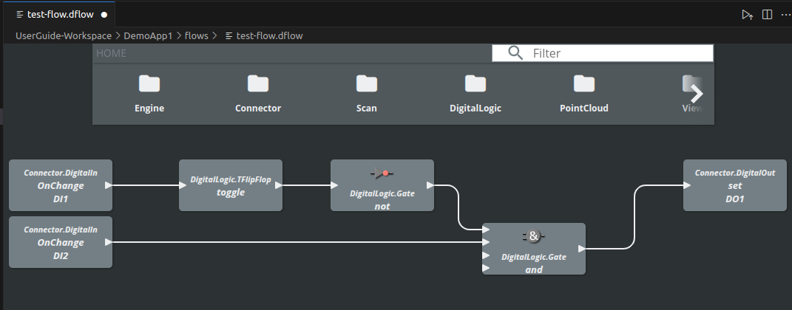
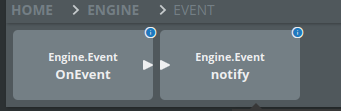
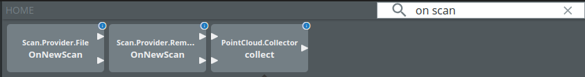
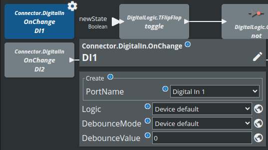
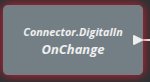
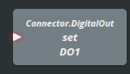

= SICK Sentio App Designer - Overview

== Blocks Editor

The Blocks Editor is a visual editor for creating block based flows in SICK Sentio applications. It allows developers to design, prototype, and implement application logic without writing extensive code.

=== Drag-and-Drop Interface
The Blocks Editor features a drag-and-drop interface, enabling developers to easily add and arrange blocks on the canvas. This intuitive approach simplifies the design process and allows for rapid development.

=== Component Library
The Blocks Editor includes a comprehensive library of pre-built blocks, such as io, digital logic and data processing blocks. Developers can extend this library by creating custom blocks in Lua script to fit their application's needs.

The library can be found at the very top of the editor and can either be manually navigated:

Or searched via the search bar:

=== Flow Area
The flow area is the main workspace of the Blocks Editor, where blocks can be placed and connected to create application logic. 

Elements can be removed by either dragging them back to the library or by selecting them and pressing the `Delete` key.

Double clicking a block will open the corresponding configuration dialog:

A red border around the block indicates that the block is not properly configured yet:

And a red connector indicates that the block is missing a link:

//footer: navigation
---
[cols="<,^,>", frame=none, grid=none]
|===
|xref:../2.2.2-UI-Builder/UI-Builder.adoc[Back: UI Builder]|xref:../Overview.adoc[Back to Overview]|xref:../2.2.4-Parameter-Editor/Parameter-Editor.adoc[Next: Parameter Editor]
|===