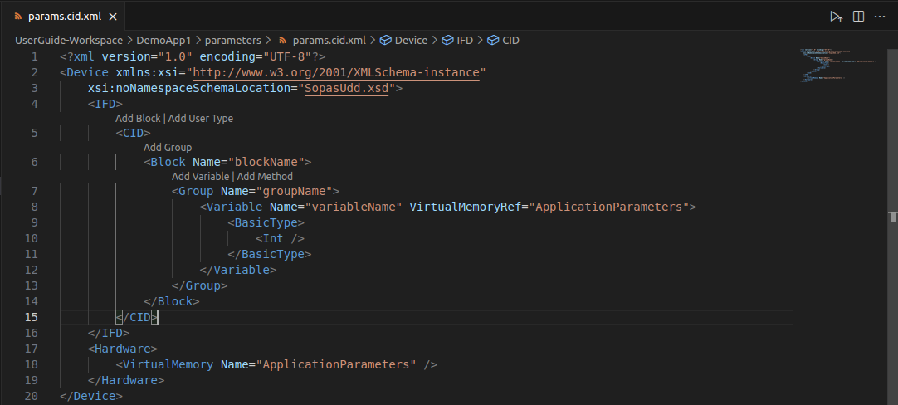
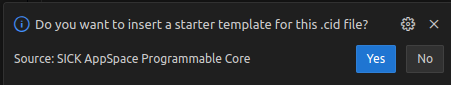
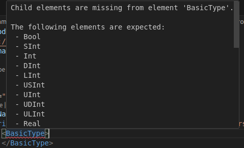
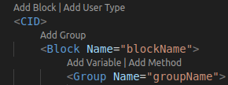
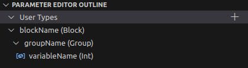
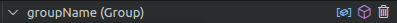

= SICK Sentio App Designer - Overview

== Parameter Editor

The Parameter Editor is a mix of a script and a visual editor for creating and managing parameters in SICK Sentio applications.

=== New paramter file

When creating a new parameter file, a dialog will open to provide a basic template for the file:

By selecting `Yes`, a basic template will be created for a quick start.

=== XML Editor

The XML editor provides syntax highlighting, auto-completion and error checking for editing parameter files in XML format:

Furthermore the editor is packed with quick code actions to extend the XML structure without typing code:

=== Editor Outline

An outline of the XML structure is provided on the *SICK Sentio App Designer* pane as soon as a parameter file is opened. This outline allows for easy navigation and quick access to add or remove elements:

The quick actions are avaible by selecting or hovering over an element:

//footer: navigation
---
[cols="<,^,>", frame=none, grid=none]
|===
|xref:../2.2.3-Blocks-Editor/Blocks-Editor.adoc[Back: Blocks Editor]|xref:../Overview.adoc[Back to Overview]|xref:../2.2.5-Manifest-Editor/Manifest-Editor.adoc[Next: Manifest Editor]
|===