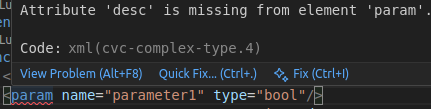

= SICK App Designer - Overview

== Manifest Editor

The Manifest Editor is a XML based editor to modify the project definition file `project.mf.xml` of a SICK sensor application.

The XML editor provides syntax highlighting, auto-completion and error checking for editing manifest files in XML format.
Furthermore the editor is packed with quick code actions to extend the XML structure without typing code.

*Auto completion:*

*Error checking:*

*Code actions:*

//footer: navigation
---
[cols="<,^,>", frame=none, grid=none]
|===
|xref:../2.2.4-Parameter-Editor/Parameter-Editor.adoc[Back: Parameter Editor]|xref:../Overview.adoc[Back to Overview]|
|===