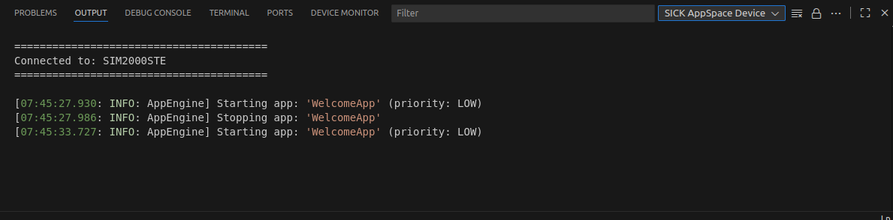
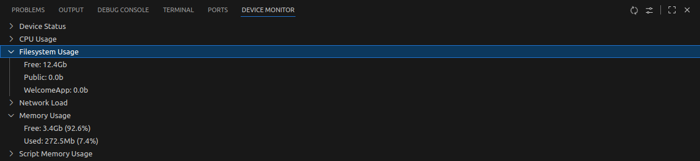

= SICK Sentio App Designer - Overview

//footer: navigation
== Auxiliary Panel
//TODO: Renew screenshot as soon as new icons are available
The Auxiliary Panel is located at the bottom of VSCode and provides additional tools and features to support the development process.

After installing the *SICK Sentio App Designer* extension, new functionalities like the Device Monitor and Device Console will be integrated into the Auxiliary Panel.

=== Device Console
 
The Device Console displays log messages and output from the connected device, allowing developers to monitor application behavior and debug issues in real-time. It is an essential tool for diagnosing problems and ensuring that applications run smoothly on the target hardware.

//TODO: link commands and device list
To access the Device Console, either manually select `SICK AppSpace Device Console` from the dropdown menu of the _OUTPUT_ Tab, use the command `SICK AppSpace: Show device console` or use the device console button on the device list.

=== Device Monitor
 
The Device Monitor provides real-time insights into the performance and resource usage of the connected device. It displays key metrics such as CPU usage, memory consumption, and network activity, helping developers identify potential bottlenecks and optimize their applications for better performance.

To access the Device Monitor, either manually select the _DEVICE MONITOR_ tab in the Auxiliary Panel or execute the command `Device Monitor: Focus on Device Monitor View`.

The device monitor will not fetch any data from the device if all items are collapsed, or the monitoring is manually paused using the pause button in the top right corner of the device monitor view.

The monitoring interval (default: 5s) can be adjusted in the settings, available via the settings button on the top right corner of the device monitor view.

---
[cols="<,^,>", frame=none, grid=none]
|===
|xref:../2.3-Editor/Editor.adoc[Back: Editor]|xref:../User_Guide.adoc[Back to User Guide]|
xref:../2.5-Home-View/Home-View.adoc[Next: Home View]
|===