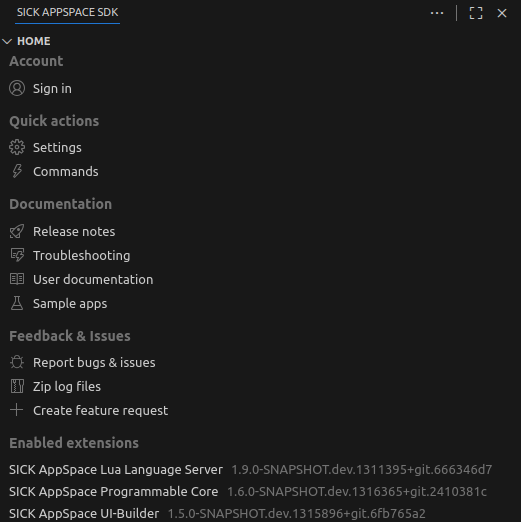

= SICK Sentio App Designer - Overview

//footer: navigation
== Home View

The Home View consists of several sections that provide quick access to important features and information.

//TODO: Renew screenshot as soon as new icons are available
 

=== Account
Here users can sign in to their SICK ID account to access the full feature scope of the *SICK Sentio App Designer*.

=== Quick actions
//TODO: link commands
* *Settings* - Opens the settings for the *SICK Sentio App Designer* extension.
* *Commands* - Opens a list of all available commands for the *SICK Sentio App Designer* extension.

=== Documentation
//TODO: link troubleshooting and sample apps
* *Release notes* - Links to *SICK Sentio App Designer* release notes on GitHub.
* *Troubleshooting* - Links to the troubleshooting section of the *SICK Sentio App Designer* documentation.
* *User documentation* - Links to User documentation of the *SICK Sentio App Designer* on GitHub.
* *Sample apps* - Links to sample applications on GitHub.

=== Feedback & Issues
We appreciate your feedback!, please be incentived to reach out to us via the provided channels:

* *Report bugs & issues* - Links to the issue tracker of the *SICK Sentio App Designer*.
* *Zip log files* - Zips the all log files of the *SICK Sentio App Designer* extension for easier sharing.
* *Create feature request* - Links to the feature tracker of the *SICK Sentio App Designer*.

=== Enabled extensions
A list of enabled extensions directly related to the Sentio environment.

---
[cols="<,^,>", frame=none, grid=none]
|===
|xref:../2.4-Auxiliary-Panel/Auxiliary-Panel.adoc[Back: Auxiliary Panel]|xref:../User_Guide.adoc[Back to User Guide]|
xref:../2.6-Workspace-View/Workspace-View.adoc[Next: Workspace View]
|===