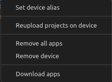

= SICK Sentio App Designer - Overview

//footer: navigation
== Device List
The device list provides an overview of all available and unavailable SICK Sentio devices. It allows users to easily manage devices, view their status, and perform a variety of actions on them.

//TODO: Renew screenshot as soon as new icons are available

=== Device List States
In the device list one of multiple devices can be selected, this device is then handled as _"connected"_ device, meaning that all actions and operations are performed on this device. The user can change the connected device by simply clicking on another device in the list:

=== Device List Actions
By selecting or hovering the device list view, quickactions will appear in the top right corner of the view.

[%collapsible]
====
|===
a| image::media/add-device.png[Add Device Action] | Opens the workflow to add a new device, either manually or via network scan.
a| image::media/refresh-devices.png[Refresh Device List Action] | Refreshes the state of all devices in the list.
a| image::media/device-console.png[Open Device Console Action] | Opens the xref:../2.4-Auxiliary-Panel/Auxiliary-Panel.adoc#Device Console[device console] of the selected device.
a| image::media/more-actions.png[More Actions] a| Show more actions:
|===

*More actions:*
//TODO: link device filesystem docu
|===
| Add device filesystem... | Attaches the filesystem of all devices to the VSCode Explorer.
|===
====

=== Device Info
By hovering a device additional information about the device is shown:

=== Device Actions
By selecting or hovering over a device entry, quickactions are displayed on the right side of the entry:

and via right click the context menu of a device can be accessed:

[%collapsible]
====
*Quick Actions:*
|===
a| image::media/user-level.png[User level icon] | Manually change the currently used user level for the device
a| image::media/ui.png[Open Device UI Action] | Opens a dialog to access the device user interfaces of the device
a| image::media/app-start.png[Start App] | Start the selected application on the device
a| image::media/app-stop.png[Stop App] | Stop the selected application on the device
|===
*Context Menu:*
|===
| Set device alias | Set a custom alias for the device to easily identify it in the list.
| Reupload projects on device | Reuploads all projects to the device from the workspace.
| Remove all apps | Removes all applications from the device.
| Remove device | Removes the device from the device list.
| Download apps | Opens a dialog to select apps from the device to download as zip file.

*Note:* 
downloading apps is only available for unprotected apps. Furthermore it is not adviced to download apps for the sole purpose of fixing an issue, it is recommended to use proper source control for this purpose.
|===
====

=== App Info
By hovering an app additional information about the app is shown:

=== App States
Different states of apps can be identified by their respective icons:
|===
a| image::media/app-running.png[Running app icon] | The app is currently in a running state
a| image::media/app-stopped.png[Stopped app icon] | The app is currently stopped
|===

=== App Actions
By selecting or hovering over an app entry, quickactions are displayed on the right side of the entry:

Trough those actions the app can be started and stopped and also be removed from the device.

---
[cols="<,^,>", frame=none, grid=none]
|===
|xref:../2.6-Workspace-View/Workspace-View.adoc[Back: Workspace View]|xref:../User_Guide.adoc[Back to User Guide]|
xref:../2.8-Device-Model/Device-Model.adoc[Next: Device Model Configuration]
|===