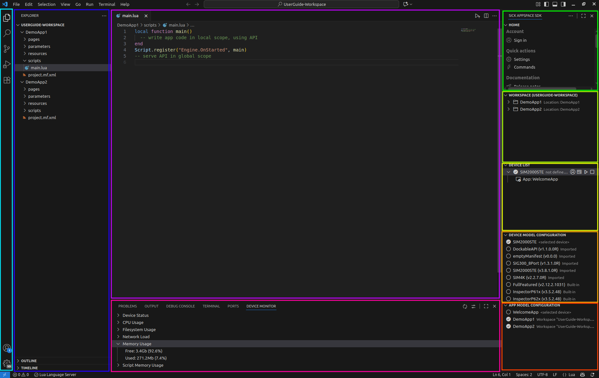

= SICK Sentio App Designer - Overview

This chapter provides an overview of the SICK Sentio App Designer, its features, and its capabilities and includes a general overview over the user interface.

---

== Components
//TODO: Renew screenshot as soon as new icons are available
// screenshot
 
// mockup like an ifixit guide with a lot of components (image with parts marked in different colors and a legend below)
[cols="1,8"]
|===
a|image::media/color_sidebar.png[light blue]|xref:2.1.1-Sidebar/Sidebar.adoc[Sidebar]
a|image::media/color_explorer.png[blue]|xref:2.1.2-Explorer/Explorer.adoc[Explorer]
a|image::media/color_editor_area.png[purple]|xref:2.1.3-Editor/Editor.adoc[Editor Area]
a|image::media/color_auxiliary_panel.png[pink]|xref:2.1.4-Auxiliary-Panel/Auxiliary-Panel.adoc[Auxiliary Panel]
a|image::media/color_home_view.png[green]|xref:2.1.5-Home-View/Home-View.adoc[Home View]
a|image::media/color_workspace_view.png[lime]|xref:2.1.6-Workspace-View/Workspace-View.adoc[Workspace View]
a|image::media/color_device_list.png[yellow]|xref:2.1.7-Device-List/Device-List.adoc[Device List]
a|image::media/color_device_model_config.png[orange]|xref:2.1.8-Device-Model/Device-Model.adoc[Device Model Configuration]
a|image::media/color_app_model_config.png[red]|xref:2.1.9-App-Model/App-Model.adoc[App Model Configuration]
|===

== Editors
There are several different editors available in the *SICK Sentio App Designer*, each designed for specific tasks in the application development process. Below is an overview of the available editors:

* xref:2.2.1-Lua-Editor/Lua-Editor.adoc[Lua Script Editor]
* xref:2.2.2-UI-Builder/UI-Builder.adoc[UI Builder]
* xref:2.2.3-Blocks-Editor/Blocks-Editor.adoc[Blocks Editor]
* xref:2.2.4-Parameter-Editor/Parameter-Editor.adoc[Parameter Editor]
* xref:2.2.5-Manifest-Editor/Manifest-Editor.adoc[Manifest XML Editor]

---
[cols="<,^,>", frame=none, grid=none]
|===
|xref:../Chapter_1-Getting_Started/Getting_Started.adoc[Back: Getting Started]|xref:../User_Guide.adoc[Back to User Guide]|
xref:../Chapter_3-App_Development/App_Development.adoc[Next: App Development]
|===