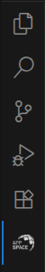

= SICK Sentio App Designer - Overview
:toc-title:
:toc:

This chapter provides an overview of the SICK Sentio App Designer, its features, and its capabilities and includes a general overview over the user interface.

---

//footer: navigation
== Sidebar
//TODO: Renew screenshot as soon as new icons are available
 
The Sidebar is located on the very left of VSCode and contains quick access to various VSCode features and extensions. After installing the *SICK Sentio App Designer* extension, a new icon will appear in the sidebar that provides access to the main features of the extension.

We recommend moving the *SICK Sentio App Designer* icon to the secondary sidebar on the very right, this way all Designer related features can be viewed while also accessing the VSCode file explorer, debugger and additional tools.

== Components
//TODO: Renew screenshot as soon as new icons are available
// screenshot
image::media/components.png[Components] 
// mockup like an ifixit guide with a lot of components (image with parts marked in different colors and a legend below)
|===
a|image::media/color_sidebar.png[light blue]|<<Sidebar>>
a|image::media/color_explorer.png[blue]|Explorer
a|image::media/color_editor_area.png[purple]|Editor Area
a|image::media/color_auxiliary_panel.png[pink]|Auxiliary Panel
a|image::media/color_home_view.png[green]|Home View
a|image::media/color_workspace_view.png[lime]|Workspace View
a|image::media/color_device_list.png[yellow]|Device List
a|image::media/color_device_model_config.png[orange]|Device Model Configuration
a|image::media/color_app_model_config.png[red]|App Model Configuration
|===

== Editors
There are several different editors available in the *SICK Sentio App Designer* extension, each designed for specific tasks in the application development process. Below is an overview of the available editors:

//TODO: Add subpages describing all editors in detail
* Lua Script Editor
* UI-Builder
* Blocks Editor
* Parameter Editor
* Manifest XML Editor

---
[cols="<,^,>", frame=none, grid=none]
|===
|xref:../Chapter_1-Getting_Started/Getting_Started.adoc[Back: Getting Started]|xref:../User_Guide.adoc[Back to User Guide]|
xref:../Chapter_3-App_Development/App_Development.adoc[Next: App Development]
|===