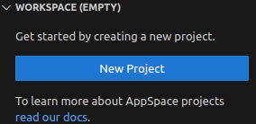
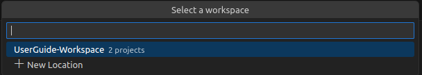
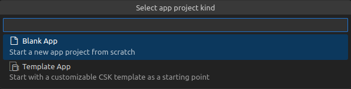
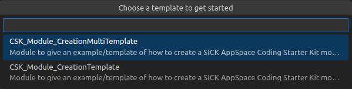
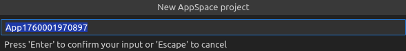

= SICK Sentio App Designer - App Development

== New Sensor App

To create a new sensor application using the *SICK Sentio App Designer*, follow these steps:

1. On the workspace tab click on the `+` icon to create a new project
+
[%collapsible]
====
image::media/create-new-project.png[New Project]
If this will be the first project, then a big `New Project` button will be shown in the center of the workspace tab:

====

2. Select the workspace folder where the new project should be created in or create a new one
+
[%collapsible]
====

====

3. Either select `Black app` or `Template app`, depending on whether you want to start from scratch or use a predefined link:https://github.com/SICKAppSpaceCodingStarterKit[CSK] template.
+
[%collapsible]
====

====

4. Depending on the selected project kind, a few more options regarding the project will be shown. After filling them out, the new project should be created successfully.
+
[%collapsible]
====

====

=== Source Control
*SICK Sentio App Designer* supports Git for version control. You can use the built-in source control features of VSCode to manage your code changes, create branches, and collaborate with others.

Other version control systems can be used as well, but they might not be fully integrated into the IDE.

[WARNING]
====
Though *SICK Sentio App Designer* supports downloading applications from connected devices, it is not advised to use this feature as replacement for a proper version control system like Git.

In case the device gets damaged or lost, the application code might be lost as well. Also multiple developers working on the same application/device will run into merge conflicts and other issues without a proper version control system.
====

// footer
[cols="<,^,>", frame=none, grid=none]
|===
||xref:../App-Development.adoc[Back to App Development]|xref:../3.2-Editing/Editing.adoc[Next: Editing]
|===