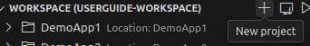

= SICK Sentio App Designer - App development

== New Sensor App

To create a new sensor application using the *SICK Sentio App Designer*, follow these steps:

1. On the workspace tab click on the `+` icon to create a new project
+
[%collapsible]
====

If this will be the first project, then a big `New Project` button will be shown in the center of the workspace tab:

====

2. Select the workspace folder where the new project should be created in or create a new one
+
[%collapsible]
====

====

3. Either select `Black app` or `Template app`, depending on whether you want to start from scratch or use a predefined link:https://github.com/SICKAppSpaceCodingStarterKit[CSK] template.
+
[%collapsible]
====

====

4. Depending on the selected project kind, a few more options regarding the project will be shown. After filling them out, the new project should be created successfully.
+
[%collapsible]
====

====

// footer
[cols="<,^,>", frame=none, grid=none]
|===
||xref:../Misc.adoc[Back to App Development]|xref:../3.2-Commands/commands.adoc[Next: Commands]
|===