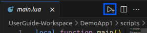
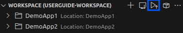
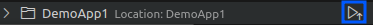
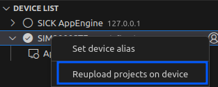

= SICK App Designer - App Development

== Editing

The main purpose of the *SICK App Designer* is to create and edit applications for SICK programmable devices. This section provides an overview of the editing capabilities and a description of the general application structure.

---

=== First steps
To Quickstart after creating a new sensor application, right click the app in the workspace view and select `Jump to Code`, this is the fastes way to jump into the main LUA file of the app

Alternatively, you can open the main file by using the `Explorer` view and navigating to `scripts/main.lua` in your newly created app.

=== Application Structure

There are several different entry points of your application, each designed for a specific part of a project. These entry points include:

* *scripts/*
* *pages/*
* *flows/*
* *parameters/*
* *resources/*
* *project.mf.xml*

Every folder is optional, and is only needed if the specific type of resource is used in the application.

The only necessary resource is the *project.mf.xml* file, which contains all metadata about the application.

[%collapsible]
.Detailed information about the different parts
====
//TODO: Add links to more detailed documentation about the different parts
[cols="1,1,3", options="header"]
|===
|Entry Point|File Types|Description

//scripts
|scripts/|.lua|This folder contains all Lua scripts of the application. Additional Lua files can be created and imported as needed. Also nested folders are supported.

//pages
|pages/|*|This folder contains the UI definition of an application, see link:https://github.com/SICKAG/SICK-AppSpace-SDK-Docs/tree/SDK-268_Documentation_update/Documentation%20and%20Tutorials/UIBuilder%20Tutorials[UI-Builder documentation] for more details.

//flows
|flows/|.cflow +
.dflow|This folder includes control and data flows. Flows can be used to visually design processes without writing accessive amounts of code. 

Control flows define purely digital logic and can utilize the FPGA capabilities of the device, if available. +
This can for example be handy to hardwire a trigger signal from one device to another, without a software processing delay.

Data flows can process any kind of data, including images, scans, pointclouds,...

//parameters
|parameters/|.cid.xml|This folder contains all parameter definitions for the application. Parameters are used to define the configuration of the application.

//resources
|resources/|*|This folder contains all resource files for the application. Resources can include images, pointclouds, raw data, and any other assets.

//project.mf.xml
|project.mf.xml||This file contains all metadata about the application, including its name, version, served elements, and other important information.
|===
====

=== Editing
Each file in the application can be edited using the appropriate editor in the *SICK App Designer*. For example, Lua scripts can be edited in the Lua Script Editor, UI pages in the UI Builder, and flows in the Blocks Editor.

For more information about the different editors, please refer to the xref:../../Chapter_2-Overview/Overview.adoc#Editors[Editors documentation].

Every type of file can be created by right-clicking the corresponding folder in the workspace view and selecting `New File`. The file extension must be correct, so that the appropriate editor can be used.

//TODO: change command after renaming
For Flow files there is also an additional command to create a new flow using a visual dialog: `SICK AppSpace: New Flow`

=== Deployment

There are several ways to deploy an application to a connected device:

* *Quick upload:* Directly integrated in the editor is a quick upload button, that uploads the current app the file belongs to onto the device:
+
[%collapsible]
====

====

* *Upload workspace:* Use the upload button in the workspace view will upload all apps in the current workspace to the connected device:
+
[%collapsible]
====

====

* *Upload single app:* Use the upload button on the app in the workspace view to upload only this specific app to the connected device:
+
[%collapsible]
====

====

* *Reupload app from device:* All apps running on a device can be reloaded from the workspace to the device by using the appropriate context menu entry of a device:
+
[%collapsible]
====

====

* *Keyboard shortcut:* The keyboard shortcut `Ctrl+F5` can be used to upload a user defined selection of apps to the device.

* *Command Palette:* There are several commands available in the command palette (`Ctrl+Shift+P`) to achive the same functionality as described above. +
Search for `SICK AppSpace: Upload` to find the available commands.

// footer
[cols="<,^,>", frame=none, grid=none]
|===
|xref:../3.1-New-Sensor-App/New-Sensor-App.adoc[Back: New Sensor App]|xref:../App-Development.adoc[Back to App Development]|xref:../3.3-Debugging/Debugging.adoc[Next: Debugging]
|===