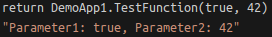

= SICK App Designer - App Development

== Debugging

The *SICK App Designer* provides a powerful debugging environment that allows you to test and debug your applications directly on a connected SICK programmble device. This section covers the key features and workflows for debugging your applications.

---

=== Start debugger
Starting the debugger can be done in multiple ways:

* Press `F5`
* Go to the Run and Debug view in the sidebar and click the big `Run and Debug` button if no launch configuration is present, otherwise select the desired configuration and click the green play button
+
[%collapsible]
====

====
* Navigate to the top menu and select `Run` -> `Start Debugging`
* Use the command palette and search for `Debug: Start Debugging`

As long as the debugger is not started via a launch configuration for a specific app, a dialog will open to select the app(s) to debug:

The app the user is currently working on will be preselected, but other apps can be selected as well.

[NOTE]
====
Debugging multiple apps at the same time is only possible if the device supports this feature. Wether or not a device supports multi-app debugging can be discovered in the hover information on a device.
====

[%collapsible]
.Optional Steps
====
The user might be asked to login with a higher userlevel at this point, depending on the current userlevel and the required userlevel for debugging on the device.

In case the app differs to the version on the device, the user will be asked if the app should be overwritten on the device.
====

After starting the debugger, the debug toolbar will appear at the top of the window and the debugger will halt at the first reachable line of code.

[%collapsible]
====
image::media/stop-at-first-line.png[Stopping at first line]
====

=== Breakpoints
Breakpoints can be set by clicking in the gutter next to the line numbers in the editor:

Removing them can be done the same way, or by removing them in the breakpoints tab of the Run and Debug view.

*Conditional Breakpoints* can be set by right-clicking an existing breakpoint and selecting `Edit Breakpoint...` and setting a condition.

[%collapsible]
====

====

=== Timings
When debugging also timings are recorded. These are displayed inline as soon as a breakpoint was hit. All executions since the last breakpoint will be annotated with the time it took to execute them.

[%collapsible]
====
image::media/timings.png[Timings]
====

This information can help to identify performance bottlenecks in the code.

=== Inspecting Variables
Basic variables can be inspected in the _VARIABLES_ tab of the *Run and Debug* view.

[%collapsible]
====

====

For a more detailed inspection of images, shapes, pointclouds and other complex visual data types, the *SICK App Designer* provides a dedicated *2D/3D Viewer* at the very bottom of the *Run and Debug* view.

All supported variables entered in the _WATCH_ tab will be visualized in the viewer. You can add them in different ways:

* Right-click a variable in the _VARIABLES_ tab and select `Add to Watch`
* Right-click a variable in the editor and select `Add to Watch`
* Manually add the variable name in the _WATCH_ tab

[%collapsible]
.Variables in WATCH tab
====

====

Variables can be added to the viewer by watching them in the _WATCH_ tab of the *Run and Debug* view or by hovering them in the editor and clicking the `+` icon next to them.

Switching between 2D and 3D view can be done by toggling the respective switch in the top right corner of the viewer.
[%collapsible]
.Elements in Viewer
====
* *2D (e.g. Image):*
+

* *3D (e.g. Pointcloud):*
+
image::media/pointcloud-in-viewer.png[Pointcloud in Viewer]
====

In case the viewer is too small, the user has the option to open the viewer in the editor area by clicking the pop-out icon in the top right corner of the viewer.

=== Stack Trace
The current call stack is displayed in the _CALL STACK_ tab of the *Run and Debug* view. The user can navigate through the stack by clicking on a stack frame, this will open the corresponding file and highlight the line of code.

[%collapsible]
.Example Call Stack
====
image::media/callstack.png[Call Stack]
====

Variables in the _WATCH_ tab always belong to the currently selected stack frame.

The _VARIABLES_ tab will show all stacklevels at the same time, allowing the user to inspect variables of different stack frames at once.

[%collapsible]
.Example Variables
====

====

=== Interacting with the Device
The *SICK App Designer* provides several ways to interact with the connected device while debugging, though not all devices support all features.

* *Variables tab*: Variables in the _VARIABLES_ tab can be double-clicked to overwrite their value. This works for basic types like numbers, strings and booleans.

* *Debug Console*: The debug console can be used to execute Lua commands directly on the device. This is useful for quick tests and inspections.
** _Inspect variables_: Variables can be inspected by typing their name in the console.
+
[%collapsible]
====

====
** _Set global variables_: As the debug console is executed in it's own callstack frame only global variables can be set.
+
[%collapsible]
====

====
** _Call functions_: Functions can be called directly from the console. Only global or served functions can be called, as the console is executed in it's own callstack frame. A `return` statement can be used to get the return value of an executed function.
+
[%collapsible]
====

====

// footer
[cols="<,^,>", frame=none, grid=none]
|===
|xref:../3.2-Editing/Editing.adoc[Back: Editing]|xref:../App-Development.adoc[Back to App Development]|xref:../3.4-Deployment/Deployment.adoc[Next: Packaging and Deployment]
|===