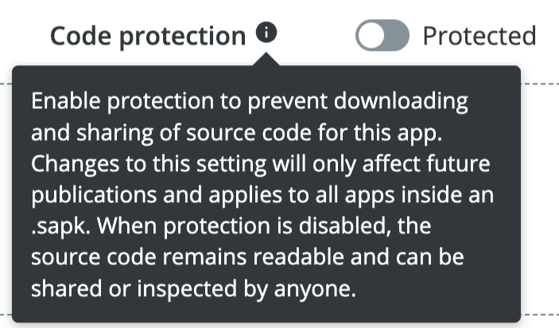

= SICK Sentio App Designer - App Development

== Packaging and Deployment

At the very end of the development cycle, the application needs to be packaged and deployed to one or more SICK Sentio devices. This section describes how to package and deploy applications using the *SICK Sentio App Designer* and how to avoid unauthorized access to the source code.

---

=== Packaging
First thing to do when the application is ready for deployment, is to package it into a deployable format. This can be done using the built-in packaging features of the *SICK Sentio App Designer*.

For this either use the command palette (`Ctrl+Shift+P`) and type `SICK: Create SAPK app package` or use the package button in the workspace view:

A deployment workflow will now pop up to guide through the packaging process:

1. Select the apps to be packaged together
+
[%collapsible]
.Example
====

====
2. Input the application name
+
[%collapsible]
.Example
====

====
3. Input the version number
+
[%collapsible]
.Example
====

====
4. (Optional) Add release notes (`.html`). Either manually input the file path or use the file picker on the upper right corner.
+
[%collapsible]
.Example
====

====
5. (Optional) Generate API documentation. This will create a `.html` documentation file, either locally next to the `.sapk` file and/or bundled into the `.sapk` for additional SICK tooling.
+
[%collapsible]
.Example
====

====
6. Set the output directory for the generated `.sapk` file (defaults to the workspace folder).
+
[%collapsible]
.Example
====
image::media/output-dir.png[Set output directory]
====

After finishing the workflow, the `.sapk` file will be created in the specified output directory. 
[%collapsible]
====
* *In Progress:*
+

* *Packaging Finished:*
+
image::media/creation-success.png[Packaging finished]
====

[WARNING]
====
The generated `.sapk` file is unprotected at this point of time and can be read without any restrictions. To protect the intellectual property of the application, it is advised to encrypt the application before deploying it to devices, see: <<Protecting Intellectual Property>>.
====

//TODO: Add link to sentio creator
=== Deployment
Deployment can be done either directly via the *SICK Sentio Creator* (see above warning) by importing the `.sapk` file, or by uploading it to the link:https://apppool.cloud.sick.com/[SICK AppPool] for distribution first. 

The second option is advised as it supports proper version control of SAPKs and allows the `.sapk` to be encrypted during upload.

=== Protecting Intellectual Property
There are two options to create a `.sapk` package with encrypted applications:

1. After packaging, the `.sapk` file using the *SICK Sentio Creator* upload it to the SICK AppPool. During the upload process an option to encrypt the applications inside of the package is presented.
+
[%collapsible]
.Encryption Option
====

====
2. _Upcoming:_ Using the *SICK Sentio Creator* CLI tool to package the application. This tool provides an option to encrypt the application during packaging and is especially useful for automated build pipelines.

The encrypted `.sapk` is readable for SICK devices at this point and can be shared via *SICK AppPool* or any other way of distribution.

As soon as the application is uploaded on a device, there's no option to download and decrypt it again. Also trying to upload it to another device will fail.

[%collapsible]
.*Full Encryption Workflow*
====

====
// footer
[cols="<,^,>", frame=none, grid=none]
|===
|xref:../3.3-Debugging/Debugging.adoc[Back: Debugging]|xref:../App-Development.adoc[Back to App Development]|
|===