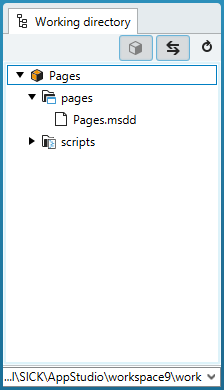
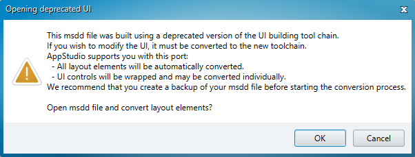
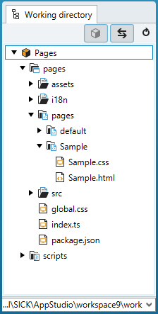
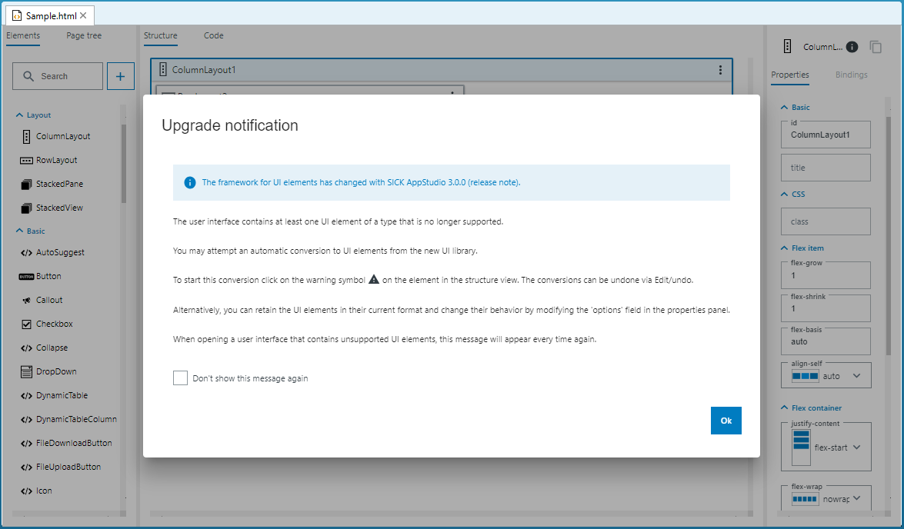

= UI-Builder: Legacy MSDD

# About this tutorial

User interfaces of SensorApps are using the file format "Mobile SICK Device Description" (MSDD), which includes a dynamic web page framework. The application-specific graphical user interfaces (GUI) are displayed as websites.

Beginning with SICK AppStudio 3.0.0, MSDD files are not stored in SICK AppStudio workspace projects anymore. Instead, the UI source files are transparently attached to the project and the MSDD file is only generated once you deploy or package the app. To continue working with an (old / already packaged) app that contains MSDD files when being opened in SICK AppStudio, you either can use the MSDD file as is or you can update the MSDD file to the new UI format.

# Using legacy MSDD files of former SICK AppStudio versions (before SICK AppStudio 3.0.0)

If you open a project, which has a MSDD included, you will see this MSDD file located in the pages folder of your app (see screenshot). As long as you do not intend to change the content of the MSDD, the file can be used for deployment and packaging as is.

*Note:* you can edit the MSDD with a version of SICK AppStudio <= 2.4.2.

# Updating legacy MSDD files to the new UI format

## Import and convert the MSDD file
If you double-click on a MSDD file, a dialog is displayed (see screenshot). If you continue, you will find the converted source files in your project structure. The original MSDD file is automatically backed up in the "pages/.backup" folder. Note: the .backup folder is hidden in the SICK AppStudio workspace.
 
*Note:* Importing legacy MSDD files is currently marked as beta feature and has to be explicitly activated in the preferences: "Edit" -> "Preferences" -> "Beta Features" -> "Import legacy pages"

New file structure of the UI in the SICK AppStudio workspace:

## Layout conversion

The conversion process mimics the layout you specified in the MSDD pages (tiles and flex layouts) with the ColumnLayout, RowLayout, and StackedLayout elements.

## Element Conversion
All elements are automatically wrapped with "SJSElements" to ensure that they work properly when saved in the new UI format. Wrapped elements can be used for deployment and packaging, but they won't be visualized in the UI preview. The properties of a wrapped element can be edited via the options property of the "SJSElement". The properties are defined as a JSON string containing key / value pairs. Existing bindings are wrapped by the "SJSBinding" type.
 
*Note:* An update of the MSDD file could break your UI. It may be required that you update or re-arrange several parts of the UI after upgrading. 

*Note:* An update of the MSDD file could break your bindings. It may be required that you update or setup bindings of several elements after upgrading. 

# Download Tutorial as PDF
