= SICK AppSpace SDK for VS Code - getting started

# About this Tutorial
## Overview
This tutorial explains how to install the SICK AppSpace SDK for Microsoft Visual Studio Code and how to start developing SensorApps.

## Prerequisites
* Rudimentary programming knowledge
* Installed https://code.visualstudio.com/download[Microsoft Visual Studio Code]
* SICK AppEngine 1.3.2 or newer. Download demo version on sick.com, operational for 2 hours at a time: https://www.sick.com/sick-appengine-28x6429-windows/p/p663780[for Windows] or https://www.sick.com/sick-appengine-28x6429-linux/p/p663779[for Linux] - SICK ID required to download, registration just takes seconds.

# The SICK AppSpace SDK components
The _SICK AppSpace SDK_ is composed of several parts that come in a form of _extensions_ for Microsoft Visual Studio Code. Find below a list of the components with short explanations of their purpose:

* *SICK AppSpace Programmable Core* - provides core functionality and view (extension tabs) for SICK AppSpace SensorApp development
* *SICK AppSpace Device Connectivity* - enables connection and communication with devices
* *SICK AppSpace Lua Language Server* - supports working with SICK AppSpace _lua_ files
* *SICK AppSpace UI-Builder* - provides UI-Builder - a graphical editor for the _.html_ files

# Installation

Open the Microsoft Visual Studio Code and go to the Extensions view.

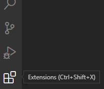

In the search bar: type _SICK AppSpace SDK_. You should see the _SICK AppSpace SDK_ bundle and components listed above appear in the search results.

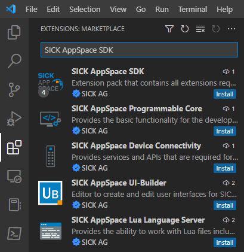

Install the *SICK AppSpace SDK* bundle by clicking on it and clicking *Install* button in the extension window or by clicking *Install* button in the extension entry in the search result window.

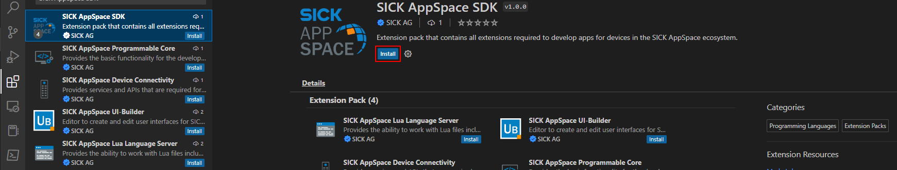
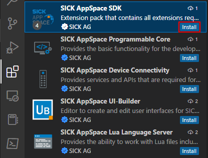

# First start
After starting Microsoft Visual Studio Code for the first time after the installation of the _SICK AppSpace SDK_, a window with the license agreement and data processing information appears. To fully activate the _SICK AppSpace SDK_, you must confirm your acceptance of these agreements.

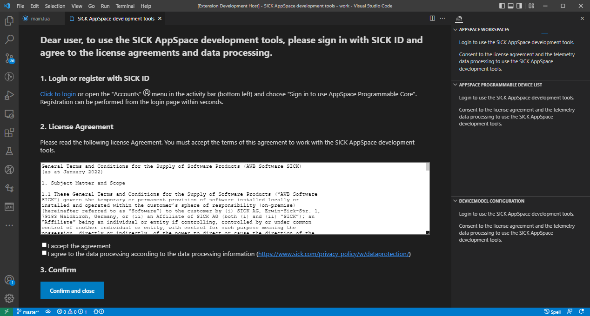

====
*For SICK AppStudio users:*

It is possible to also add your license file. By default, the SDK will ask for a license after it is started for the first time. In the bottom of the screen, a pop-up window will appear. Click *Choose license file* to select a license file from your computer.

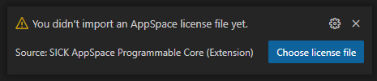

If the user already added the license, or if the license prompt didn't appear, the license can be reset by opening the command prompt (default - press F1) and searching for _SICK AppSpace: Reset AppSpace license_ command.

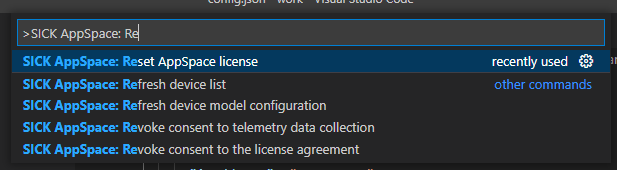

====

# The SICK AppSpace SDK view
Most of the features of the _SICK AppSpace SDK_ can be accessed via the *SICK AppSpace SDK* view. This view is added by the the _SICK AppSpace-Programmable-Core_ component of _SICK AppSpace SDK_ and should be available after correct installation process. It can be opened by clicking the *SICK AppSpace button* on the sidebar of Microsoft Visual Studio Code.

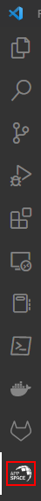

The view consists out of four main sections: *Workspaces*, *Device list* and *DeviceModel configuration* and *App model configuration*. The sections central for SensorApp development.

# Development process
This paragraph presents a general workflow for SensorApp development with the _SICK AppSpace SDK_. Depending on your task, not all of the steps may be relevant. This tutorial covers all steps in the general order, in which you would experience them when developing your very first SensorApp.

## Selecting a workspace
A workspace is the location, in which the SensorApps are saved. Selecting it is necessary for the _SICK AppSpace SDK_ to work as intended. It can either be an empty folder or a location already containing some SensorApps. You can read more about Microsoft Visual Studio Code workspaces via this https://code.visualstudio.com/docs/editor/workspaces[link].

====
*For SICK AppStudio users:*

It is possible to set the Microsoft Visual Studio Code workspace to the same folder SICK AppStudio uses. For example, the default working directory of SICK AppStudio: _%localappdata%\SICK\AppStudio\workspace\work_.

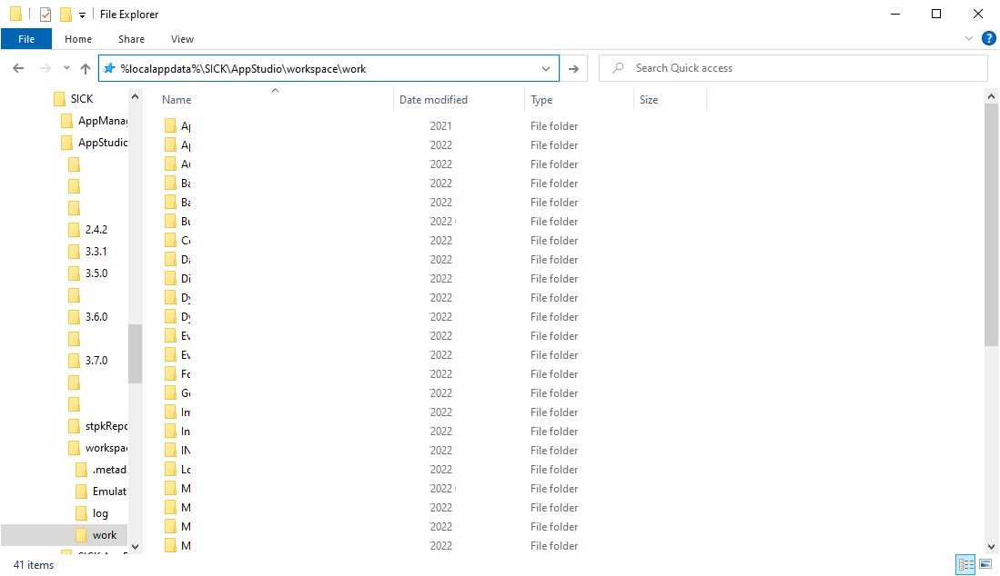
====

To select a new workspace, Microsoft Visual Studio Code needs to open the target directory. This can be done for example via context menu, by right-clicking inside the target directory and selecting *Open with Code* or by selecting the option *Open Folder...* in the *File* menu of Microsoft Visual Studio Code.

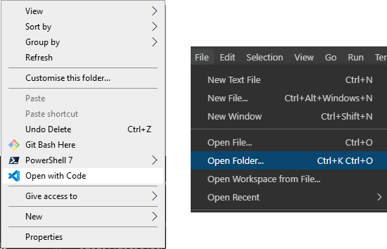

Existing workspaces are handled similarly. In that case, the folder, which contains the SensorApps needs to be targeted.

NOTE: Selecting multiple workspaces is also possible by utilizing the https://code.visualstudio.com/docs/editor/multi-root-workspaces[multi-root feature of Microsoft Visual Studio Code].

After selecting the workspace in the *SICK AppSpace SDK* view, the name of the selected workspace(s) should be visible in the *Workspaces* section. Clicking the expand button to the left of the workspace in the list shows and hides the apps inside that specific folder.

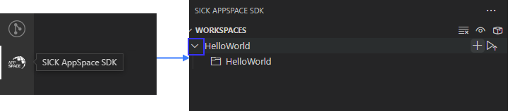

## Selecting a device model or manifest
It is recommended to select a specific device or manifest before starting the development of a SensorApp. Doing this enables the code completion to display the CROWNs (APIs), which the device offers as the manifest provides information about the CROWNs available on a specific device and their capabilities.

### Selecting existing manifest
Selecting an existing manifest can be done in the *DeviceModel configuration* section, which is part of the *SICK AppSpace SDK* view. There are several options readily available with the _SICK AppSpace SDK_, which includes most recent releases of the device manifests of most of the SICK AppSpace programmable devices. To select one of them, the circle on the left of the name of the manifest can be clicked. The current selection is indicated by the circle being filled and displaying a check mark. Only one device manifest can be active at a time.

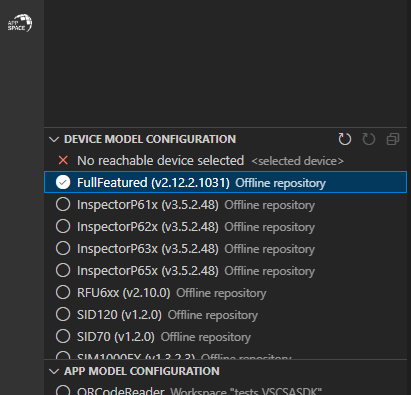

### Selecting a SensorApp manifest
During the development of a solution consisting out of one or more SensorApps, some of them may provide their own CROWNs. The code completion and UIBuilder binding connection for these specific CROWNs is not automatically enabled and needs to be switched on manually. This is done in a similar way as selecting a manifest of a specific device.

This functionality is located in the *App model configuration* section, which is part of the *SICK AppSpace SDK* view. To activate the code completion based on one or more SensorApps, the circle on the left of the name of the SensorApp can be clicked. Each app that has been activated will be marked by a filled circle with a check mark in it. Multiple SensorApps can be active in this context at the same time. Activating the SensorApps this way is necessary for the UIBuilder's binding tool and Language Server's code completion to function properly.

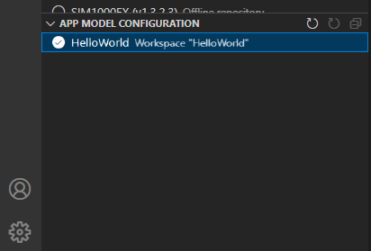

## Connecting to a device

Connecting to a device like e.g. an InspectorP6xx or the SICK AppEngine on a PC can be done in the *Device list* section of the *SICK AppSpace SDK* view. Initially, the list is empty as the connection settings need to be configured first.

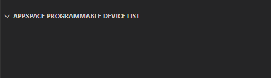

The configuration of the connection can be done either automatically by using the scan functionality of the _SICK AppSpace SDK_, or manually by editing the JSON file containing settings options. Below you can find an explanation of the manual process. Instructions for the automated configuration will be added in the near future.

### General information

Connecting to the device is done by clicking on the circle to the left of the respective device in the list. 

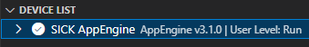

Connecting the device makes it also possible to use the manifest of the connected device for code completion. The option becomes available in the *DeviceModel configuration* section, usually at the top of the list.

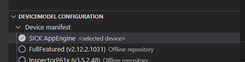

If the device is unavailable, a red X is visible next to its name on the device list. That may mean that the device is not connected, the IP address changed or something else is preventing a connection.

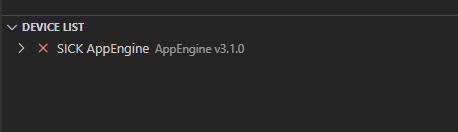

Refreshing the status of the device doesn't happen automatically and therefore always needs to be performed manually.

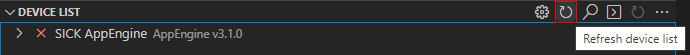

### Automatic configuration

To automatically scan for devices on available network interfaces, the _Scan_ function can be used. To activate it click on the magnifying glass icon next to the *Device list* section title.

image::media/device_list_scan.png[]

After clicking on the magnifying glass icon, a menu appears within which you can select the network interfaces on which the device scan should be performed. Multiple interfaces can be selected. Each option has listed its IPv6 and IPv4 address range below its name. To scan for local devices such as AppEngine, select an option that has _127.0.0.1_ within its range. Click the *OK* button to start the scan.

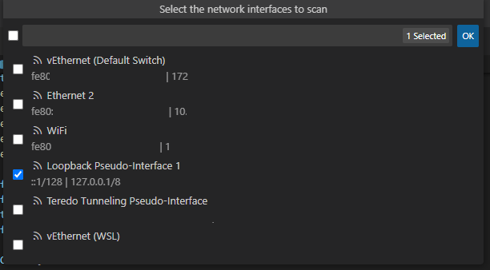

Depending on the number of selected interfaces and number of devices connected, the scan will take a different amount of time. The devices found during the scan appear in the menu window. Each entry includes the devices type, name, interface via which it is connected, IP address, communication protocol it uses (COLA_A/B or COLA_2), and firmware version. Select the device and click on the *OK* button to add it to *Device list*. Multiple devices can be selected and added at once.

image::media/device_scan_devices_found.png[]

Once added, the device(s) will become available in the *Device list* section and therefore can be connected to.

### Manual configuration
To open the file containing the connection settings, click on the gear icon next to *Device list* section title.

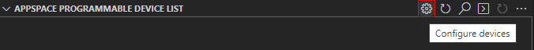

Please find below an example of the connection configuration.

[source, json]
----
{
  "keepSdds": false,
  "devices": [
    {
      "id": "test-device",
      "ipAddress": "127.0.0.1",
      "port": 2122,   
      "protocol": "COLA_2",
      "byteOrder": "BIG_ENDIAN",
      "addressingMode": "BY_NAME",
      "driver": null
    }
  ]
}
----

Explanation of the fields in the configuration:

* *keepSdds* - sets whether the downloaded SDD files are automatically kept after connecting with the device
* *id* - device UUID or other custom unique name for the device
* *ipAddress* - current IP address of the device
* *port* - port for the _CoLa_ communication. Usually it is _2111_ for _CoLa A_ and _CoLa B_ dialects and _2122_ for _CoLa 2_
* *protocol* - selected a _CoLa_ protocol for communication with this device. Possible values: *COLA_A*, *COLA_B* and *COLA_2*
* *byteOrder* - byte order used to communicate with the device. Possible values: *BIG_ENDIAN*, *LITTLE_ENDIAN*
* *addressingMode* - _CoLa_ addressing mode used in the communication. Possible values: *BY_NAME*, *BY_INDEX*
* *driver* - set to _null_ for automatic SDD/CID upload

Adding more devices is possible by adding another device entry in the connection file.

After all the details are filled in and the device is connected to the computer, the list needs to be refreshed by clicking the refresh button next to title of the the *Device list* section.

## Developing a SensorApp
After selecting a workspace, you can start developing your SensorApps. In a first step you either select an existing app to work on, or create a new one.

### Creating a new SensorApp
To create a new SensorApp, the *SICK AppSpace SDK* view needs to be active. To create a new SensorApp, click on the plus button next to the name of the workspace.

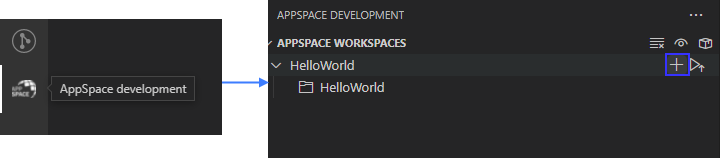

This will open a dialog window in which you define the name of the new SensorApp. The name can consist only of alphanumeric characters and underscores.

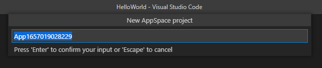

Clicking outside of the dialog or pressing escape on the keyboard will cancel the process. Pressing return will create a new app with the selected name.

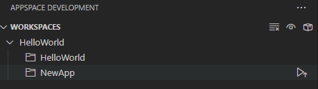

### Editing a SensorApp
Once the SensorApp is created, it becomes possible to work with its components. Editing each of them requires switching back to the explorer view of Microsoft Visual Studio Code.

#### Writing Lua scripts
Writing the code can be done in the text editor of Microsoft Visual Studio Code. The IntelliSense code completion fully supports the device and SensorApp CROWNs (provided they were correctly activated as described in *_Selecting a device model or manifest_* paragraph).
// TODO: Add links when available
More information about how to code SensorApps and coding guidelines will be added in the future.

====
*For SICK AppStudio users:*

The code editing and SensorApp designing is very similar to the way established in SICK AppStudio.

The documentation style used in the SICK AppStudio versions before 3.7 is not supported by the code completion. The current annotation guide can be found here via this https://github.com/SICKAG/SICK-AppSpace-SDK-Docs/blob/master/Programming-SensorApps-LUA-Annotations/Programming-SensorApps-LUA-Annotations.adoc[link].
====

Serving the functions and events to be available as CROWNs can be done via code actions. To serve a function, the name of the function needs to be selected in the code editor. You can open the code actions menu by pressing _CTRL + ._ or by right clicking the selected text and choosing the appropriate option from the context menu. Selecting *Serve Function* will create the respective documentation in the lua file, a line of code that serves the function and an entry in the manifest will be created, declaring the CROWN.

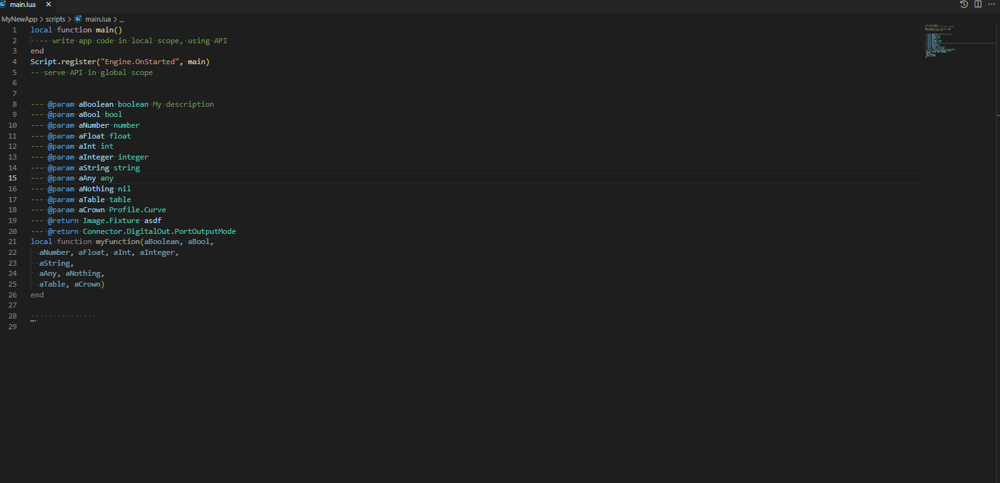

Serving an event is handled similarly, but it can be performed in any empty line of the file.

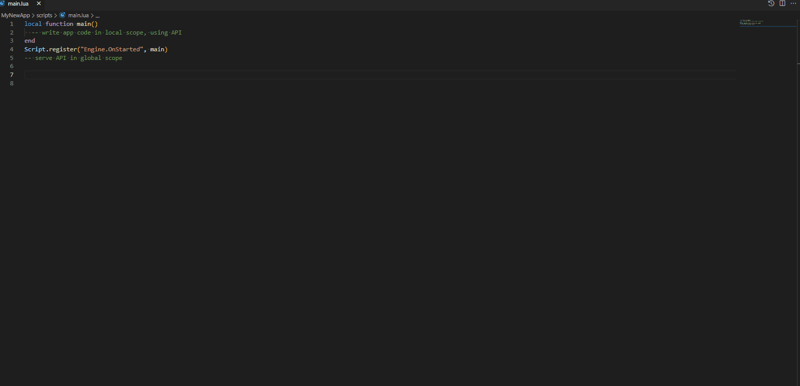

// TODO: Add link when available.
Please note, that the publicly available documentation will be expanded continuously. Thus, additional tutorials about programming SensorApps, working with CROWNs and related topics will be added in the future.

#### Creating a UI for a SensorApp
// TODO: Add link when available.
The UI-Builder tool is automatically started when opening the _.html_ file from _pages_ component of the SensorApp. More information about how to design the UI with the UIBuilder will be made available in future.

====
*For SICK AppStudio users:*

Designing the user interfaces of the SensorApp is done in a similar way as established in the IDE SICK AppStudio.
====

#### Editing parameters, flows, app properties and served CROWNs
For the moment, the _SICK AppSpace SDK_ does not offer support for editing the parameter and flow files, CROWNs and app properties visually. Editing the parameter and flow files can be done by manually editing their code directly (CROWNs are edited similarly) - in the _project.mf.xml_ manifest file.

### Packaging SensorApps
Packaging allows putting one or several SensorApps in one SAPK file that can later be published on SICK AppPool or deployed on a device using software such as SICK AppManager.

To start the SAPK creation click on the package symbol next to the *Workspaces* section title.

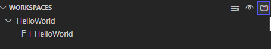

The SAPK creation wizard allows you to select the SensorApps, which will be part of the package. Also the SAPK name and version number can be changed and the output folder can be selected.

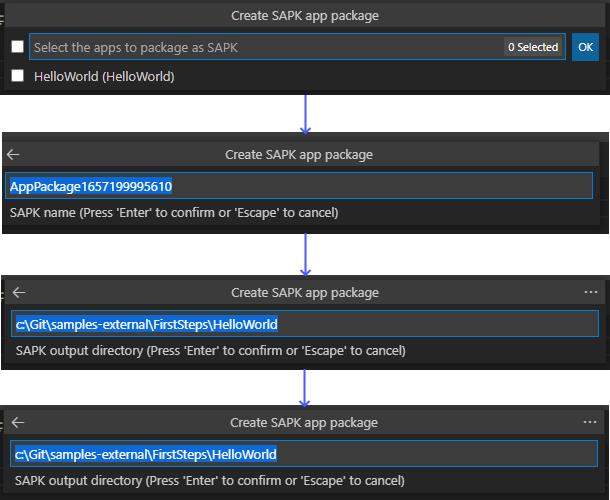

### Deploying SensorApps
Finally, the created SensorApps can be deployed to a connected device. Please note, that you are able to upload apps individually or in bulk.

To start the upload to the device, click on the upload symbol next to the name of the workspace in the *Workspaces* section. This will upload all the SensorApps in the workspace. Clicking on the same symbol next to the name of an individual SensorApp, will upload only the respective SensorApp.

image::media/upload_apps_symbol.png[]

In the next step, the upload wizard will ask to provide user level and password for communication with the device, if not selected before. The _SICK AppSpace SDK_ already contains default passwords for selected user levels, but if at any point the password for some levels were changed, you need to provide the updated password to proceed.

image::media/upload_apps_process.png[]

## Managing SensorApps on a device
Currently, it is not possible to delete, stop or start the SensorApps, which are deployed on a device. It is also not possible to download SensorApps from the devices. It is recommended to use SICK AppStudio and / or SICK AppManager to execute such actions.
// TODO: # File system management
// TODO: Add link when available.

# More details
Please note, that additional tutorials and information on technical details as well as the latest releases will be made available in the future.
