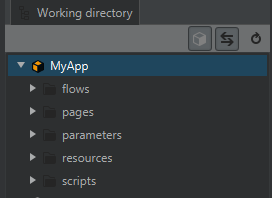
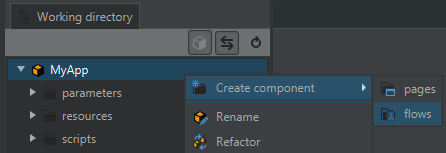
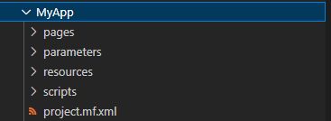

= SensorApp components

# Overview

. Depending on the type of _SensorApp_ being developed and the approach assumed, selection of the application components may vary
. All available components can be added or removed
** In *SICK AppStudio* - in _Working directory_: removed by deleting the component folder or added by right clicking on the _SensorApp_ and choosing component to add
+

** In *SICK AppSpace SDK* -  currently all newly created _SensorApps_ are created with every component and it is only possible to remove components by removing their directories in the _Explorer_ view. For now, they can not be add
+

. The root of your _SensorApp_ corresponds to the name of your application

# Types of Components

## Manifest

Every _SensorApp_ includes a manifest file which contains metadata and is located in the root directory of the application. The manifest provides the *SICK AppEngine* with essential references to the contents of the _SensorApp_: the capabilities of your application ("Serves") as well as its needs ("Uses"). This also defines the _SensorApp's_ namespace and references all components of your application.

In addition, other relevant data such as application name, author, version, and license information are listed in the manifest file.

In *SICK AppStudio*, the manifest file does not need to be directly edited. The _App properties_ window within the IDE can provide a more convenient way of customizing the metadata. _App properties_ window can be accessed for each _SensorApp_ in the workspace individually, by selecting each in the _AppExplorer_ tab.

## Flows
_Flows_ are graphical programing approaches that can be used as an alternative to writing code for some _SensorApps_. The data sources and processing functions are represented by _function blocks_ and links between them by _wires_. The _FlowEditor_ tool essentially creates and edits an _.xml_ file that is used by the engine to run the application.
Each flow file can define one or more _flows_ of an application.
There are two different types of _flows_: *data-flows* and *control-flows*

Developing an application with the use of flows offers a seamless transition from design to implementation. See more details in the Flows Tutorial https://supportportal.sick.com/tutorial/flows-first-steps/[on supportportal]
// TODO: add link to github once available

### Control Flow
_Control flows_ can only be used for wiring of digital signal processing blocks such as _DigitalLogic.Gate.and_. _Control flows_ run on the highest priority available on the device and oftentimes are accelerated by the device's FPGA. We call this the Hard-Real-Time (HRT) priority level. Available _control flow blocks_ are determined by the device and cannot be extended by the user. Access to and from scripts can be created using the _Engine.Event blocks_.

### Data Flow
_Data flows_ can be used for wiring of complex data processing blocks such as a _Scan.EdgeHitFilter.filter_. _Data flows_ run on the priority level of the _SensorApp_ that contains the _flow_. We call this the Real-Time (RT) priority level. User-defined _data flow_ blocks can also be created by serving functions or events and enabling _Include 'data-flow'_ option in the _app properties_ for that entry.

## Scripts
_SensorApps_ can be written using solely the scripting approach. The language to be used is *lua* - lightweight and fast scripting language well suited for the use in the embedded software. User can create one or more lua scripts inside one application. All the APIs and language features can be accessed from within the script. There the user is assisted by the code completion feature and other tool available in the code editor.

NOTE: To ensure that the application is running correctly with the scripts, it is important to mark one of the lua files as a starting point ('main' script). It usually is automatically done by the programming tool, however that information should be kept in mind in case of any problems.

For more details see Scripting - First Steps tutorial https://supportportal.sick.com/tutorial/scripting-first-steps/[on supportportal].
// TODO: add link to github once available

## Parameters
_SensorApps_ can also contain parameter definitions. _Parameters_ are described in _.cid.xml_ file. Every _parameter_ file that is added to an application adds its contents to a general _parameter_ repository of the device.

### Features of parameters

* They can be directly accessed from the scripts, UI and SOPAS protocol
* Each one has a unique name allowing for individual access
* _Parameter_ variable types vary from the ones available in lua language.
* They can assume only the basic types, such as _Real_, _UInt_, _Bool_ or _String_
* _Parameters_ can be arranged in the following structures: _Struct_ - a table containing several parameters, which can be of various types, and _Array_ - can contain multiple entries of the same type, including _Structs_
* In the definition file, a default value for a _parameter_ can be supplied
* Dependent on the type some more properties can be defined and some are mandatory. They include settings such as _MinValue_, _MaxValue_ and _Length_
* They can have a property which defines the minimum user level which is needed to write the _parameter_

For more details see Parameter handling tutorial https://supportportal.sick.com/tutorial/programming-parameter-handling/[on supportportal].
// TODO: add link to github once available

## Pages
_Pages_ component contains the user interface of a _SensorApp_. _Pages_ consist of various files of different type that together define the user experience. This UI is automatically built when the application is deployed. When connecting to a device via a web browser the UI is interpreted and the data it contains is displayed. Developers can change the contents and layout of the web page without a need to restart a device. _Pages_ can be easily created or edited using the _UIBuilder_ tool in the programming environment, which opens automatically when double-clicking on an _.html_ file. Elements on a _page_ can be linked to functions, events or parameters and communicate using HTTP protocol or webhooks.

NOTE: Since the user interface provided by the _SensorApp_ is not running directly on the device and just communicates with it via various  protocols, it is not possible to access features that are not either inherently accessible outside of the device or made accessible by the user (e.g. with the use of serves)

For more details see Application specific user interface tutorial https://supportportal.sick.com/tutorial/ui-builder2-application-specific-ui/[on supportportal] and other UI building tutorials.
// TODO: add link to github once available

## Resources
If the _SensorApp_ needs additional resources other than the ones offered by the application components, corresponding files should be included with the _resources_ component. E.g. HALCON procedures or reference images can be used as ressources. Any type of file can be placed inside this component and can be accessed from the lua scripts of the application. _Resources_ are private and thus can't be accessed by _SensorApps_ other than the one which they were included in.

From the programming perspective, _resources_ component is just another storage directory and can be accessed by any API that reads data from file, like _File.open_:

[source, lua]
----
local myFile = File.open("resources/MyFile.txt")
----
