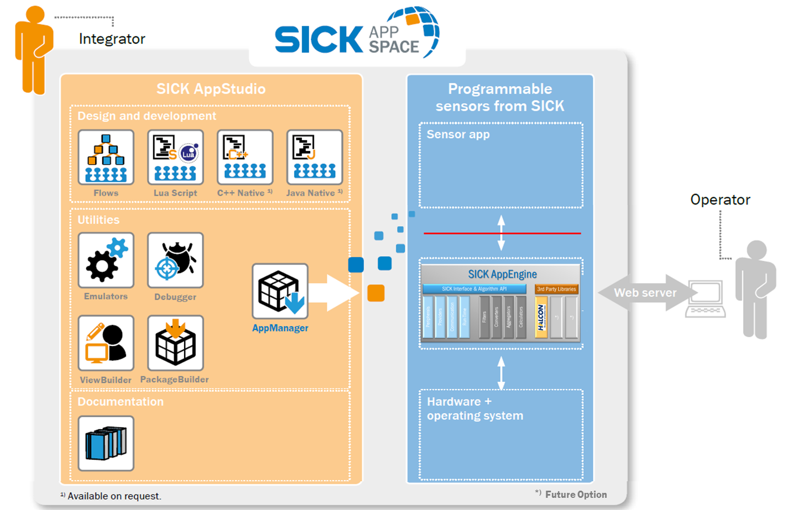

= Working with APIs

The apps can be developed with our development environments: **SICK AppStudio** IDE, or **SICK AppSpace SDK** plugins for **Microsoft Visual Studio Code**. These development environments enable developers to create applications using scripts and flows, as well as resources from third-party libraries such as HALCON. 

The further support of developers is provided by the following tools and features: **SICK AppEngine** - program that emulates functionalities of real devices; **intelligent code completion**, based on selected device model and available resources; **debugger**, allowing to troubleshoot the app directly on the device, using functions that include visualization of 2D and 3D material. Moreover, developers can create user interfaces for operators using the built-in **UI-Builder** tool. 

Applications are developed by using the APIs, which are defined by the device. Each device has its own subset of APIs, depending on the capabilities of the device. Many of those APIs are identical or similar across different devices. As a result, apps that are using such APIs don't need to be rewritten in order to work across various platforms. 

**SICK AppStudio** and **SICK AppSpace SDK** provide developers easy access to a device's API. In essence: the functionality of a connected device is reflected by and accessible with the help of either of these development environments. The API isolates the device's hardware and operating system from the app, improving the stability. This also supports developers as they don't need to learn and adapt each devices' specific drivers and functions. Some APIs are implemented via hardware acceleration or FPGA, depending on the hardware, which is managed automatically, without developer needing to implement them every time.

Programming an app consists of linking API functions by corresponding lua instructions forming the application script. The integrated code completion function helps to navigate through the API and enables faster programming. 

Firmware updates enhance a device's functionality and its API, implementing new and improved functions. The new version remains backwards compatible as the existing APIs are not immediately removed during the lifecycle of the device. However, they may become deprecated, indicating to the developer that it is recommended and beneficial to replace the deprecated instructions by the new one. Firmware updates can be performed with the **SICK AppManager** and **SICK SOPAS Engineering Tool**.

API functions range from configuration of ports and communications to extended algorithm abilities. The **SICK AppEngine** is by default using "full-featured" model, which includes all of the functions available on every device. In **SICK AppStudio** it is possible to limit the available APIs to match a specific device by selecting this specific device's manifest.

Please find the device specific API reference within the release documentation of the corresponding device.

